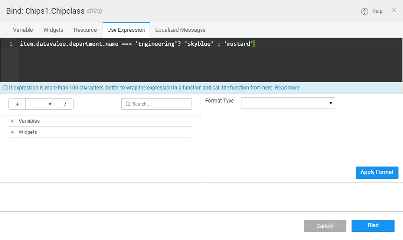
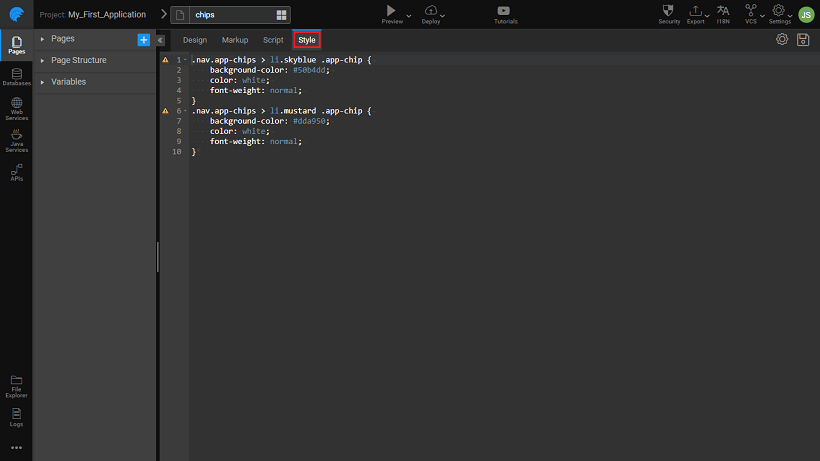
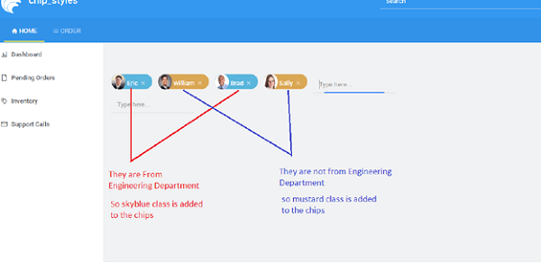

represent complex entities in small blocks, such as a contact. Contact chips may represent contact information in a compact way. Chips can be used for various types of entities, including free-form text, predefined text, rules, or contacts. Chips may also contain icons.

**to use this widget: ** Chips widget is a growing trend across social and communication-related apps. This can afford recipient selection using tokenized auto-completing text fields. This kind of UI is more concise than list-based interfaces and more visually rich, intuitive and directly manipulable (manage recipients by touching their token).

**can Chips Widget be used in WaveMaker**

Widget is one of the Form Widgets. It is available to be used as a standalone widget or as a part of Live Forms, Data Entry Dialogs etc.

1. Chips widget property can be bound to a dataset of valid values for eg – Email Addresses, Hobbies, Skillset, Categories etc.. User can add new values but these new values will not be added to the dataset.
2. acts as **/autocomplete** widget. When the user starts typing in the Chips widget, it triggers the selection of values from the dataset and shows the corresponding values for the character pressed.
3. **Only Select** (Default: false) - If Allow Only Select is set to true, Chips will restrict adding values other than in the selection. By default, there is no restriction. But note that these new values will not be added to the dataset.
4. **Size** (Default: 0) - By default, there is no limit on the number of chips to add. If it set to true, after Max Size is reached the input box to add more will be hidden and will be shown again after some of the elements are deleted.
5. **reorder** property can be used to allow the user to reorder the Chip Elements at runtime, using a simple drag and drop operation.
6. Functionality: User can  between the chip items using the keyboard right and left keys. Also using the delete/backspace keys the Chip item can be 
7. **item class name** property from styles tab can be used to apply styles for individual items of the Chip:
    1. class can be added conditionally when bound to an expression ( [below for use case example](#ex3)), or
    2. names can be entered (without any condition), these classes will be applied to all the chips.

**difference between Search and Chips widget:**

1. Search, you can select only one element, whereas in Chips multiple elements can be selected.
2. Search, you cannot edit or remove selected items, whereas Chips support these features.

## a Chip

1. for a field by typing it in the input box. Select the required chip and by clicking on to it or enter key press
2. add chip other than listed items and hit enter that will add to existing list
3. you want to add an item which is not there in the populated list, type the item and press enter. It will be added to the chips list but it will not be added to the dataset.

## a Chip

1. on to the cross button of each Chip element.
2. can also select a Chip element and press DELETE button
3. backspace in the input will select the last Chips element and later deletes it.

## a Chip

1. user can double click on the Chip element and edit it.
2. double click, you will see a format like: “displayField < dataField >”
3. the changes and hit the enter key. Changes will be persisted.

## Chip Elements

1. user can drag and drop the element in the required place.

name is a unique identifier for the chips. Special characters and spaces are not allowed in widget name.

placeholder is a text to show in the editor when there is no value. A common use of this is a search box that says in faint gray italicized text "Search..." which disappears as soon as the user starts to edit the text box. This is a useful alternative to a caption if you are constrained in space and asking for something simple of the user.

Index

tab index attribute specifies the tab order of an element. You can use this property to change the default tabbing order for widget access using the tab key. The value can range from 0 to 32767. The default is 0 and -1 makes the element non-focusable.

NOTE: In Safari browsers, by default, Tab highlights only text fields. To enable Tab functionality, in Safari Browser from Preferences -> Advanced -> Accessibility set the option "Press Tab to highlight each item on a webpage".

width of Chip widget can be specified in em, pt, px or % (i.e 50px, 75%).

height of Chip widget can be specified in em, pt, px or % (i.e 50px, 75%).

Width

this property to set the width of the chip item input box.

You can select from:

- – which is the normal Chip widget size, 170px, or
- – 100% width of the container

this property to a variable to populate the list of values to display. Can be bound to a Variable.

Key

field from the above Value dataset based on which the search needs to be performed for fetching Chip Elements for user selection.

Source

property sets the image to be displayed in the search results. Pick from the fields from the above Dataset Value.

field

property is useful when the dataSet is an array of objects. It decides the dataValue to be returned by the widget. If set to "All Fields", the whole object is returned against user selection. If set to a particular field, the returned value will be the value of that field in the selected object. In the case of multi-selection, the returned dataValue will also be an array.

Field

property sets the displayValue to show in the select editor when the list is populated using the dataSet property.

Expression

is an advanced property that gives more control over what is displayed in the drop-down select list. A Display Expression uses a Javascript expression to format exactly what is shown.

by

allows for multiple selections for ordering the display of rows based on fields in asc or desc order - up arrow for asc and down arrow for desc.

**Value**

is the default value to display value for an editor widget. Note that the display value is just what the user sees initially, and is not the dataValue returned by the widget.

Focus

property makes the Chip to get focus automatically when the page loads.

only

this property prevents the user from being able to change the data value of a widget. This property can be bound to a boolean value.

Size

max size is set, chips will restrict adding more than max size.

Position

this property to change the position of the newly added chip item as

- \- The input box appears in the beginning followed by the selected chips
- – The input box appears at the end of the chip item list, this is the default setting

Only Select

Allow Only Select is set to true, chips will restrict adding values other than in the selection. By default, there is no restriction.

Reorder

property will allow users to reorder the Chip Elements at runtime. This is a bindable property.

determines whether or not a component is visible. It is a bindable property.

on Demand (visible only when show property is bound to a variable)

this property is set and show property is bound, the initialization of the widget will be deferred until the widget becomes visible. This behavior improves the load time. Use this feature with caution, as it has a downside (as we will not be able to interact with the widget through script until the widget is initialized). When show property is not bound the widget will be initialized immediately.

the disabled property is true (checked) the widget becomes display-only and user input will not be accepted. It can also set programmatically by binding it to a boolean type variable.

Chars

minimum number of characters to be entered by the user before the search query is triggered. The value should be greater than 0. The default value is 1.

event handler is called each time the chip item value changes.

**Events**

Chip Click

event handler is called each time the chip item is clicked.

**Events**

Before Add

event gives handle to user whether to continue or abort to add current chip item

1. the function does not return anything the chip item will be added
2. the function returns false, then chip item will not be added
3. the function returns anything other than false, chip item will be added

Add

event gives a handle on the successful addition of the Chip item.

Before Remove

event gives handle to user whether to continue or abort removing current chip item

1. the function does not return anything the chip item will be removed
2. the function returns false, then chip item will not be removed
3. the function returns anything other than false, chip item will be removed

Remove

event gives handle to user on successful removal

Chip Select

event handler is called each time the chip item is selected.

Before Service Call

event is triggered before sending the service call for fetching the search results.

Before Reorder

event gives handle to user whether to continue or abort reordering current chip item

1. the function does not return anything the chip item will be reordered
2. the function returns false, then chip item will not be reordered
3. the function returns anything other than false, chip item will be reordered

Reorder

event gives a handle on successful reordered in the following form:

1Reorder = function($event, widget, $data, $changedItem)

where

- _$data_ - is the object containing the current chip item data,
- _$changedItem - _ and specifying the position of the chip item

# Cases

**1: Adding contacts and sending Emails**:  In this use case, you will be using the chips widget as email recipients and create a UI of Composing an Email.

- a database called ProfileDB and a table named Profile with basic fields like first name, last name, job title, email.
- **:**
    1. and drop the chips widget onto the canvas.
    2. a variable based on the database CRUD APIs that is bound to Profile Table. [more from here](/learn/app-development/variables/database-crud/#)
    3. this variable to the dataset value property.
    4. Data Field as email
    5. Display Field as FirstName
    6. and Drop a TextArea Field for composing messages
    7. a [Service for Sending Email](/learn/app-development/services/3rd-party-libraries/using-3rd-party-jar-files/)
    8. a variable based on the APIs auto-generated for the methods from the Java service.  [more from here](/learn/app-development/variables/java-services/)
    9. the Data tab, bind the values to those returned by the Chips widget.
    10. and Drop a button – Give the caption as Send. On Click of that button trigger the service variable for Java service.

**2: Use in Live Form**:

1. two more tables in Profile DB namely Hobbies and Skillsets. Have ID and Name as fields in both.
2. a one-to-many relationship between id -  HobbyID
3. a Live Form based on a data source – ProfileDB.
4. Advanced Settings and set the widget property for the fields Hobbies and Skillset to chips and also display expression as Hobbies and Skillset respectively.
5. Save and Run the App. You will observe for the Hobbies and Skillsets you are able to enter multiple values.
6. multiple values will have to be delimited before you save the date in live form. This can be done through scripting. 
    1. to the Live Form events tab and for the "On before service call" event
    2. JavaScript from the drop down and in the script tab  add the code as below
        
        1Beforeservicecall = function($event, $operation, $data) { 
                  $data.<field\_name> = $data.<field\_name>.join(','); 
           };
        

**3: Use a conditional class**:

1. sample hrdb and create a CRUD Variable for the Employee table.
2. and drop Chips widget and bind the Dataset Value property to the HRDB employee variable
3. Data field property to All Fields,
4. the Styles tab bind Chip item class name to the following expression: : item.datavalue.department.name === 'Engineering'? 'skyblue' : 'mustard' This will check if employee's department name is engineering applies "skyblue" class else applies "mustard" class (note: here "item" denotes the chip object.) 
5. the following class to the app using the Style tab – for skyblue and mustard
    
    \-chips > li.skyblue .app-chip {
        background-color: #50b4dd;
        color: white;
        font-weight: normal;
    }
    .nav.app-chips > li.mustard .app-chip {
        background-color: #dda950;
        color: white;
        font-weight: normal;
    }
    
    
6. the page 
7. the chip item class name (or Class Name property) as skyblue, will apply skyblue class to all the chips at runtime. 

[3\. Form Widgets](/learn/app-development/widgets/widget-library/#form)

- [3.1 Button](/learn/app-development/widgets/form/button/)
- [3.2 Button Group](/learn/app-development/widgets/form/button-group/)
- [3.3 Calendar](/learn/app-development/widgets/form/calendar/)
- [3.4 Checkbox](/learn/app-development/widgets/form/checkbox/)
- [3.5 CheckboxSet](/learn/app-development/widgets/form/checkboxset/)
- [3.6 Chips](/learn/app-development/widgets/form/chips/)
    - [Features](#features)
    - [Properties](#properties)
    - [Events](#events)
    - [Use Cases](#use-cases)
- [3.7 Color Picker](/learn/app-development/widgets/form/color-picker/)
- [3.8 Currency](/learn/app-development/widgets/form/currency/)
- [3.9 Date](/learn/app-development/widgets/form-widgets/date-time-datetime/)
- [3.10 Datetime](/learn/app-development/widgets/form-widgets/date-time-datetime/)
- [3.11 FileUpload](/learn/app-development/widgets/form/file-upload/)
- [3.12 Number](/learn/app-development/widgets/form-widgets/number/)
- [3.13 Radioset](/learn/app-development/widgets/form/radioset/)
- [3.14 Rating](/learn/app-development/widgets/form/rating/)
- [3.15 Select](/learn/app-development/widgets/form/select/)
- [3.16 Select Locale](/learn/app-development/widgets/form/select-locale/)
- [3.17 Slider](/learn/app-development/widgets/form/slider/)
- [3.18 Switch](/learn/app-development/widgets/form/switch/)
- [3.19 Text](/learn/app-development/widgets/form/text/)
- [3.20 Textarea](/learn/app-development/widgets/form/textarea/)
- [3.21 Time](/learn/app-development/widgets/form-widgets/date-time-datetime/)
- [3.22 Toggle](/learn/app-development/widgets/form/toggle/)
