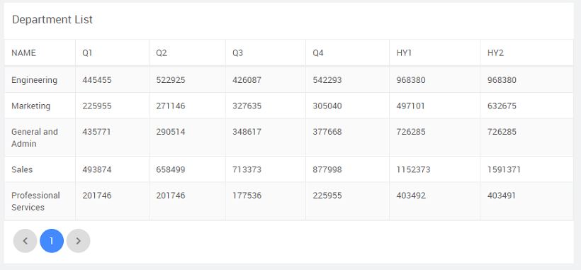

: You can combine two or more columns to be displayed in a single column in a Data Table. **Case**: From the Department table, display two half-yearly budget figures by adding the values for first two and the second two quarters. We will be using the hrdb that is shipped with WaveMaker.

**\-requisites**:

1. a Web responsive app
2. the sample hrdb database
3. and drop a Data Table, setting the data source to the Department table from hrdb

**to combine to columns**:

1. to Advanced Settings of the Data Table from the Properties panel
2. the Columns tab, add two new columns - H1 and H2
3. the View Mode section, enter the following for Value Expression:
    
    {{row.getProperty('q1') + row.getProperty('q2')}}
    
    This will add the content from columns q1 and q2 and set it as the content for H1 column. 
    
    : q1 and q1 are the Mapped Column name for the columns Q1 and Q2. 
4. the app and see the Data Table. 

[Table Use Cases](/learn/app-development/widgets/datalive/datatable/data-table-use-cases/)

- [1\. Basic Table Usage](/learn/app-development/widgets/datalive/datatable/data-table-basic-usage/)
- [2\. How to customise table actions](/learn/how-tos/data-table-actions/)
- [3\. How to represent data table columns using widgets](/learn/how-tos/data-table-widget-representations/)
- [4\. How to format data table column](/learn/how-tos/data-table-format/)
- [5\. How to apply styles (generic and conditional) to data table](/learn/how-tos/data-table-styling/)
- [6\. How to combine multiple columns to one](/learn/how-tos/combining-columns-data-table/)
- [7\. How to view master-detail record using a data table](/learn/how-tos/view-master-detail-data-records-using-data-table/)
- [8\. How to add master-detail record using a data table](/learn/how-tos/add-master-detail-records-using-data-table/)
- [9\. How to export data using a data table](/learn/how-tos/export-data-data-table/)
- [10\. How to create a dynamic data table](/learn/how-tos/dynamic-data-tables/)
