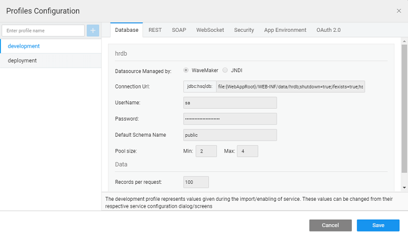
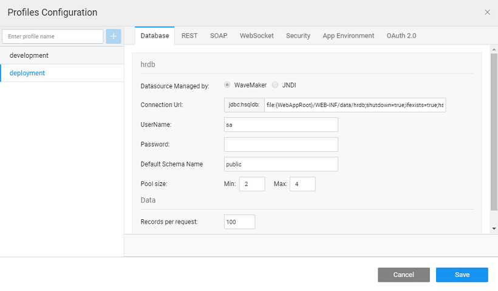
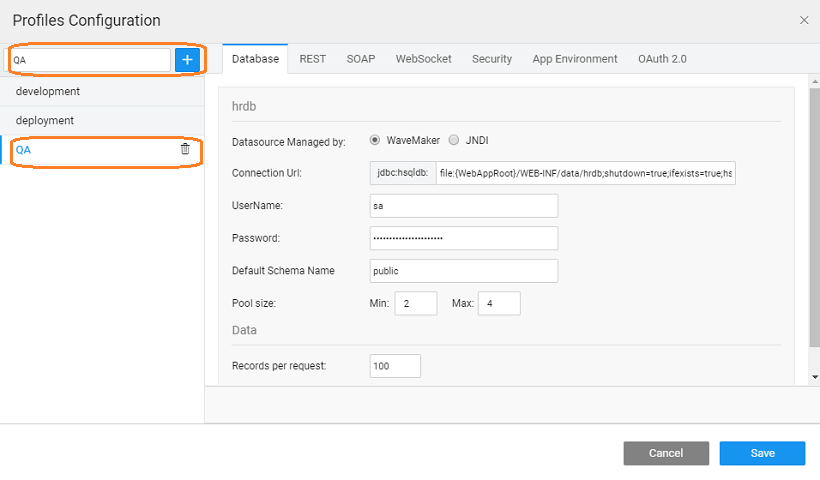

Configuration is externalized at each service through configuration profiles. Configuration for DB, REST servers etc. can be separated for Development and Deployment environments through Profiles. The profile can be accessed from the Settings option in the Secondary Actions.

**Profiles** allows one to run the same application under different environments with different configurations. This is in line with _[Configuration Profiles](https://maven.apache.org/guides/mini/guide-building-for-different-environments.html)_ By default, two profiles are generated for every application - used with the option and for option.

## Configuration Profile

**Configuration Profiles,** used with the option, are not editable. The values are set from the configuration of the underlying services at the time of import/creation. If you want to change these values, go the respective service configuration dialog and make the changes.

- Security tab, Configuration SSL is disabled by default.
- is no provision to configure X-Frame options. It is by default set to “Same Origin”.
- App Environment properties can be added, deleted or modified. When you click on Save button, the properties get synchronized with all the profiles. [on App Env property usage](/learn/how-tos/using-app-environment-properties/)

## Configuration Profile

** Configuration Profiles,** used with the , are editable. The values are set from the configuration of the underlying services at the time of import/creation. You can change them according to the Deployment Environment settings.

- **Settings**:
    - **per request:** Results can be set for Database configuration. This option will restrict the number of rows returned by any Variable associated with the database. The REST API calls will impose this restriction.
    - can also specify the minimum and maximum **size** to limit the number of connections to a database.
- service settings for Protocol, Host and Application path can be modified.
- service settings especially those related to the connection and request timeout can be modified.
- **Socket** settings can also be modified.
- settings allow enabling SSL encryption, XSS Protection, and X-Frame-Options.
    - **\-Frame-Options**: X-Frame-Options is an HTTP response header, that indicates how the browser should handle rendering of embedded pages within frame or iframe or as objects. You can either
        - hence allowing all pages to be displayed in any frame, or
        -  the option. Once enabled, the X-Frame options are available to be set as per application needs. There are 3 options available:
            - **:** This option restricts the page from getting displayed in any frame, irrespective of the site accessing it.
            - **Origin:** This option displays the page in a frame of the same origin as the page. This is the default behavior.
            - **From:** The page can only be displayed in a frame of a specified origin. With this option, the browser makes a decision on whether to display the response in the iframe based on the scheme, host and port values.  The “Allow From” header will automatically be converted to the Content Security Policy header, based on the target browser, thus ensuring cross-browser support. Multiple URLs can be set using comma-separated notation.
    - **Configuration** like Session Timeout and persistent login feature can be set.
    - **Based Authentication**: Token-based Authentication is an authentication mechanism, that authenticates API request. The user is issued an API access token upon successful authentication, which will be used while invoking any API request. For more information on generating a Token [here](/learn/app-development/app-security/token-based-authentication/) To modify token related details, click on Security tab. Under deployment check for Token-Based Authentication. Token Based Authentication consists of three options:
        
        1. **Tokens:** This option enables the token parameter and token validity options.
        2. **Parameter: ** API's can be accessed once the token is issued. It is done by passing the token in the Request Header or Parameter.
        3. **validity:** Default valid time for a token is 1800 sec (30 mins). However, you can customize the token valid time as required.
        
        Click Apply to set the modified token details. **:** The user can modify only the token valid time and not the token parameter value.
    - **:** can enable cross-origin resource sharing so that websites from different domains can access resources in a WaveMaker app. From here you can set:
        1. **Credentials**: This option is to allow users to include credentials (including cookies and auth data) to be sent with the XHR requests.
        2. **Age**: This option is used to set the validity, in seconds, of the pre-flight request response.
        3. : Only the resources (in WaveMaker app) with the mentioned path can be exposed.
        4. : WaveMaker app resources can be exposed only to these origins.
    - **Provider Configuration**: Various details for service providers like LDAP, AD, SAML can be configured. that when changing the deployment profile in Studio for a deployed app, will not have any effect on the deployed version until you re-deploy the app to Demo phase.
- **Environment** can only be configured/updated, but not added or deleted. In other words, you are allowed to change the property values, but restricted to add or delete properties. [on App Env property usage](/learn/how-tos/using-app-environment-properties/)
- **2.0** provider settings can be modified by changing the Access Token URL, Authorization URL, Client Id and Client Secret.

## Configuration Profile

your app is using Prefab which has services imported, you can configure the same here. Same as with the app profiles, only Deployment Profile is configurable. Also, for Prefabs, you cannot change the Security settings.

## Configuration Profile

You can choose to **different configuration profiles** as per the need of the application. These profiles can be deleted.

: This custom profile can be used when exporting the project as a WAR file.

< Manage Deployed Apps

9\. Deployment

- 9.1 One-Click Deployment
    - [Overview](/learn/app-development/deployment/one-click-deployment/)
    - [Deployment to Cloud](/learn/app-development/deployment/one-click-deployment/#cloud-deployment)
- 9.2 Release Management
    - [Overview](/learn/app-development/deployment/release-management/)
    - [Implementation](/learn/app-development/deployment/release-management/#working)
- 9.3 Manage Deployed Apps
    - [Overview](/learn/app-development/deployment/manage-deployed-apps/)
    - [Apps Portal](/learn/app-development/deployment/manage-deployed-apps/#apps-portal)
    - [Manage Deployed App](/learn/app-development/deployment/manage-deployed-apps/#manage-deployed-app)
    - [Push to Live](/learn/app-development/deployment/manage-deployed-apps/#push-to-live)
    - [App Versioning](/learn/app-development/deployment/manage-deployed-apps/#versioning)
    - [AWS Deployment](/learn/app-development/deployment/deployment-to-aws/)
    - [Azure Deployment](/learn/app-development/deployment/deployment-to-azure/)
    - [Google Cloud Deployment](/learn/app-development/deployment/deployment-google-cloud/)
- 9.4 Deployment to Web Server
    - [Overview](/learn/app-development/deployment/deployment-web-server/#)
    - [WAR file generation](/learn/app-development/deployment/deployment-web-server/#war-file-generation)
    - [Deployment to Tomcat](/learn/how-tos/wavemaker-application-deployment-tomcat/)
    - [Deployment to WebSphere](/learn/how-tos/wavemaker-application-deployment-websphere-liberty-profile/)
    - [Deployment to JBoss](/learn/how-tos/wavemaker-application-deployment-jboss/)
    - [Deployment to WebLogic](/learn/how-tos/wavemaker-application-deployment-weblogic-application-server/)
- [9.5 Configuration Profiles](#)
    - [Overview](#)
    - [Development Profiles](#dev-profile)
    - [Deployment Profiles](#deploy-profile)
    - [Prefab Profiles](#prefab-profile)
    - [Custom Profiles](#custom-profile)
