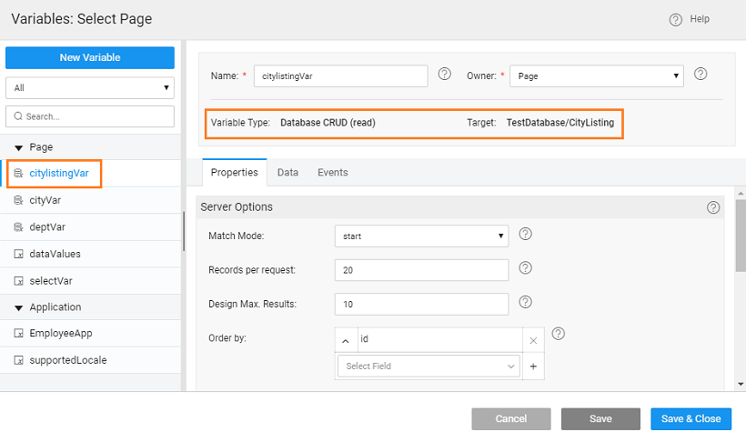

One can drive the content of a Select widget based upon the selection of another Select widget. For example, a user is provided with a list of Countries and based upon the selection, a list of Cities is displayed for selection from a second list. Let us see how to achieve this in WaveMaker. : We are using a dataset CityListing which contains the country and city details. 

1. and drop two Select and one Label widgets onto the canvas.
2. [a Database CRUD Variable](http://[supsystic-show-popup id=105]) for the above CityListing table (say, ). 
3. the first Select widget to the  Set the Display Field and Data Field to the Country field of the dataset. 
4. [another Database CRUD variable](http://[supsystic-show-popup id=105]) (say, ), bind it to the CityListing dataset and set filter on the Country field to the Country Select widget datavalue. 
5. the second Select widget to the variable (_) _ in the above step. Set the Display Field and Data Field to the City field. 
6. the application, select country and see the city list change.

[Use Cases](/learn/app-development/widgets/form-widgets/select-use-cases/)

- [1\. How to use list of values for select widget configuration](/learn/how-tos/configuring-select-widget-static-list-values/)
- [2\. How to use variable for select widget configuration](/learn/how-tos/configuring-select-widget-variable/)
- [3\. How to use display and data value fields for select widget configuration](/learn/how-tos/configuring-select-widget-display-data-fields/)
- [4\. How to use database fields for select widget configuration](/learn/how-tos/configuring-select-widget-database-fields/)
- [5\. How to configure cascading select](/learn/how-tos/configuring-cascading-select/)
