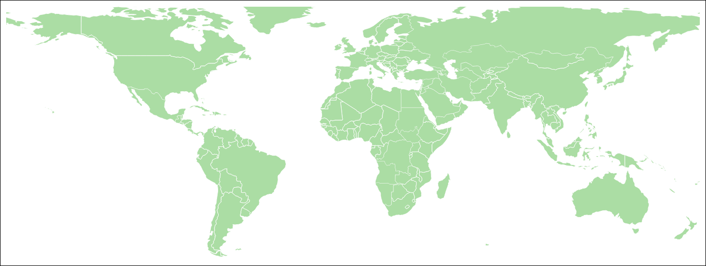
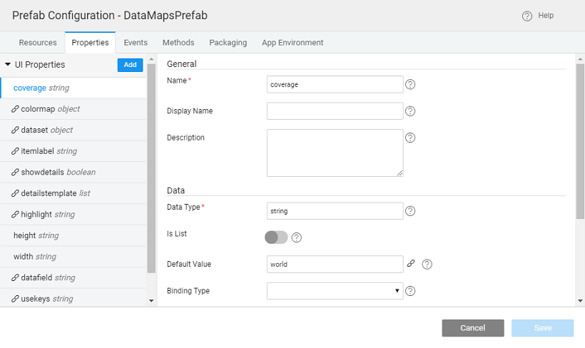

**D3.js** (or just D3 for Data-Driven Documents) is a JavaScript library for producing dynamic, interactive data visualizations in web browsers. It makes use of the widely implemented SVG, HTML5, and CSS standards. **Datamaps** is intended to provide data visualizations based on geographical data. It is SVG-based and can scale to any screen size. It heavily relies on the D3.js library.

In this section we will see how to create a Prefab to display the datamaps and use it in a project of your own.  We will be showing how to add some basic properties to manipulate the functionality. 

# DataMaps Prefab Creation

1. Click on **Create** from the _Prefab_ tab of the [Project Dashboard](http://[supsystic-show-popup id=102])
2. Enter a name and description for the Prefab
3. Visit the website for [DataMaps](http://datamaps.github.io/) and download the required files from the Downloads section. We will be implementing the Basic edition. We have used the following two files - [topojson min.js](./assets/topojson.min_.zip) and [datamaps world min.js](./assets/datamaps.world_.min_.zip). (extract from the provided zip files)
4. [Import the Resources](http://[supsystic-show-popup id=112])
5. Select the folder you want the resource to be imported to, here we had selected _resources_ folder. 
6. From [Project Configurations](http://[supsystic-show-popup id=107]), choose Config Prefab under Settings:
    - Add the uploaded script files. Make sure you enter topojson first and then datamaps resource 
    - **UI Design**: Drag and drop a **Container Widget** onto the canvas, **name** it _mapContainer_ and set the **class** as _map-container_ 
    - Open the **Script** tab and enter the following code for _Prefab.onReady_ method  **Note**: After successful creation of the prefab, inside the script, we notice there are few functions pre-defined:
        -  _\[Prefab.onPropertyChange = propertyChangeHandler;\]_
        - _Prefab.onReady_ method will be triggered post-initialization of the prefab. The code should go here:
            
            Prefab.onReady = function () {
                var mapCtr = Prefab.Widgets.mapContainer.$element\[0\];
                // this method will be triggered post initialization of the prefab.
                Prefab.map = new Datamap({
                    element: mapCtr,
                    scope: Prefab.coverage,
                    fills: Prefab.colormap,
                    data: Prefab.data,
                    customTemplate: Prefab.detailstemplate,
                    done: function (datamap) {
                        datamap.svg.call(d3.behavior.zoom().on("zoom", redrawMap));
                        Prefab.datamap = datamap;
                        Prefab.zoom = d3.behavior.zoom().scaleExtent(\[1, 8\]).on("zoom", zoomed);
            
                        function redrawMap() {
                            datamap.svg.selectAll("g").attr("transform", "translate(" + d3.event.translate + ")scale(" + d3.event.scale + ")");
                        }
                        Prefab.datamap = datamap;
                    },
                    responsive: true
                });
            
                generateLabelsfromKey();
                if (Prefab.labeldata) {
                    //get all keys from the label data
                    \_.forEach(Prefab.labeldata, function (value, key) {
                        labelKeys.push(key);
                    });
            
                    \_.forEach(Prefab.datamap.worldTopo.objects.world.geometries, function (value) {
                        \_.includes(labelKeys, value.id) ? countryList\[value.id\] = Prefab.labeldata\[value.id\] : countryList\[value.id\] = ' ';
                    });
            
                    Prefab.map.labels({
                        'customLabelText': countryList
                    });
            
                }
            };
            
            $(window).on('resize', function () {
                Prefab.datamap.resize();
            });
            
    - Prefab is ready for use.

# DataMaps Prefab Usage

1. Save and **Publish** the Prefab
2. You can set the version for the Prefab and Publish it. Know more about publishing Prefabs from [here](/learn/app-development/custom-widgets/custom-widgets/#publishing-prefabs).
3. The Prefab will be available for use across the Projects. You can see the entry in the Artefacts list from the Developer Utilities on the [Project Workspace](http://[supsystic-show-popup id=107]) and in the Widget Toolbox of any Project within your workspace.
4. Open the project where you want to incorporate the Datamap Prefab created earlier
5. You will find the Prefab entry in the Prefab toolbox 
6. Drag and drop the Prefab onto the canvas and set the height to 500px
7. Run the app and see the map displayed 

# DataMaps Prefab - added functionality

Now that we have seen the usage of a basic datamap, let us add some properties to the Prefab which can be bound from the project containing the Prefab.

1. Open the Datamap Prefab created earlier
2. Open the Prefab Settings and add the following properties to it

| Name | Display Value | Data Type | Default Value | Binding Type | Widget Type | Data Options |
| --- | --- | --- | --- | --- | --- | --- |
| coverage | Coverage | string | world |  | select | world,usa |
| colormap | Color Map | object |  | in-bound | text |  |
| dataset | Dataset | object |  | in-bound | text |  |
| datafield | Data Field | string |  | in-bound | select |  |
| usekeys | Use Keys | string |  | in-bound | select |  |
| itemlabel | Item Label | string | world | in-bound | select |  |
| showdetails | Show | boolean | true | in-bound |  checkbox |  |
| detailstemplate | Details Template | list |  | in-bound |  text |  |
| highlight | Highlight | string | #e36000 | in-bound | colorpicker |  |
| height | Height | string | 400 |  |  text |  |
| width | Width | string | 100% |  |  text |  |

3. Drag and drop another **container**, **name** - _mapActionContainer_; **class** - _map-action-buttons_
4. Add **three buttons** **named** - _zoomIn, zoomOut and zoomHome_; with **icon class** - _wi wi-zoom-in, wi wi-zoom-out, wi wi-home_; and **Click event** to trigger - _zoomInClick, zoomOutClick, zoomHomeClick_
5. The **Script** needs to be updated to include the functionality to support the properties and button events added. Download the following file for the updated script: [datamaps\_additional\_script](./assets/datamaps_additional_script.txt)
6. Now the Prefab is ready for consumption

# DataMaps Prefab Usage - added functionality

Now that you have made changes to the Prefab, we have to incorporate these changes in the Project using the Prefab. There are two ways to achieve this - Update in Prefab in Project or Publish Prefab with an updated version.

- **Update Prefab in Project**:
    1. From the Prefab, select Update Prefab in Project under the Export option and select the Project using the Prefab. 
    2. Open the Project where Prefab was incorporated earlier
    3. You will see a dialog saying the updated version is available for usage. You can choose to **Revert** to the published version or **Continue** with the updated version. Click **Continue** to see the updated version.
    4. You will see the Prefab in the Toolbox with **MOD** status indicating that it is the modified version
    5. You need to Publish the Prefab to get the updated version in the Artifacts
- **Publish Prefab**:
    1. Publish the Prefab and increment the version number
    2. Open the Project where Prefab was incorporated earlier
    3. You will see a dialog saying the updated version is available for usage. **Update & Reload**.
- You will find new properties displayed in the Properties panel
- To set the properties we will be [creating **two Model Variables**](http://[supsystic-show-popup id=105]) - MapProps and ColorMap:
    1. **MapProps** as a _list JSON format_, we are setting label etc.:
        
        \[
          {
            "name": "RUS",
            "fillKey": "RUS",
            "numberOfThings": 1564,
            "customLabel": "2,361$"
          },
          {
            "name": "PRK",
            "fillKey": "PRK",
            "numberOfThings": 2786,
            "customLabel": "2,749$"
          },
          {
            "name": "PRC",
            "fillKey": "PRC",
            "numberOfThings": 13456,
            "customLabel": "3,418$"
          },
          {
            "name": "IND",
            "fillKey": "IND",
            "numberOfThings": 23459,
            "customLabel": "5,456$"
          },
          {
            "name": "GBR",
            "fillKey": "GBR",
            "numberOfThings": 1038,
            "customLabel": "4,894$"
          },
          {
            "name": "FRA",
            "fillKey": "FRA",
            "numberOfThings": 3814,
            "customLabel": "4,456$"
          },
          {
            "name": "PAK",
            "fillKey": "PAK",
            "numberOfThings": 6381,
            "customLabel": "4,196$"
          },
          {
            "name": "USA",
            "fillKey": "USA",
            "numberOfThings": 10381,
            "customLabel": "4,231$"
          }
        \]
        
        
    2. **ColorMap** with the following code, where we are defining colors for a few countries:
        
        {
          "USA": "#1f77b4",
          "RUS": "#9467bd",
          "PRK": "#ff7f0e",
          "PRC": "#2ca02c",
          "IND": "#e377c2",
          "GBR": "#8c564b",
          "FRA": "#d62728",
          "PAK": "#7f7f7f",
          "defaultFill": "#EDDC4E"
        }
        
        
- Bind the MapProps Variable to the **Dataset** property and set the rest of the properties; Bind ColorMaps Variable to the **Colormap** Property 
- Run the app, you can see the countries color coded, along with the labels. You can use the buttons to zoom in, zoom out or return to home settings: 

[Prefab Use Cases](/learn/app-development/widgets/use-cases-prefabs/)

- [1\. Prefab to compare two strings](/learn/how-tos/create-simple-prefab/)
- [2\. Prefab using 3rd Party UI Widgets](/learn/how-tos/create-prefab-using-third-party-ui-widgets/)
- [3\. Prefab Using D3 & NVD3 Charts](/learn/how-tos/create-prefab-using-d3-nvd3-charts/)
- [4\. Prefab Using D3 Library (DataMaps)](#)
    - [i. Creating Prefab](#create)
    - [ii. Using Prefab](#using)
    - [iii. Adding Functionality](#functionality)
    - [iv. Using Updated Prefab](#functionality-using)
- [5\. Prefab Using JQuery Plugin - showcases using Events and Methods](/learn/how-tos/create-prefab-using-jquery-plugin/)
