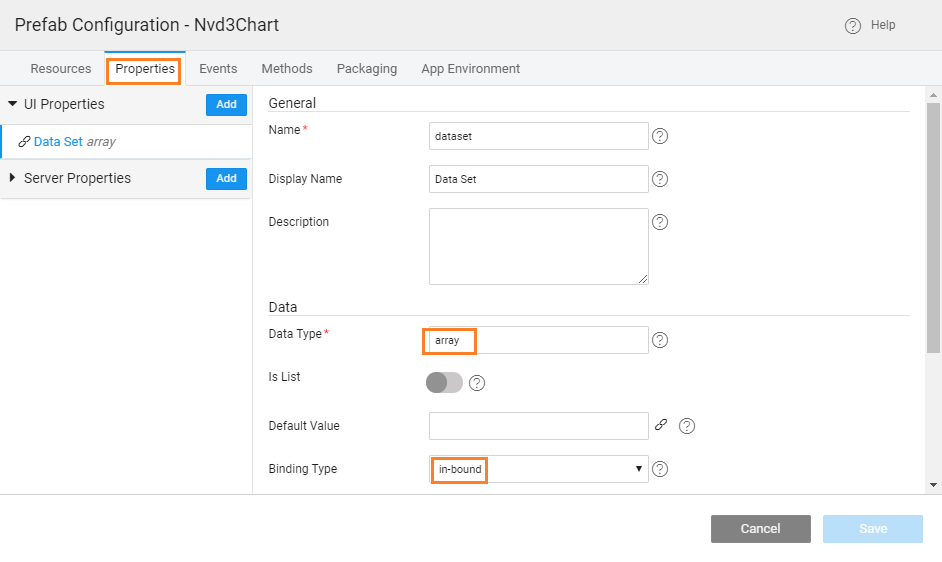

3 allows you to bind arbitrary data to a Document Object Model (DOM), and then apply data-driven transformations to the document. For example, you can use D3 to generate an HTML table from an array of numbers. Or, use the same data to create an interactive SVG bar chart with smooth transitions and interaction. The chart widgets which are offered by WaveMaker are based out of NVD3 charts, which are re-usable charts for D3 charts. and as such implementing any of the NVD3 & D3 charts becomes easy. Here we will see two simple examples - [chart (D3)](#creationd3) and [plus bar chart (NVD3)](#creationnvd3)

## D3 Charts

will see the implementation of a simple d3 line chart using [following example](http://www.sitepoint.com/creating-simple-line-bar-charts-using-d3-js/)

: This implementation is for D3 version: 3.5.17 charts.

1. on from the tab of the [Dashboard](http://[supsystic-show-popup id=102])
2. a name and description for the Prefab
3. the project setting without making any changes
4. the tab of the Main page
    
    - a variable var data = \[\];
    - the following code to the function. This code is taking the input data in the form of an object and generating the values to be represented on the sale- and year- attributes for the chart. **input object, according to the below code snippet, is expected to have at least two fields named budget and year** We are using this since in implementation we will show binding the chart to Department database.
        
         propertyChangeHandler(key, newVal, oldVal) {
            switch (key) {
            case "dataset":
                //                    debugger;
                var year = 2000;
                \_.each(newVal.data, function (obj) {
                    data.push({
                        "sale": obj.budget / 10000,
                        "year": year
                    });
        
                    year += 1;
                });
                renderChart();
                break;
            case "prop2":
                // do something with newVal for property 'prop2'
                break;
            }
        }
        /\* register the property change handler \*/
        Prefab.onPropertyChange = propertyChangeHandler;
        
    - the following code (you can copy and paste the same). This code is to set up the visual rendering of D3 chart.
        
         renderChart() {
            var vis = d3.select("#visualisation"),
                    WIDTH = 1000,
                    HEIGHT = 1000,
                    MARGINS = {
                        top: 20,
                        right: 20,
                        bottom: 20,
                        left: 50
                    },
                    xScale = d3.scale.linear().range(\[MARGINS.left, WIDTH - MARGINS.right\]).domain(\[2000, 2004\]),
                    yScale = d3.scale.linear().range(\[HEIGHT - MARGINS.top, MARGINS.bottom\]).domain(\[0, 350\]),
                    xAxis = d3.svg.axis()
                    .scale(xScale),
                    yAxis = d3.svg.axis()
                vis.append("svg:g")
                    .attr("transform", "translate(0," + (HEIGHT - MARGINS.bottom) + ")")
                    .call(xAxis);
                     yAxis = d3.svg.axis()
                    .scale(yScale)
                    .orient("left");
                vis.append("svg:g")
                    .attr("transform", "translate(" + (MARGINS.left) + ",0)")
                    .call(yAxis);
                var lineGen = d3.svg.line()
                    .x(function(d) {
                        return xScale(d.year);
                    })
                    .y(function(d) {
                        return yScale(d.sale);
                    });
                vis.append('svg:path')
                    .attr('d', lineGen(data))
                    .attr('stroke', 'green')
                    .attr('stroke-width', 2)
                    .attr('fill', 'none');
        
    - the above function when Prefab loads:
        
         = function() {
            renderChart();
        }
        
    
    
5. the tab add the following code within the _\-content_ tag: 
    
     <svg id="visualisation" width="100%" height="500"></svg>
    
6. [Resource](http://[supsystic-show-popup id=112]), to import the [3-min js](../assets/d3-min.zip) file (download and extract the file) into the Resource folder of your Prefab 
7. [Configurations](http://[supsystic-show-popup id=107]), choose Config Prefab under Settings:
    - Resources, add the js files  NOTE: You can expose many properties and set the values as static or dynamic to be bound. For details of the properties that can be exposed refer to the [3 website](https://d3js.org/)
    - **Property** - with attributes set to , set to (type it, if not selectable) and set to **\-bound** 
8. can set the display icon and mention the group for Prefab from the Packaging tab
9. can publish the Prefab to a project for testing or publish it to EDN for making it available across the enterprise.
10. and Publish the Prefab. You can set the version for the Prefab and Publish it. Know more about publishing Prefabs from
11. approved by the EDN Admin, the Prefab will be available for use across the Projects. You can see the entry in the Artifacts list from the Developer Utilities on the [Workspace](http://[supsystic-show-popup id=107]) Import it to see the same in the Widget Toolbox of any Project within your workspace.

## D3 Charts Prefab

1. the app, where you want to incorporate this Prefab.
2. you have published to the app, in the **section of the toolbox** on the left, you will see the newly imported Prefab.
3. and drop the Prefab onto the canvas and Bind its dataset property. For this example, we have bound it to the HrdbDepartmentData dataset, which is available on the [of sample database](http://[supsystic-show-popup id=106]) 
4. the app

## NVD3 Charts

the previous section, we have seen a simple implementation using D3 Chart. This section we will see the implementation of NVD3 charts. **3** is wrapper upon D3 which simplifies the implementation when compared to D3. These can also be incorporated easily into WaveMaker applications. In this section, we will see how to implement the Line Plus Bar Chart as [here](http://nvd3.org/examples/linePlusBar.html)

: This implementation is for NVD3 version: 1.8.4 charts.

1. on from the tab of the [Dashboard](http://[supsystic-show-popup id=102])
2. a name and description for the Prefab
3. the project setting without making any changes
4. [Resource](http://[supsystic-show-popup id=112]) to import the following resource files: [\-d3-min](../assets/nv-d3-min.zip) & [\-d3 file](../assets/nv.d3.zip) into the Resource folder of your Prefab (download and extract the files). 
5. the tab of the Main page
6. the following code (you can copy and paste the same). This code generates the sin and cosine values that can be represented on the chart. Note that for the sin values, the bar attribute is set to true, thus the sine values are represented as bar chart while cosine values are represented as line graph. [here for the code](../assets/nvd3_linegraph.txt) Enter the following function, too, within function after the above code. This code is to set up the visual rendering of NVD3 chart. [here for the code](../assets/nvd3_onReady.txt) 
7. the tab add the following code within the _\-content_ tag: 
    
            <svg id="visualisation" width="100%" height="500"></svg>
    
8. the app  Try selecting a part of the graph from the bottom miniature graph and see the UI changes
9. be used as the Prefab, it would be nice to bind the data to an object in the app using the Prefab instead of static graph display. Next couple of steps will help do the same
10. [Configurations](http://[supsystic-show-popup id=107]), choose Config Prefab under Settings:
    - Resources, include the script and css files imported earlier, you can pick from the drop down list  OR, You can instead include http url in place of script and style files: ://cdnjs.cloudflare.com/ajax/libs/nvd3/1.8.4/nv.d3.css ://cdnjs.cloudflare.com/ajax/libs/nvd3/1.8.4/nv.d3.min.js  NOTE: You can expose many properties and set the values as static or dynamic to be bound. For details of the properties that can be exposed refer to the [3 website](http://nvd3.org/)
    - **property dataset**, with as , (type if not selectable) as and **\-bound** as the attributes. 
    - the following code to the function. This function is triggered when the Prefab property changes in the incorporated app. This replaces the data built in the onInitPrefab function. Here, instead of taking static data, we are using the object passed to the Prefab to calculate the values to be represented on the x- and y-axis. **input object, according to the below code snippet, is expected to have two fields budget and q1** We are using this since in the app incorporating this Prefab we will see the binding with Department database. Add the following variable declaration:
        
            var data = \[\],
                sin = \[\],
                cos = \[\];
        
                switch (key) {
                   case "dataset":
                       //    debugger;
                       \_.each(newVal.data, function(obj, index) {
                           sin.push({
                               "y": obj.budget,
                               "x": index
                           });
                           cos.push({
                               "y": obj.q1,
                               "x": index
                           });
        
                       });
        
                       data = \[{
                           values: sin,
                           bar: true,
                           key: 'Sine Wave',
                           color: '#ff7f0e'
                       }, {
                           values: cos,
                           key: 'Cosine Wave',
                           color: '#2ca02c'
                       }\];
        
                       break;
                   case "prop2":
                       // do something with newVal for property 'prop2'
                       break;
               }
           }
        
        
    - can publish the Prefab to a project for testing or publish it to EDN for making it available across the enterprise.
    - and Publish the Prefab. You can set the version for the Prefab and Publish it. Know more about publishing Prefabs from
    - approved by the EDN Admin, the Prefab will be available for use across the Projects. You can see the entry in the Artifacts list from the Developer Utilities on the [Workspace](http://[supsystic-show-popup id=107]) Import it to see the same in the Widget Toolbox of any Project within your workspace.

## NVD3 Charts Prefab

1. the app, where you want to incorporate this Prefab
2. we published the Prefab, in the **section of the toolbox** on the left, you will see the newly imported Prefab
3. **and drop the Prefab** onto the canvas and bind its property. For this example, we have bound it to the _dataset_, [from the Database CRUD APIs](http://[supsystic-show-popup id=105]) available on the [of sample database](http://[supsystic-show-popup id=106]) 
4. the app 

[Use Cases](/learn/app-development/widgets/use-cases-prefabs/)

- [1\. Prefab to compare two strings](/learn/how-tos/create-simple-prefab/)
- [2\. Prefab using 3rd Party UI Widgets](/learn/how-tos/create-prefab-using-third-party-ui-widgets/)
- [3\. Prefab Using D3 & NVD3 Charts](/learn/how-tos/create-prefab-using-d3-nvd3-charts/)
    - [Implementing D3 Charts](#creationd3)
    - [Using D3 Charts](#usaged3)
    - [Implementing NVD3 Charts](#creationnvd3)
    - [Using D3 Charts](#usagenvd3)
- [4\. Prefab Using D3 Library (DataMaps)](/learn/how-tos/create-prefab-using-d3-library-datamaps/)
- [5\. Prefab Using JQuery Plugin - showcases using Events and Methods](/learn/how-tos/create-prefab-using-jquery-plugin/)
