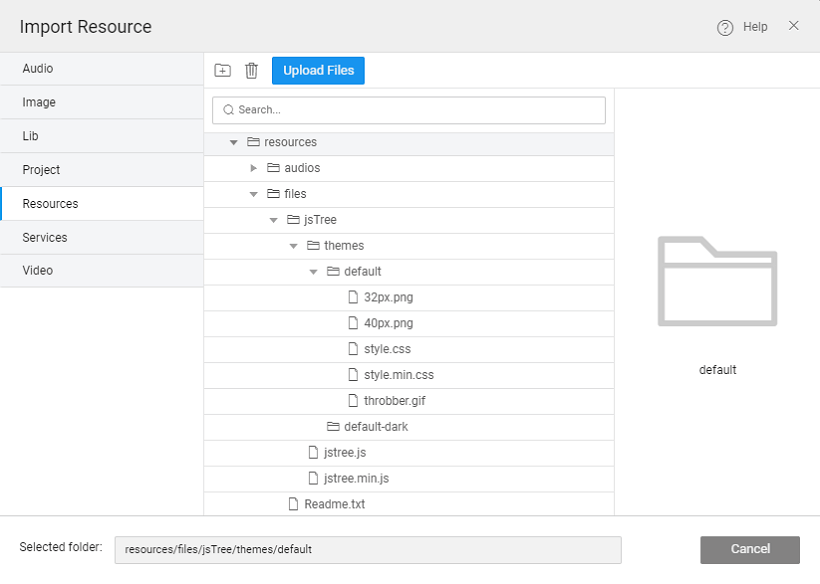
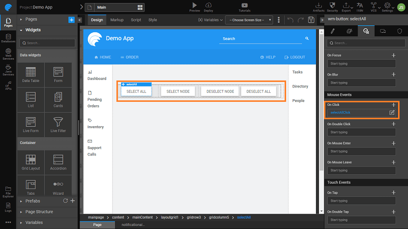
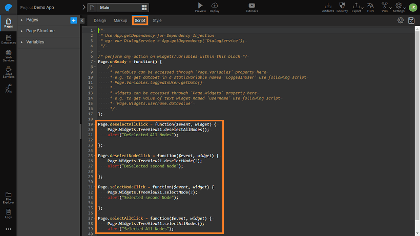

This post walks you through the creation and usage of a Prefab using JQuery Plugin. This is to showcase the use of Events and Methods in a Prefab.

Let us create a simple Prefab named TreeView which is interactive. We are going to use a JQuery plugin named jsTree is a JQuery plugin, that provides interactive trees. jsTree is easily extendable, theme-able and configurable, it supports HTML & JSON data sources and AJAX loading.

Download the jsTree JQuery Plugin from [://www.jstree.com/](https://www.jstree.com/) Unzip the file downloaded and use the files from the dist folder.

# the Prefab

1. on from the tab of the [Dashboard](http://[supsystic-show-popup id=102])
2. a name (say TreeView2) and description for the Prefab.
3. [Explorer](http://[supsystic-show-popup id=112]) add the JS and CSS files from the above-downloaded dist folder. Here we have created a folder to hold the same structure as the dist folder. 
4. [Configurations](http://[supsystic-show-popup id=107]), choose Config Prefab under Settings:
    1. the Resources tab, choose the css and js files. 
    2. the Properties tab, add an property as an object,array (type if not selectable) which should consist of parent and child node names: 
    3. the Events tab, add events to be triggered when a node is Selected, Deselected, Expanded or Collapsed. Note, by default two events are already given - Load and Destroy 
    4. the Methods tab, add the following methods:
        
        1. : Method to select a node
            - : Node, Type: any
            - type: void
        2. : Method to redraw the whole tree
            - type: void
        3. : Method to select all Nodes
            - type: void
        4. : Method to deselect all nodes
            - type: void
        5. : Method to deselect a node
            - : Node, Type: any
            - type: void
        
        
5. these properties, methods, and events are added to Prefab configuration in the Prefab Script the Method snippets will be auto-generated. You can fill with the code for the same.
6. is the script for all methods : Declare a variable:
    
     treeMapInstance;
    
    Property Change event:
    
     = function(key, newVal, oldVal) {
        switch (key) {
            case "treedata": //UI Property for the node array
                initJStreeView();
                break;
            case "multiple":
            case "dots":
                \_redraw();
                break;
        }
    };
    
    Function to initialize the tree view:
    
     initJStreeView() {
        var treeViewELe = Prefab.Widgets.treeViewContainer.$element;
        treeViewELe.jstree({
            core: {
                multiple: true,
                themes: {
                    dots: true,
                },
                data: Prefab.treedata
            }
        });
        treeMapInstance = Prefab.Widgets.treeViewContainer.$element.jstree(true);
        // treeViewELe.on("changed.jstree", function(node, action, selected, event) {
        //     console.log("The selected nodes are:");
        //     console.log(action.selected);
        // });
    
        // select event
        treeViewELe.on("select\_node.jstree", function(e, data) {
            Prefab.onSelect(e, data);
        });
    
        // deselect event
        treeViewELe.on("deselect\_node.jstree", function(e, data) {
            Prefab.onDeselect(e, data);
        });
    
        // expand event
        treeViewELe.on("open\_node.jstree", function(e, data) {
            Prefab.onExpand(e, data);
        });
    
        // collapse event
        treeViewELe.on("close\_node.jstree", function(e, data) {
            Prefab.onCollapse(e, data);
        });
    }
    
    Function to redraw the tree view:
    
     \_redraw() {
        if (treeMapInstance) {
            treeMapInstance.redraw();
        }
    }
    
    Methods for the tree:
    
    /\*
     \* Method to select all nodes
     \*/
    Prefab.selectAllNodes = function() {
        if (treeMapInstance) {
            treeMapInstance.select\_all();
        }
    };
    
    /\*
     \* Deselect all nodes
     \*/
    Prefab.deselectAllNodes = function() {
        if (treeMapInstance) {
            treeMapInstance.deselect\_all();
        }
    };
    
    /\*
     \* Method for selecting a node in the tree by id.
     \*/
    Prefab.selectNode = function(node, preventOpen) {
        if (treeMapInstance) {
            treeMapInstance.select\_node(node, false, preventOpen);
        }
    };
    
    /\*
     \* Method for deselecting a node in the tree.
     \*/
    Prefab.deselectNode = function(node) {
        if (treeMapInstance) {
            treeMapInstance.deselect\_node(node);
        }
    };
    
    /\*
     \* Re Draws the whole tree
     \*/
    Prefab.redraw = function() {
        \_redraw();
    }
    
7. a _\-container tag_ with the name in the Markup, as follows:
    
    <wm-container name="treeViewContainer"></wm-container>
    
    
8. the Prefab. Know more about publishing Prefabs from

# the Prefab in Project

1. us now use the above-created Prefab in an application.
2. are using the WaveMaker non-enterprise version and have Published the Prefab to Workspace.
3. _or Open an application_
4. can see the Prefab in the Prefab Listing.
5. the Main page drag and drop the TreeView2 Prefab. 

## Prefab Methods in Project

The prefab has exposed methods which can be triggered by the application as shown below.

1. call the exposed methods drag and drop **Button Widgets** in the main page under the Prefab and give the for the buttons as SELECT ALL, SELECT NODE, DESELECT NODE and DESELECT ALL. We have the buttons as selectAll, selectNode, deselectNode and deselectAll.
2. _Click_ events for each of the buttons. 
3. will create the snippet for the _<button>Click_ event in the script tab of the main page in the application.
4. code for the _<button>Click_ event will call the exposed methods respectively (check the name of the Button widget, it might be different if you have not named them as mentioned in step 1). Ensure that the Prefab name (TreeView21) matches what you have in your project:
    
     = function($event, widget) {
        Page.Widgets.TreeView21.selectAllNodes();
        alert("Selected All Nodes");
    };
    Page.selectNodeClick = function($event, widget) {
        Page.Widgets.TreeView21.selectNode(2);
        alert("Selected second Node");
    };
    
    Page.deselectNodeClick = function($event, widget) {
        Page.Widgets.TreeView21.deselectNode(2);
        alert("DeSelected second Node");
    };
    
    Page.deselectAllClick = function($event, widget) {
        Page.Widgets.TreeView21.deselectAllNodes();
        alert("DeSelected All Nodes");
    };
    
    

## Prefab Events in Project

The events are also exposed on the events tab and you can create actions for each of them.

Here we have created Notification Action to be displayed for each of the Event:

-  for **Select** - Create a Notification Action and when any node is selected, it will give a callback as a notification with the text “Node Selected”
-   **collapse** - Create a Notification Action and when nodes are collapsed, it will give a callback as a notification with the text “Nodes Collapsed”
-   **expand** - Create a Notification Action and when nodes are expanded it will give a callback as a notification with the text “Nodes expanded”
-  for  **deselect** - Create a Notification Action and when any node is deselected, it will give a callback as a notification with the text “Node DeSelected” 

The Prefab application can also add an Event listener for an event and take some appropriate action once the event happens.

## Data to Prefab in Project

Finally, this Prefab needs data to render in the Tree format.

1. this, we have created a Model Variable with the following JSON structure:
    
    \[
      {
        "id": 1,
        "text": "Root node",
        "state": {
          "opened": true
        },
        "icon": "",
        "type": \[\],
        "children": \[
          {
            "id": 2,
            "text": "Child node 1",
            "state": {
              "selected": true
            },
            "icon": "glyphicon glyphicon-flash"
          },
          {
            "id": 3,
            "text": "Child node 2",
            "children": \[
              {
                "id": 4,
                "text": "Child node 2 - 1",
                "state": {
                  "opened": true
                },
                "icon": "",
                "type": \[\],
                "children": \[
                  {
                    "id": 5,
                    "text": "Child node 2 - 1 - 1",
                    "state": {
                      "selected": true
                    },
                    "icon": "glyphicon glyphicon-flash"
                  },
                  {
                    "id": 6,
                    "text": "Child node 2 - 1 - 1",
                    "icon": "glyphicon glyphicon-flash"
                  }
                \]
              }
            \]
          },
          {
            "id": 7,
            "text": "Child node 3",
            "state": {
              "selected": true
            },
            "icon": "glyphicon glyphicon-flash"
          }
        \]
      }
    \]
    
    
2. the above Variable to the Tree Data property of the Prefab:  
3. the app and see the Prefab in action 

[Use Cases](/learn/app-development/widgets/use-cases-prefabs/)

- [1\. Prefab to compare two strings](/learn/how-tos/create-simple-prefab/)
- [2\. Prefab using 3rd Party UI Widgets](/learn/how-tos/create-prefab-using-third-party-ui-widgets/)
- [3\. Prefab Using D3 & NVD3 Charts](/learn/how-tos/create-prefab-using-d3-nvd3-charts/)
- [4\. Prefab Using D3 Library (DataMaps)](/learn/how-tos/create-prefab-using-d3-library-datamaps/)
- [5\. Prefab using JQuery Plugin](#)
    - [Creation](#creation)
    - [Usage](#usage)
        - [Invoking Methods](#methods)
        - [Invoking Events](#events)
        - [Passing Data](#data)
