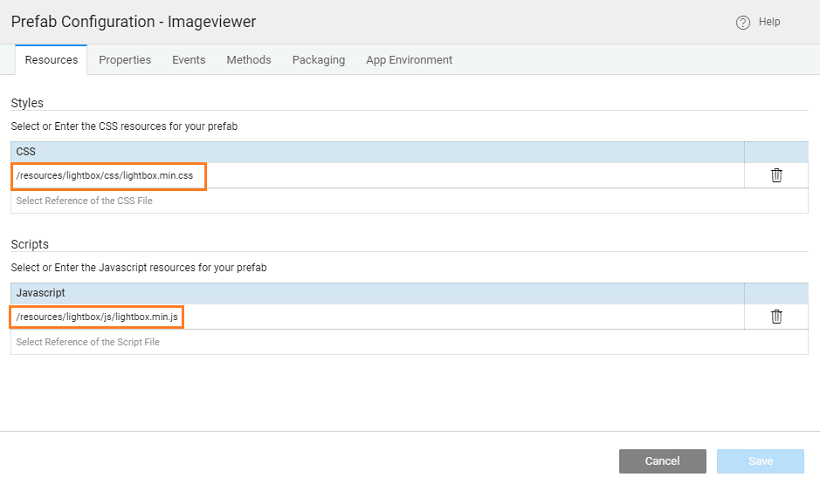
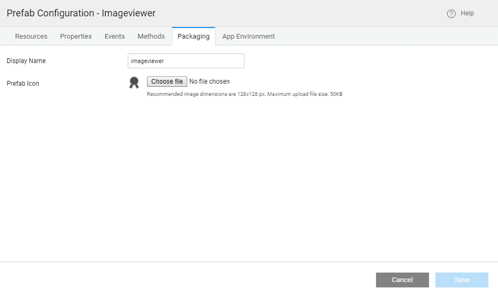

In this section, you will learn how to use third-party UI widgets in Studio. We do this with the help of Prefabs. We will use the example of integrating Lightbox image viewer in our application. It involves two steps – creating prefab and using the same. **\-Requisites**:

- the resources needed from [image viewer](http://lokeshdhakar.com/projects/lightbox2/) and unzip the file.

# Prefab

1. on from the tab of the [Dashboard](http://[supsystic-show-popup id=102])
2. a name and description for the Prefab
3. [the resources](http://[supsystic-show-popup id=112]) needed
4. **lightbox** with **sub-folders css, js and images**
5. the following files to their respective folders - **, lightbox.min.css and four images** You will find these files in the respective folders from the extracted folder _2-master/dist_ folder. 
6. [Configurations](http://[supsystic-show-popup id=107]), choose Config Prefab under Settings:
    - \- delete the from and add the following:
        - : include the css file imported in the above step
        - : include the js file imported in the above step 
    - : any properties you want to expose to the user of this prefab. Here we have set two properties and , both being _\-bound_

Name

Type

Value

Type

Type

://lokeshdhakar.com/projects/ lightbox2/images/image-1.jpg

\-bound

\-bound

7. can set the group and icon to be associated with the Prefab from the Packaging section. This will be displayed in the Widget toolbox of the apps after Publishing the Prefab (next section). 
8. we need to design the Prefab UI.
    - and drop an widget onto the canvas.
    - Caption property to blank and bind the Prefab Properties defined in the previous step as follows:
        - to the Prefab Property title, 
        - to the Prefab Property pic and
        - **Url** to the Prefab Property pic. Set Icon Width and Height to 100 
9. per Lightbox requirement, in the add attribute _\-lightbox _ the widget tag as shown below: NOTE: Be aware that the names might change as per your app specifics.
    
    <wm-prefab-container name="page1">  
         
        <wm-anchor data-lightbox="image-1" margin="unset 0.5em" name="anchor1" caption="" hint="bind:title" hyperlink="bind:pic" iconurl="bind:pic" iconwidth="100" iconheight="100"></wm-anchor>  
    </wm-prefab-container>
    
10. can test the Prefab using the option from the Main Menu, this will take the values provided in the Default Values section of Properties. You can change the In-bound property and see the change.

# Prefab

We will use the Prefab to display the image in an app.

1. and Publish the Prefab.
2. can set the version for the Prefab and Publish it. Know more about publishing Prefabs from
3. approved, the Prefab will be available for use across the Projects. An entry will appear in the Artefacts list from the Developer Utilities on the [Workspace.](http://[supsystic-show-popup id=107]) The Prefab needs to be imported before it can be used from the Widget Toolbox.
4. /Create a project to see the usage of the above Prefab. Import the Prefanb from Artifacts listing dialog. Drag and drop the onto the canvas.
5. the Title and Picture property. Here we are binding the Picture property to an image resource already imported into the app. 
6. the project, the image will be displayed.
7. the mouse over the image and see the name displayed in the hint field.
8. on one image to set Lightbox in motion, the image is displayed in the center of the page.

[Use Cases](/learn/app-development/widgets/use-cases-prefabs/)

- [1\. Prefab to compare two strings](/learn/how-tos/create-simple-prefab/)
- [2\. Prefab using 3rd Party UI Widgets](#)
    - [Creating Prefab](#create)
    - [Using Prefab](#using)
- [3\. Prefab Using D3 & NVD3 Charts](/learn/how-tos/create-prefab-using-d3-nvd3-charts/)
- [4\. Prefab Using D3 Library (DataMaps)](/learn/how-tos/create-prefab-using-d3-library-datamaps/)
- [5\. Prefab Using JQuery Plugin - showcases using Events and Methods](/learn/how-tos/create-prefab-using-jquery-plugin/)
