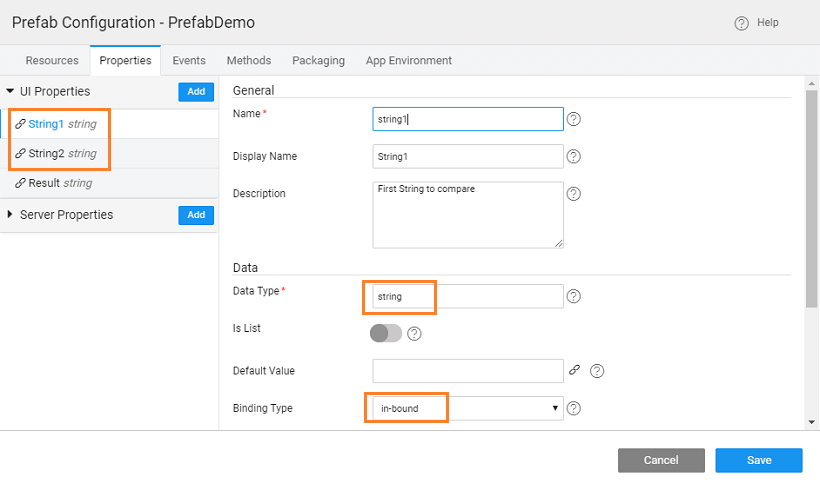
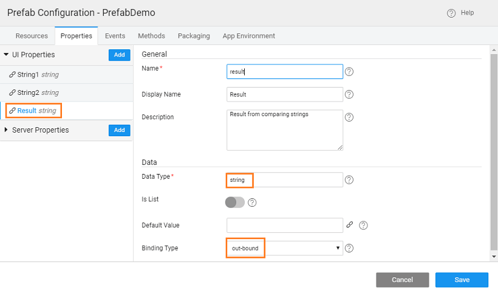
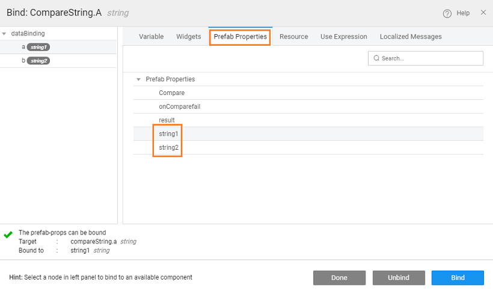
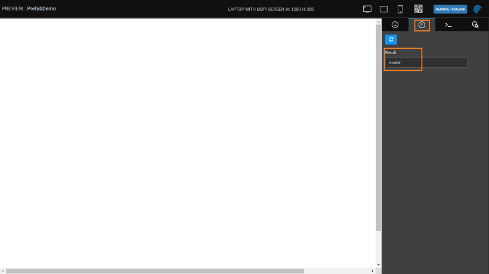
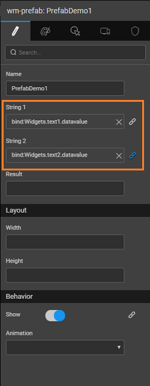
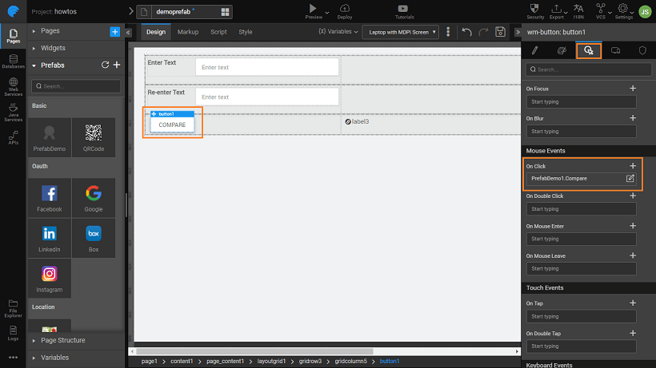

This post walks you through the creation and usage of a simple Prefab. We will be creating a Prefab which _two text strings_ and returns the result. For string comparison, we will be writing a _Java_ code.

# the Prefab

1. on from the tab of the [Dashboard](http://[supsystic-show-popup id=102])
2. a name and description for the Prefab
3. [Configurations](http://[supsystic-show-popup id=107]), choose Config Prefab under Settings:
    - the Properties tab, add two properties which will take in the two strings to compare  and one  property to return the result 
    - the Events tab, add an (Comparefail) which will be triggered when the comparison of strings fails. The event will be defined in the of the Prefab, the application using this Prefab will be defining the action for this event. Note, by default two events are already given - Load and Destroy 
    - can set the display icon and mention the group for Prefab from the Packaging tab
4. [a **Service**](http://[supsystic-show-popup id=119]) for the string comparison logic. Use the same names that you gave in the Methods of Prefab Settings, in this case, **\_compare** for _Service_ and for the Enter the following method to compare strings:
    
        
        public String confirm(String a, String b) {
            String result = null;
            if (a.equals(b))
            {
                result = "matched";
            }
            else
            { 
                result = "invalid";
            }
            return result;
        }
    
    }
    
    The final Java service should look like this:
    
    /\*Copyright (c) 2015-2016 wavemaker-com All Rights Reserved.
     This software is the confidential and proprietary information of wavemaker-com You shall not disclose such Confidential Information and shall use it only in accordance
     with the terms of the source code license agreement you entered into with wavemaker-com\*/
    package com.prefabdemo.string\_compare;
    
    import javax.servlet.http.HttpServletRequest;
    
    import org.slf4j.Logger;
    import org.slf4j.LoggerFactory;
    
    import org.springframework.beans.factory.annotation.Autowired;
    
    import com.wavemaker.runtime.security.SecurityService;
    import com.wavemaker.runtime.service.annotations.ExposeToClient;
    import com.wavemaker.runtime.service.annotations.HideFromClient;
    
    //import com.prefabdemo.string\_compare.model.\*;
    
    /\*\*
     \* This is a singleton class with all its public methods exposed as REST APIs via generated controller class.
     \* To avoid exposing an API for a particular public method, annotate it with @HideFromClient.
     \*
     \* Method names will play a major role in defining the Http Method for the generated APIs. For example, a method name
     \* that starts with delete/remove, will make the API exposed as Http Method "DELETE".
     \*
     \* Method Parameters of type primitives (including java.lang.String) will be exposed as Query Parameters &
     \* Complex Types/Objects will become part of the Request body in the generated API.
     \*/
    @ExposeToClient
    public class String\_compare {
    
        private static final Logger logger = LoggerFactory.getLogger(String\_compare.class);
    
        @Autowired
        private SecurityService securityService;
    
        /\*\*
         \* This is sample java operation that accepts an input from the caller and responds with "Hello".
         \*
         \* SecurityService that is Autowired will provide access to the security context of the caller. It has methods like isAuthenticated(),
         \* getUserName() and getUserId() etc which returns the information based on the caller context.
         \*
         \* Methods in this class can declare HttpServletRequest, HttpServletResponse as input parameters to access the
         \* caller's request/response objects respectively. These parameters will be injected when request is made (during API invocation).
         \*/
        public String sampleJavaOperation(String name, HttpServletRequest request) {
            logger.debug("Starting sample operation with request url " + request.getRequestURL().toString());
    
            String result = null;
            if (securityService.isAuthenticated()) {
                result = "Hello " + name + ", You are logged in as "+  securityService.getLoggedInUser().getUserName();
            } else {
                result = "Hello " + name + ", You are not authenticated yet!";
            }
            logger.debug("Returning {}", result);
            return result;
        }
    
        public String confirm(String a, String b) {
            String result = null;
            if (a.equals(b))
            {
                result = "matched";
            }
            else
            { 
                result = "invalid";
            }
            return result;
        }
    
    }
    
5. [a Variable](http://[supsystic-show-popup id=105]) invoke the Java Service (string\_compare) and method (confirm) within that service 
6. the _parameters_ of the Prefab to the Java Service, by binding them to the input fields accessible from the Data tab  
7. want the of the Prefab to be triggered when the returns an "invalid" message. This can be achieved by writing the appropriate for the event of the method accessible from the Events tab of the Variable.  You will find a message guiding you to the location of the JavaScript file. Click the link and use the following code in the JavaScript in the snippet
    
     = function(variable, data) {
        if (data === "invalid") {
            if (Prefab.onComparefail) {
                Prefab.onComparefail();
            }
        }
    };
    
8. result from the Java method needs to be bound to the outbound property declared in the above steps. From the Prefab Settings, Properties tab bind the of the Java Service to the property of the Prefab. 
9. and Preview the Prefab. Give the In-bound values: and see the result in the Out-bound properties tab:
10. the Prefab. 
11. can set the version for the Prefab and Publish it. Know more about publishing Prefabs from
12. Prefab will be available for use across the Projects. You can see the entry in the Artifacts list from the Developer Utilities on the [Workspace](http://[supsystic-show-popup id=107]) and in the Widget Toolbox of any Project within your workspace.

# the Prefab in Project

1. us now use the above-created Prefab in an application. _or Open an application_
2. the Artifact Listing, import the above published Prefab.
3. the Prefab appear in the section of the Toolbox. The group name (Basic, in this example) and the icon are the values set from the Packaging tab of Prefab Settings. 
4. two strings for comparison input to Prefab, a to hold the result from the Prefab, a to trigger the Prefab and the on the canvas. Your canvas should look like this (we have used a Grid Layout for widget placement) 
5. the _(inbound)_ of the Prefab to the two _box_ 
6. the on the canvas to the _(outbound)_ from Prefab. 
7. event of the invokes the _method_ 
8. the application:
    1. the same string in both the text boxes and see the comparison result:
    2. different string in the text boxes and see the comparison result

[Use Cases](/learn/app-development/widgets/use-cases-prefabs/)

- [1\. Prefab to compare two strings](#)
    - [Creation](#creation)
    - [Usage](#usage)
- [2\. Prefab using 3rd Party UI Widgets](/learn/how-tos/create-prefab-using-third-party-ui-widgets/)
- [3\. Prefab Using D3 & NVD3 Charts](/learn/how-tos/create-prefab-using-d3-nvd3-charts/)
- [4\. Prefab Using D3 Library (DataMaps)](/learn/how-tos/create-prefab-using-d3-library-datamaps/)
- [5\. Prefab Using JQuery Plugin - showcases using Events and Methods](/learn/how-tos/create-prefab-using-jquery-plugin/)
