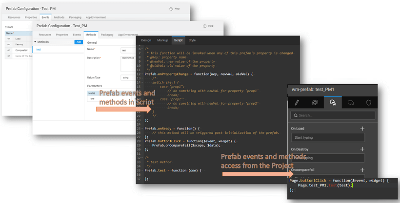
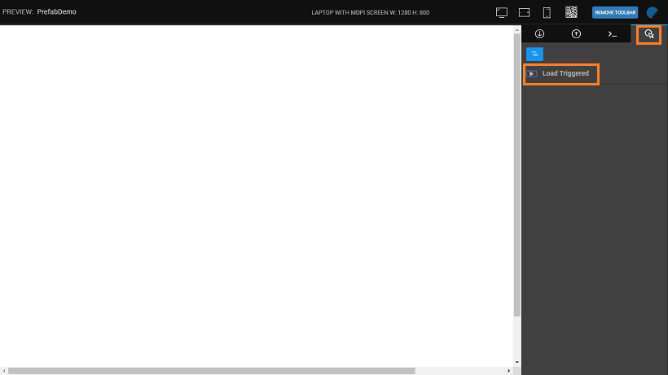
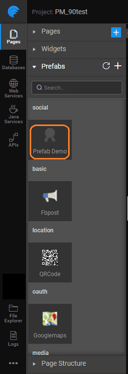
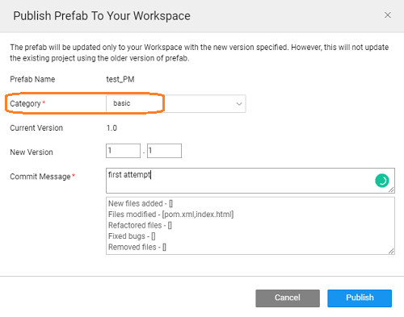
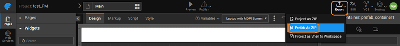
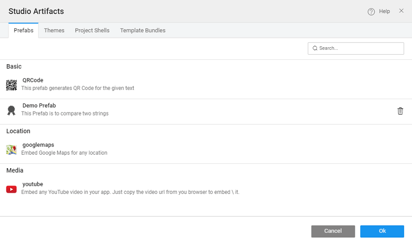

we have [here](/learn/app-development/custom-widgets/custom-widgets/), Prefabs are reusable application parts that interact with APIs and data on the web. Prefabs can be embedded and integrated into your applications with ease. You can create your own Prefabs using WaveMaker.

this document, we will be discussing the various phases of building you own Prefabs:

- [Prefab](#build-prefabs)
- [Configuration](#prefab-settings) like resources, properties, events, methods, and packaging.
- [Prefabs](#publish-prefab) - [to workspace](#publish-to-workspace), [a published prefab](#update-prefab), [in a project](#update-in-project), and [mismatches](#conflicts)
- [Prefab](#delete-prefab) from your project
- [Prefab through Script](#accessing-prefab-through-scripting)

# your own Prefabs

are reusable application parts that interact with APIs and data on the web. Prefabs can be embedded and integrated into your applications with ease. You can create your own Prefabs using WaveMaker. 

1. the [**Dashboard**](http://[supsystic-show-popup id=102]), select  tab and click
2. a , set an for the Provatar and enter
3. the and information and to continue. Make changes if needed.

#  Configuration

, from [Configurations](http://[supsystic-show-popup id=107]) click  to select **Prefab** option. The various configurations are grouped under various headings for developer convenience

Under this tab, you can set the following resource references as needed by your Prefab. Before setting the details, you will need to [Resource](http://[supsystic-show-popup id=112]) into your Prefab project.

1. : The CSS style associated with the project will be applied to this prefab. You can add your own style file.
2. : Any scripts that need prior execution can be added here.

can add Prefab properties, which are exposed to the developers using the Prefab. These properties can take some input from the app(inbound) or give some output to the app(outbound) or both. These properties are defined in the Prefab scope. These properties will be displayed in the properties panel when the user uses the Prefab. The properties are further classified into UI and Server properties.

- _Properties_: These are the properties that can be set from the front-end by the app developer using the Prefab
    - :
        - a meaningful name in small characters,
        - _Name_: property for setting the display name of the property in the properties panel,
        - : This property can be used to set the help text for the property in the properties panel. This will also be used when generating Documentation for the Prefab while publishing the same,
    - :
        - _Type_: of the value that can be entered for this property,
        - _Value_: value given to the property, in case the user does not enter any value,
        - _Type_: specifies the binding behavior of the property:
            - _\-bound_ allows binding for input value for the property by giving a bind icon next to it,
            - _\-bound_ allows for the value of this property to be bound to another widget by exposing it in the binding dialog,
            - _\-out-bound_: allows both input and output binding.
    - : to be displayed in the properties panel  - only for inbound properties
        - : of widget for display;
        - _Options_: list of values for user selection. (NOTE: Available only for the select, checkbox set, radioset widget type and can be bound to a variable). This can be set to:
            -  - Dataset property can be populated with comma-separated values or bound to a variable.
            - _on UI property_ - Property Name can be set to the already declared in-bound property. If the selected property has an object structure the same will be retained.
        - : whether the property is visible or not, can be conditional if bound to a variable returning a boolean value;
        - : whether the property is disabled or not, can be conditional if bound to a variable returning a boolean value.
- _Properties_: These are the properties that need to be set from the back-end (using Java service) by the app developer using the Prefab. These would typically include the token for authorization etc..
    - : of the property
    - _Value_: for the property.

You can define events that can be handled by the developers using the Prefab. These events will be exposed under the events tab when the developer uses the Prefab, the developer can handle these events as per their requirements. By default, two events are defined - and which will be triggered when the Prefab is loaded and deleted, respectively, from the app. Each Event will have the following properties that can be set:

- of the event. It should be lower case and without any special characters. The event name gets prefixed with and the first alphabet will get capitalized. For example, if you name an event the event variable created would be
- of the event. This will be used in the generatation of the documentation for the Prefab while publishing.

### Flow

Following are the pre-defined events for every Prefab:

- **Load**: this event is triggered whenever the page containing the Prefab loads or when the Prefab is dragged and dropped onto a page. This event is exposed to the Prefab user and can be further customized. It is displayed in the Events tab of the Prefab properties panel, after drag and drop in the project page.
- **Property Change**: is triggered when any Prefab property is changed. This event is available only to the Prefab developer and is not exposed to the Prefab user.
- **Destroy**: is triggered when the page containing the Prefab is closed or the Prefab is deleted from the page. This event is exposed to the Prefab user and can be further customized. It is displayed in the Events tab of the Prefab properties panel, after drag and drop in the project page.

Apart from these, Prefab developer can define **events**, as mentioned in the previous section. These events are displayed in the Events tab of the Prefab properties panel, after drag and drop in the project page. Note that these custom events need to be triggered from within the Prefab. Actions assigned to these events from the project containing the Prefab will be performed only when the event is triggered. Events can be triggered using the following code (parameters $scope and $data are optional):

<event\_name>($scope, $data)

You can define functionality in JavaScript which can be used by the developer. The developer can choose to invoke these methods in any way within the application using the Prefab as follows:

<prefab\_name>.<method\_name>(<parameter\_values>)

- of the method;
- of the method. This will be used in the generation of the documentation for the Prefab while publishing;
- _Type_ of the method;
- required by the method.

If the method does not exist, a function definition for the method will be generated in the JavaScript which can be accessed from the Script tab of the Prefab.  [here to see the creation of a Prefab using Events and Methods](/learn/how-tos/create-prefab-using-jquery-plugin/)

define how the Prefab appears in the Widget Toolbox in the apps

1. _:_ display name for the Prefab.
2. : The icon displayed on the project dashboard for this Prefab can be changed by uploading it.

# Prefab

preview option on Prefab allows you to test your Prefab. The following options are available from the Preview screen:

1. In-bound Properties are listed and you can enter the test values. 
2. result is displayed from the Out-bound Properties tab. 
3. various methods included in the Prefab can be viewed and invoked from the Methods tab. 
4. various events invoked can be viewed from the Events Tab. 

# Prefab

a Prefab has the following options:

- **to Project:** Prefab can be made available to a specific project in your project workspace or network for testing purpose only.
    - Prefab will only appear in the specified project's widgets panel for use
    - Project which is using a test Prefab cannot be pushed to VCS
- **to Workspace** (non-enterprise version):
    - Prefab will appear in the Widget Panel for all projects within your workspace 
- **to EDN** (enterprise version)**: ** needed by EDN Admin
    - can publish the Prefab to EDN, and make it available to the entire enterprise
    - Admin approval, the Prefab will be listed in the artifact repository listing
    - the Prefab to see it in the Widget Panel for drag and drop usage. 

Once the published Prefab is imported it will be available in the Widget Toolbox for drag and drop usage. You can use the refresh icon to check for any modification/updates in the Prefab. 

## Prefab to Workspace

##### Only for non-Enterprise Version

Using the Publish to Workspace option from the Main Menu listed under the app name, you can make your Prefab available across all projects within your workspace.  Once Published the Prefab will be displayed in the Prefab section of the Widgets Panel under the category specified at the time of publishing.  If you want to share the Prefab with another WaveMaker Developer, Export the Prefab as Zip. This zipped file can be imported from the Prefab section of the Project Workspace. 

## Prefab to EDN

##### Only for Enterprise Version

Using the Publish to EDN option from the Main Menu listed under the app name, you can make your Prefab available across all projects. Refer to [Publishing Mechanism](/learn/app-development/wavemaker-overview/artifacts-repository/#publishing) for more details. 

Once approved, these Prefabs will be available for Import from the Artifacts List. : To use the Prefab in a project, the developer must Import the prefab into the project from the artifact repository and refresh the Prefab panel.

## Prefab to Project

Sometimes a Prefab may be used within a single project for testing purposes while it is still in development stages or changes made to a Prefab needs to be incorporated into a single project. In such cases, you can choose to **Prefab to Project** You can choose the project to which the Prefab needs to be updated, by selecting from the list. The Prefab will be displayed in the Widget Panel under Prefab section with a tag to indicate that it is an unpublished Prefab.

You need to remember the following:

- version of the Prefab will not be available to other projects within your Project Workspace, nor will it appear in the Artifacts list (if not published).
- it is an already published Prefab:
    - you open the selected project, you will be prompted either to to the published Prefab or with the modified, unpublished version.
    - to continue, when you want to test the Prefab for any changes before Publishing the changes.
-  the Prefab is not published
    - have published the Prefab directly to the project, or,
    - have imported a project zip file and it uses a Prefab that does not exist in your workspace, or,
    - have deleted the Prefab from the Artifacts dialog.

## Prefab

In continuous development scenario, Prefabs may be enhanced to incorporate new functionality. In such cases you need to Publish the Prefab, changing the version number. **Prefabs**: By updating the Prefab version while publishing the Prefab will update the version and the latest version will be available across all the projects. When a project using this Prefab is opened,  the developer will be prompted to update the same within the project. When you open a project using the Prefab (i.e the Prefab was dragged and dropped onto the canvas) you will see a dialog asking you to update the Prefab You can choose to update or continue with the previous version. In case you choose to continue with the previous version, whenever you try to drag and drop the Prefab, you will be prompted to update the same.

## Mismatches

Conflicts can arise when different versions of Prefabs are in use. Consider the following cases:

- **1**:
    
    - P is using Prefab A (ver 1.0).
    - and drop Prefab B which internally uses Prefab A (ver 2.0).
    - arises over the version of Prefab A.
    
    
- **2**:
    
    - P is using Prefab A which internally uses Prefab C (ver 1.0).
    - and drop Prefab B which internally uses Prefab C (ver 2.0).
    - arises over the version of Prefab C.
    
    
- **3**:
    
    - P is using Prefab A ver 1.0 and Prefab B which internally uses Prefab A (ver 1.0).
    - on Prefab A (ver 2.0) is available.
    - P tries to update Prefab A.
    - arises over the version of Prefab A.
    
    
- **4**:
    
    - P is using Prefab A and Prefab B
    - the Prefabs use Prefab C (ver 1.0).
    - A (ver 2.0) is updated with Prefab C ver 2.1.
    - P tries to update Prefab A.
    - arises over the version of Prefab C.
    
    

In all of the above cases, WaveMaker gives you an option of

- **Anyway**: which will update the Prefab in conflict. This might break the functionality of the other Prefab which uses the conflict Prefab, or
- : this will retain the older version of the Prefab in conflict and cancel the current action which resulted in the conflict - drag and drop of Prefab B in Case 1 & 2 or update Prefab A in Case 3 & 4. 

## Special Case

In case an updated dependent Prefab is deleted that the force update will be reverted in the conflict Prefab. Revisiting the Case 4 above:

- **4**:
    
    - P is using Prefab A and Prefab B
    - the Prefabs use Prefab C (ver 1.0).
    - A (ver 2.0) is updated with Prefab C ver 2.1.
    - P tries to update Prefab A.
    - arises over the version of Prefab C.
    
    

Assume that the Project P developer choose to update Prefab C

- Prefab A and Prefab B are working with Prefab C ver 2.1.
- that Prefab A is updated to ver 2.1 wherein the Prefab C has been deleted
- Project P updates Prefab A to ver 2.1, then the Prefab C in Prefab B will be reverted to the original ver 1.0.

# Prefab

You can delete a custom Prefab from your project using the delete icon in the [Artifacts](http://[supsystic-show-popup id=120]) listing dialog.

# Prefab through Scripting

- the Prefab properties are set, a event is created, which can be programmed from the Script. 
- exposed properties are defined on the Prefab scope. They can be accessed/modified in the Prefab script using: \[propertyname\]

We have seen the basics of creating a Prefab including the configuration settings, and various publishing options. Check out various use cases for Prefab creation by [this link](/learn/app-development/custom-widgets/use-cases-prefabs/)

< Prefabs

Use Cases >

4\. Prefabs - Custom Widgets

- 4.1 Prefabs - Custom Widgets & Extensions
    - i. Overview
        - [Understanding Prefabs](/learn/app-development/custom-widgets/custom-widgets/#)
        - [Prefabs & API Integration](/learn/app-development/custom-widgets/custom-widgets/#prefabs-apis)
        - [Prefab Benefits](/learn/app-development/custom-widgets/custom-widgets/#prefab-benefits)
        - [Prefab Anatomy](/learn/app-development/custom-widgets/custom-widgets/#prefab-anatomy)
        - [Prefab Types](/learn/app-development/custom-widgets/custom-widgets/#prefab-types)
    - [Prefab Features](/learn/app-development/custom-widgets/custom-widgets/#prefab-features)
    - [Publishing Prefabs](/learn/app-development/custom-widgets/custom-widgets/#publishing-prefabs)
    - [Importing Prefabs](/learn/app-development/custom-widgets/custom-widgets/#importing-prefabs)
    - [File Structure](/learn/app-development/custom-widgets/custom-widgets/#files-prefabs)
- 4.2 Predefined Prefabs
    - [Basic Prefabs](/learn/app-development/widgets/widget-library/#prefabs)
    - [OAuth Prefabs](/learn/app-development/widgets/prefab/oauth-prefabs/)
- [4.3 Custom Prefabs](#)
    - [Creation](#)
    - [Configuration](#prefab-settings)
    - [Testing](#testing-prefab)
    - [Publishing](#publish-prefab)
    - [Script Access](#accessing-prefab-through-scripting)
    - [Use Cases](/learn/app-development/ui-design/use-cases-prefabs/)
