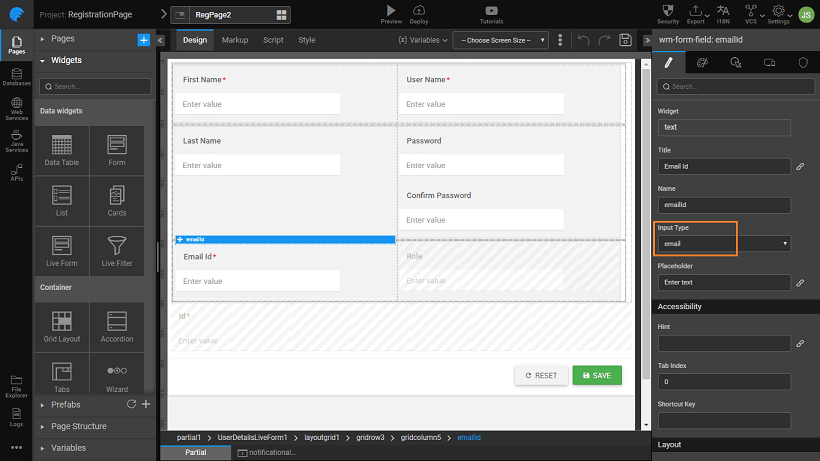
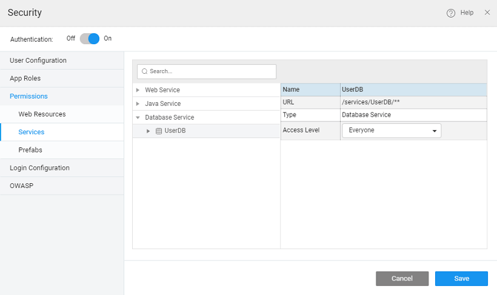
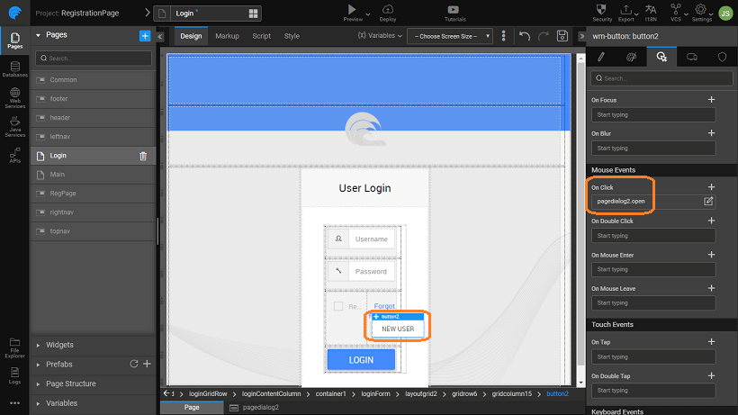
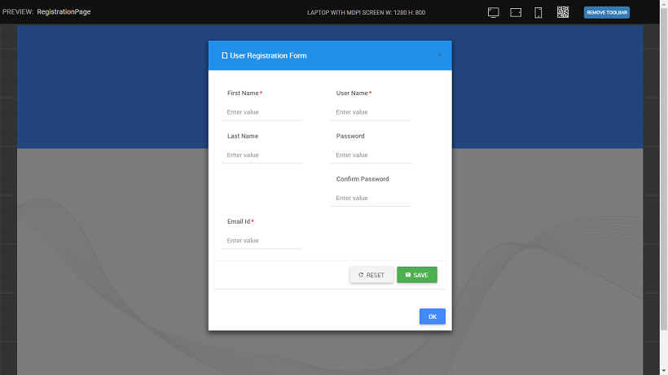
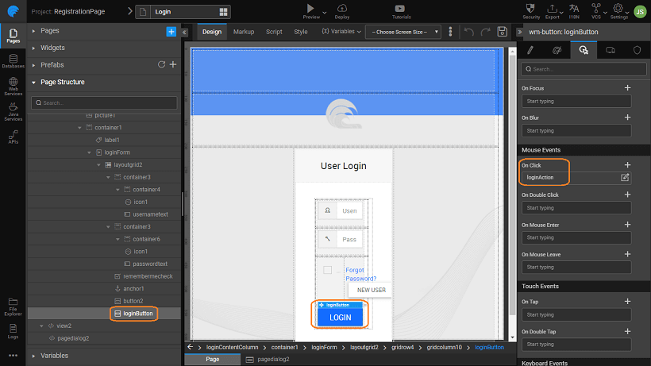

[security and login pages](http://[supsystic-show-popup id=111]) to your application is a good idea and simple one at that. another story. Registration is a common process in web applications. Many applications have the facility to self-register and then allow registered users to login to the applications. The link to registration page is provided on the login page. In this post we will see how to create this registration page using WaveMaker Studio. In this section you will see

1. to [a registration page](#design),
2. to link the registration to the [security and login page](#login), and
3. [encryption](#encryption) to password field using Java service

1. [user database](http://[supsystic-show-popup id=106]) - this should contain the details of the users, their usernames, password etc. 
2. the registration page - create a **page** to allow a new user enter his/her details. Live Form will allow user to enter their details and insert the details to the database table. Drag and drop a Live Form widget, use the Database CRUD from the UserDB service and the UserDetails table and set the properties, as per your app requirements. We have used the following settings:
    - column layout with first name, last name and email id in the first column; username, password, and role in the second column,
    - First Name, and Username as Required fields,
    - Id is also set as Required and in addition, the Input Type is set as email. This will auto validate the field entry to be in the email format with @ symbol 
    - a text widget for confirm password field,
    - default value for Role field to 'User' and set it as hidden. 
3. Variable with the User table is created which will perform the insert into the database automatically. 
4. case of any processing that needs to be done before insertion, it can be done from the Form on Before Service Call event. You can add any other validation checks here. For example, in this script we are ensuring the the entries match. The appropriate message is loaded into the _Action_ and is invoked. NOTE: We have already created a the Notification Action needs to be created.
    
        Partial.UserDetailsLiveForm1Beforeservicecall = function($event, $operation, $data, options) {
            if ($data.password != $data.confirm\_password) {
                Partial.Actions.password\_error.invoke({
                    "message": "Password Mismatch, try again",
                    "position": "center center"
                });
                return false;
            }
        };
    
    
5. and set the _Provider_ to be the UserDB from step 1  Set the permissions level for _ page_, and  to _ all_ This is essential since we want the new users to be able to access to the registration page and add their details to the database.  
6. login page:
    - the Login page by selecting it from the Resources
    - a widget, with content as the registration partial page. 
    - back to the _page, (_ the Page tab from the bottom)
    - **New User button**, should open the registration page dialog. 
7. when you run the application, you see the **User** button on the page. 
8. on it will take you to the _Registration_ page. 
9. on the button without entering the _name_ or with not matching in the two fields, will display the _message_
10. all required data and clicking , displays the _message_
11. you can with the new credentials.

## Encryption

To ensure that the password field is secure, it is advisable to store it in an encrypted format. For this, we will use an md5 code to encrypt the password entry before passing it onto the live variable for insert into the database table.

NOTE: This method is useful for enforcing two-way encryption, i.e. in addition to the SSL communication, you can encrypt the password before sending it to the backend. In case you want to use the One-way Digest method of scrambling the encrypted value to produce a digest we suggest you follow the steps given in [document](/learn/how-tos/support-password-encryption/)

1. [a Java Service](http://[supsystic-show-popup id=119]) called MD5Encryption.
2. the following to the Java Service code. Here we are using an MD5 hashing algorithm to generate a checksum for the password field, refer here for more Ensure that the length of the password column in the database is greater than the length of the result from the encryption algorithm used, in this case, it should be greater than 32. Import the following files:
    
     org.apache.commons.codec.digest.DigestUtils;
    import java.io.UnsupportedEncodingException;
    import java.security.MessageDigest;
    import java.security.NoSuchAlgorithmException;
    import java.util.logging.Level;
    
    Use the following method to encrypt the password:
    
        public String md5Spring(String text) {
             String digest = null;
            try {
                MessageDigest md = MessageDigest.getInstance("MD5");
                byte\[\] hash = md.digest(text.getBytes("UTF-8"));
                StringBuilder sb = new StringBuilder(2 \* hash.length);
                for (byte b: hash) {
                    sb.append(String.format("%02x", b & 0xff));
                }
                digest = sb.toString();
            } catch (UnsupportedEncodingException ex) {
                //Logger.getLogger(StringReplace.class.getName()).log(Level.SEVERE, null, ex);
            } catch (NoSuchAlgorithmException ex) {
               // Logger.getLogger(StringReplace.class.getName()).log(Level.SEVERE, null, ex);
            }
            return digest;
    
        }
    
3. [a variable](http://[supsystic-show-popup id=105]) to invoke the Java Service created above  and set the input data to the password widget of the registration page. 
4. Password field needs to be replaced with the encrypted one returned from the above Java service. For this, we will be using the _Before Service Call_ event of the Live Form, we are invoking the Java service variable and setting the password field to the value returned from the Java Service.
    
        Partial.UserDetailsLiveForm1Beforeservicecall = function($event, $operation, $data, options) {
            if ($data.password != $data.confirm\_password) {
                Partial.Actions.password\_error.invoke({
                    "message": "Password Mismatch, try again",
                    "position": "center center"
                });
                return false;
            } else {
                Partial.Variables.md5InsertJava.invoke();
                $data.password = Partial.Variables.md5InsertJava.dataSet.value;
            }
    
        };
    
5. that in the dialog box, the Java Service created has permission level.
6. your
    1. a variable for the _Service_ created, 
    2. the _data_ to the widget on the login page, 
    3. , set the data to the value returned by the above service variable. 
    4. the event of the **In** to This will ensure that when any user logs in, the password is encrypted before checking it against the database by the login variable. 
7. application will work as before. The only change would be the values stored in the database, now the password field will be encrypted. 

- [Design a registration page](#design)
- [Security and login page](#login)
- [Password Encryption](#encryption)
