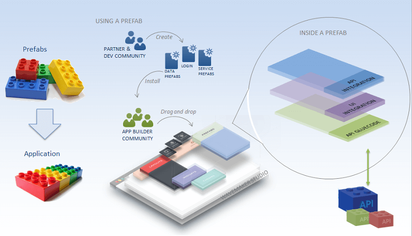
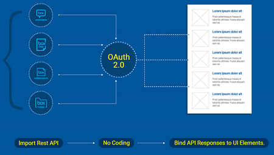
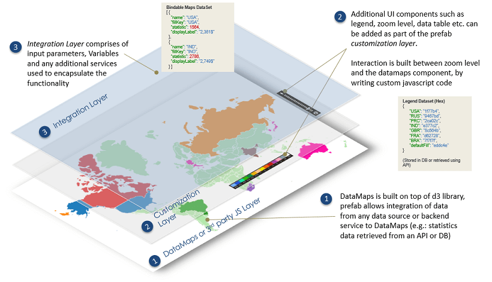
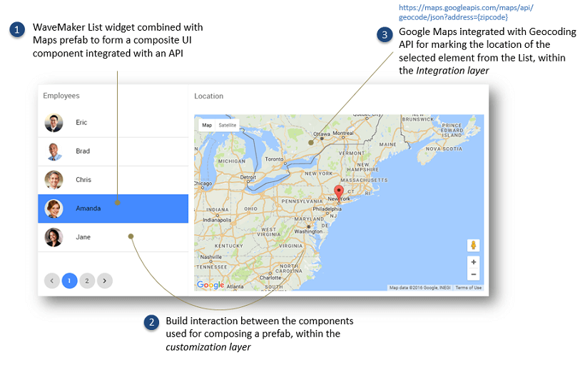
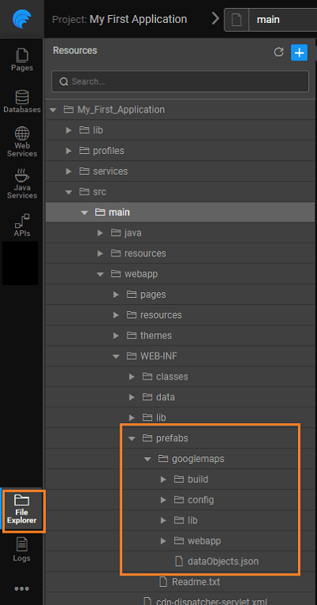

is a reusable, distributable component of an application, which can be tested independently. It can interact with APIs and data on the web. Prefabs can be embedded and integrated into your applications with ease.

this document the following topics related to Prefabs are covered:

- , and of a Prefab,
- [features](#prefab-features) of a Prefab,
- Prefabs in your application by and , and
- of the Prefab code.

# Prefabs - An Example

following example is a document collaboration use case, where multiple users can annotate, comment and collaborate changes to a document. A Prefab can be built which shows all comments made on the document, retrieving them from an API. Prefab can be associated with the context of the document and organization/user to which the document is associated. Within this app or other apps wherever file comments are shown, this prefab could be simply reused.

Prefab can be made to tightly integrate with specific APIs as shown below. Prefab parameters can be defined to externalize configurations such as email, organization account, etc. to carry the content.

# & API Integration

Prefabs make API integration a lot easier. You can

1. with REST API by importing API as a Service
2. the transaction via the built-in OAuth 2.0 handshake without the need to write additional code
3. the JSON responses by binding them to UI elements or widgets
4. input parameters through Prefab settings
5. data output and events for client-side integration

# Prefabs

Benefits of Prefabs are multifold. To list a few:

1. are reusable, API-integrated components that can be used across apps.
2. encapsulate functionality, interaction & data.
3. widgets can be built by composing from existing widgets – Extensions.
4. widgets can be built by wrapping 3rd party JavaScript frameworks – jQuery extensions, d3 visualization components etc.
5. \-usable backend Services can be built leveraging 3rd party Java Libraries – Jasper reports, Apache POI, etc.

#  Anatomy

leverage all the features available to a WaveMaker app, completely encapsulating them into one reusable component. Their UI Layer is composed of multiple widgets and acts as a single component, which is integrated with corresponding back-end services and they expose events & methods for integration with the enclosing app.

# Types

can be applied in many situations, Broadly, they fall into following categories:

1. **widget extensions**: they can be built on top of 3rd party JS libraries and extend these libraries' functionality; 
2. **API integrated components**: WaveMaker UI components can be made to interact with the Prefab APIs to customize the Prefab behavior; 
3. **Backend service extensions**: reusable backend services can be built by leveraging 3rd party Java libraries. 

# Features

, like any widget, have the following features that can be set:

1. : If a Prefab exposes properties, you can set them using the Properties Panel. Depending upon the complexity of the Prefab, you may need to integrate the Prefab into your page using code.
2. : There are two default events which can be handled - on Load and on Destroy. These events get triggered when the Prefab is loaded or removed, respectively, from the page containing the Prefab. Any other events that have been defined by the Prefab developer will also be listed and these can be handled by the user.
3. : Any methods that have been written and exposed by the Prefab developer will be available for invocation by binding them to an event of any widget.

[more about Prefab settings](/learn/app-development/widgets/creating-prefabs/#prefab-settings)

# Prefabs

Once you have created a Prefab, it needs to be published in order for the apps to use it. [more about Publishing Prefabs](/learn/app-development/widgets/creating-prefabs/#publish-prefab)

# Prefabs

1. use a prefab for the first time, it needs to be imported into your app. You can import your prefabs by clicking + on the Prefab Resource panel.
2. imported, you can find the prefab in the  section of the **Resources** These prefabs are grouped into categories like Media, location, etc., as defined in the properties of the Prefab at the time of creation.
3. can use prefabs in any of your projects by simply dragging them from the   section of the **Resources** dropping them onto your page, like any other widget. Once, embedded into the page, all the functionality of the prefab becomes part of that page.
4. can find the list of available Prefabs from the [Artefacts](http://[supsystic-show-popup id=120]) page.

**:**

1. Published Prefabs will be available under Prefabs, without needing to Import. Just click the refresh icon if you don't find the Prefab.
2. incorporate any changes made to an already imported prefab, it needs to be re-imported to an updated version of the project. Use the refresh icon for the same.
3. a prefab already incorporated into a project will not affect the project.
4. using a Prefab in your applications, ensure that the widget names in the application do not conflict with the widgets names used in the Prefab.

# Structure for Prefabs

When a prefab is imported into a project, it places the prefab content into the folder: `/main/webapp/WEB-INF/prefabs/{prefab-name}.` For each Prefab imported a separate folder is created, with the same name as that of the Prefab.

**:** Deleting this folder will delete the Prefab from the project.

For each Prefab you will find 3 subfolders:

- - \- consisting of the configuration files
    - \- any library files like jar files uploaded while Prefab creation
    - \- contains the pages comprising the Prefab and any resources imported

In this document, we have learned the basics of a Prefab what they are and how they are implemented within WaveMaker. For details on how to use [Prefabs](/learn/app-development/widgets/widget-library/#prefabs) or to [your own Prefabs](/learn/app-development/custom-widgets/creating-prefabs/) refer the links.

\-defined Prefabs >

Prefabs >

4\. Prefabs - Custom Widgets

- [4.1 Prefabs - Custom Widgets & Extensions](#)
    - [Overview](#)
        - [Understanding Prefabs](#prefabs-example)
        - [Prefabs & API Integration](#prefabs-apis)
        - [Prefab Benefits](#prefab-benefits)
        - [Prefab Anatomy](#prefab-anatomy)
        - [Prefab Types](#prefab-types)
    - [Prefab Features](#prefab-features)
    - [Publishing Prefabs](#publishing-prefabs)
    - [Importing Prefabs](#importing-prefabs)
    - [File Structure](#files-prefabs)
- 4.2 Predefined Prefabs
    - [Basic Prefabs](/learn/app-development/widgets/widget-library/#prefabs)
    - [OAuth Prefabs](/learn/app-development/widgets/prefab/oauth-prefabs/)
- 4.3 Custom Prefabs
    - [Creation](/learn/app-development/widgets/creating-prefabs/)
    - [Configuration](/learn/app-development/widgets/creating-prefabs/#prefab-settings)
    - [Publishing](/learn/app-development/widgets/creating-prefabs/#publish-prefab)
    - [Script Access](/learn/app-development/widgets/creating-prefabs/#accessing-prefab-through-scripting)
    - [Use Cases](/learn/app-development/ui-design/use-cases-prefabs/)
