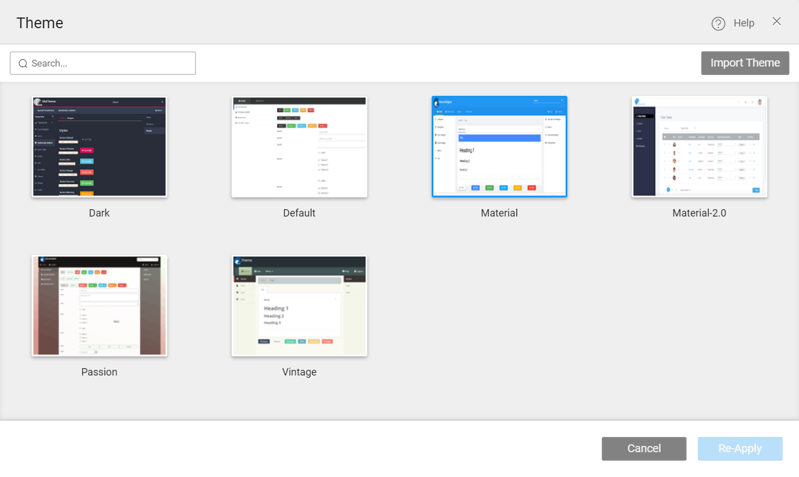

Themes are used to provide consistent usage of font, color, border, and layout throughout the application. WaveMaker provides sample themes that you can apply to your app. If needed you can make changes to the same. This How-To talks about customizing an existing WaveMaker theme. The steps include:

1. Theme to WaveMaker app,
2. changes to the WaveMaker theme from Grunt,
3. the Theme and Import to apply to the app.

## to apply Theme

1. the Project Toolbar bar, select Themes option. 
2. opens the theme window.
3. the desired theme or search the theme name and click on Apply button 
4. the project, by clicking on Run button in the menu bar. The theme will be applied to all the pages present in the project.

## **WaveMaker Theme**

NOTE: Before customizing the WaveMaker theme set-up the theme repository following [from here](/learn/app-development/ui-design/themes/#create-theme)

To customize the existing theme in WaveMaker, perform the following steps:

1. the File Explorer, under themes, expand the desired theme.
2. the style.less and variable.less file. 
3. both the files
4. the corresponding files in the Theme repository with the downloaded files.
5. desired changes as required. For instance, change the background color or font color.
6. the style.less file, edit the following path- `@import url(**"../../../components/bootstrap/less/bootstrap.less"**` to `@import url(**"../../components/bootstrap/less/bootstrap.less"**)`
7. the theme by using [given here](/learn/app-development/ui-design/themes/#build-theme)
8. and the theme to your app.

Themes

- [1\. How to change background of an application](/learn/how-tos/customizing-theme/#background)
- [2\. How to use web fonts in theme](/learn/how-tos/customizing-theme/#web-fonts)
- [3\. How to style app components](/learn/how-tos/customizing-theme/#styling)
- [4\. How to customize existing theme](#)
