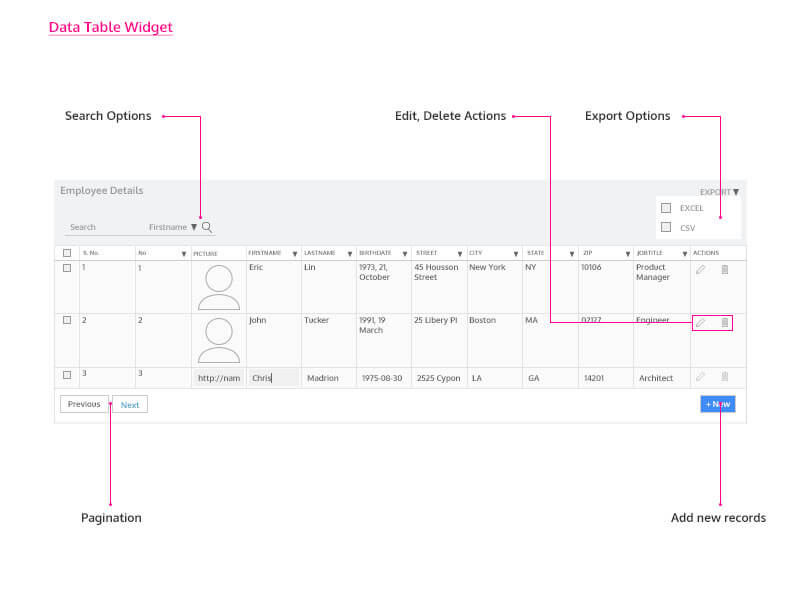

[  ](../assets/laptop.png): Data Table is available only for web responsive apps.

**Table** provides a tabular view for database Entities or API response data. Data Table can be bound to data sources like database tables, queries, procedures, web services or JSON objects through Variables.

Table provides a user interface to perform CRUD operations for data from a database, by integrating the editable actions with their corresponding CRUD APIs that are generated automatically during [Integration](http://[supsystic-show-popup id=106]) process through Database CRUD variables.

Tables can also be bound with Web or Java or Query and Procedure Services, to display the response data in a tabular form. Note for such cases you will have the option of using a **\-Only** table since the underlying CRUD functionality does not exist.

While designing Data Table in WaveMaker, the following features are provided to configure and customize the Data Table:

- the type of form to be displayed for editing purposes in case of editable Data Table,
- , filter and sort facility for the columns,
- configuration of columns in terms of layout, format, style and role-based security,
- styles for traversing through multi-page data,
- and row level actions for adding, editing or deleting rows
- any other custom action,
- to CSV or Excel files, and much more.

Source >

[1\. Live & Data Widgets](/learn/app-development/widgets/widget-library/#data-live)

- [1.1 Cards](/learn/app-development/widgets/datalive/cards/)
- [1.2 Data Table](/learn/app-development/widgets/datalive/data-table/)
    - [Data Source](/learn/app-development/widgets/datalive/datatable/data-source/)
        - [Variable Source](/learn/app-development/widgets/datalive/datatable/data-source/#variable-source)
        - [Widget Source](/learn/app-development/widgets/datalive/datatable/data-source/#widget-source)
    - [Layouts](/learn/app-development/widgets/datalive/datatable/layouts/)
        - [Editable with Form as Dialog](/learn/app-development/widgets/datalive/datatable/layouts/#efd)
        - [Editable with Form given below the Table](/learn/app-development/widgets/datalive/datatable/layouts/#efb)
        - [Inline Editable](/learn/app-development/widgets/datalive/datatable/layouts/#edi)
        - [Quick Edit](/learn/app-development/widgets/datalive/datatable/layouts/#edq)
        - [Read-Only with details given below](/learn/app-development/widgets/datalive/datatable/layouts/#rof)
        - [Read-only Simple View](/learn/app-development/widgets/datalive/datatable/layouts/#ros)
    - [Table Configuration](/learn/app-development/widgets/datalive/datatable/table-configuration/)
        - [Search & Filter](/learn/app-development/widgets/datalive/datatable/table-configuration/#search-n-filter)
        - [Sorting](/learn/app-development/widgets/datalive/datatable/table-configuration/#sorting)
        - [Selection](/learn/app-development/widgets/datalive/datatable/table-configuration/#selection)
        - [Pagination](/learn/app-development/widgets/datalive/datatable/table-configuration/#pagin)
        - [Export Data](/learn/app-development/widgets/datalive/datatable/table-configuration/#export-data)
        - [Message](/learn/app-development/widgets/datalive/datatable/table-configuration/#message)
    - [Field Configuration](/learn/app-development/widgets/datalive/datatable/field-configuration/)
        - [View Mode](/learn/app-development/widgets/datalive/datatable/field-configuration/#view-mode)
        - [Edit Mode](/learn/app-development/widgets/datalive/datatable/field-configuration/#edit-mode)
    - [Actions](/learn/app-development/widgets/datalive/datatable/actions/)
        - [Table Specific Actions](/learn/app-development/widgets/datalive/datatable/actions/#table-actions)
        - [Row Specific Actions](/learn/app-development/widgets/datalive/datatable/actions/#row-actions)
        - [Actions Visibility](/learn/app-development/widgets/datalive/datatable/actions/#actions-visibility)
        - [Actions Layout](/learn/app-development/widgets/datalive/datatable/actions/#actions-layout)
    - [Events & Methods](/learn/app-development/widgets/datalive/datatable/datatable-events-methods/)
        - [Events](/learn/app-development/widgets/datalive/datatable/datatable-events-methods/#events)
        - [Methods](/learn/app-development/widgets/datalive/datatable/datatable-events-methods/#methods)
    - [Cases](/learn/app-development/widgets/datalive/datatable/data-table-use-cases/)
- [1.3 Form](/learn/app-development/widgets/datalive/form/)
- [1.4 List](/learn/app-development/widgets/datalive/list/)
- [1.5 Live Form](/learn/app-development/widgets/datalive/live-form/)
- [1.6 Live Filter](/learn/app-development/widgets/datalive/live-filter/)
