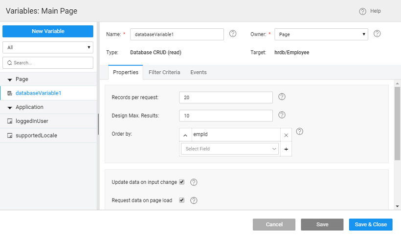

**CRUD Variable** connects to an individual database entity through auto generated CRUD APIs. It contains the values from the specified database table and controls such as Live Form require a Database CRUD Variable as input.

As the name suggests, operations include the CRUD operations on the database:

- which can be used to fetch data from the database;
- **/update** which can be used to insert data to a database, this would require the fields from the data tab bound either to static default values or from widgets capturing and processing the input from the user. any fields that are not bound will be set to NULL. If according to your use case user is prevented from updating a column value then you can uncheck the option for that column from the **Designer** [here for more](/learn/app-development/services/database-services/working-database-schema/#metadata-implementation)
- which can be used to delete data from the database, the primary key value needs to be bound from the data tab.

# Creation

The **data source** for these Variables comes from a There are two ways of creating variables:

1. [workspace toolbar](#direct)
2. the time of [data and live widgets](#widgets);

## Creation - direct method

we list the steps to create a Variable for Database CRUD operations:

1. the Variable option from the Variable Workspace Toolbar. 
2. New Variable from the Variable Dialog 
3. will initiate the Create Variable wizard with the following steps:
    
    1. we are creating a variable to perform database CRUD operations, select **CRUD** as the target operation
    2. :
        - \- database (already imported) name,
        - \- entity or table within the database and
        - \- choose from read, insert, update or delete depending upon the purpose of the variable
        - \- is set by default but can be modified
        - \- the scope of the Variable being created. By default it is set to Page, you can change it to Application if you want this variable to be available across the app
    3. to complete the variable creation process
    
    
4. will be directed to the Variables page, with the new variable listed.  As you can see:
    1. **CRUD** Variable for selected operation is created,
    2. the selected database and table as target
    3. **tab** contains all the properties like _options_, and behavior. [more about properties](#properties)
    4. **tab** will contain the fields for which the values can be set/bound for Insert, Delete and Update operations. Note for Update operation all the fields need to be set irrespective of whether they are to be updated or not
    5. (for READ operation) the **Criteria tab** will contain the fields serving as _fields_ for data fetch operation. [more about Filter Criteria usage](/learn/how-tos/using-filter-criteria-database-crud-variable/)
    6. tab will contain the events that can be configured to trigger any action. [more about events](#events)

## Creation - from Data & Live Widgets

We will show the steps in creating Variable using the Data Table widget. The steps will be same for any Data Widgets

1. and drop a **Table ** the canvas
2. **Data** from : If you have not imported any database or web service in your application, you will be prompted to import the same.
3. you have imported the data source, choose _CRUD_ from the list of ** type**
4. the to the desired and then select a **/Entity** from the list of entities of tables within the selected database. 
5. you have selected the service type and the service you can:
    - the **of the variable** generated
    - **Configuration** includes:
        - also have the option choose a particular data node.
        - **per request** to be fetched, default set to 20
        - **data on input change** will ensure that the data content of the variable is refreshed when the value of the input parameter changes
        - **data on page load** will ensure that the data is fetched when the page rendering the variable data is loaded
6. will be followed by steps to select the Data Table layout and columns to be displayed.
7. can see the variable listed Variables dialog  As you can see:
    1. **CRUD** Variable for Read operation is created,
    2. is a **scoped variable,**
    3. the selected database and table as target
    4. **tab** contains all the properties like _options_, and behavior. (Click on the Variable to view the Variable definition).  [more about properties](#properties)
    5. **criteria tab** will contain the fields serving as _fields_ for data fetch operation
    6. tab will contain the events that can be configured to trigger any action. [more about events](#events)

created for Database CRUD are special variables that store the results of a database that was created or imported into the WaveMaker App.

**Options**

Mode

property specifies how to apply the filter on fields under the Data tab. The options are:

- : match characters at the front of the string. For example, "Wa" would match "WaveMaker".
- : match characters at the end of the string. For example, "Maker" would match "WaveMaker".
- : match characters anywhere in the string. For example, "ve" would match "WaveMaker".
- : match all characters the string. For example, only "WaveMaker" would match "WaveMaker".

per request

property sets the number of records to be fetched at runtime. It can be set to a value with 100 being maximum allowed value. 0 is invalid and entering the same will reset it to the default value. The default value is 20.

In the Development profile, the maximum limit is set to 100 records for optimized performance. For Deployment profile, you can change this limit by changing the change the “Records per Request” for the Database from the Config Profiles for Deployment Profile.

Max. Results

number of records that are returned when viewing data at design time.

by

to use for ordering the data. Sorting can be in ascending or descending order. By default, it is set to the Primary Key Field ascending order. You can add more fields, or delete this setting.

**Usage**: You can select the fields to which you want the data to be ordered from a drop-down list and click on + to add new order by field. By default, the order is set to descending which can be changed by a simple click operation.

Case

checked, the filter will ignore case. For example, "wa" will match "WaveMaker".

data on input change

checked, the component will be triggered automatically on the change of input data (as mentioned in the data tab) for the variable.

data on page load

checked, 'Page' variable will be triggered on page load while 'Application' variable will be triggered on application load.

Flight Behavior

property determines the behavior when a call is fired through the variable with the previous call still pending. Variable queues all these calls, waits for the previous call completion and then based on the value of the property, decides what to do with all the queued calls:

- \- all the queued calls will be discarded,
- \- all the calls will be triggered one by one, or
- \- only the last call is triggered and the rest are discarded, this is the default behavior

Context

property specifies the UI widget on which the spinner should show. Leave empty if no spinner required.

Message

message to be displayed below the spinner. Leave empty if no message is required below the spinner. Note: If multiple variables are fired then the spinner messages will be displayed as a list below a single spinner.

the life cycle of a Variable, a set of events are emitted by the Variable, thus giving you the option to control the behavior of the Variable such as input data validations, data processing, success/error handling, etc. [More](/learn/app-development/variables/variables-actions/#events-implementation)

Few Methods are exposed for Variables which can be used for achieving more control and accessing extra functionality. Listed here are the same.

## (options, successCallback, errorCallback)

method updates the Variable’s dataSet with new data by making a call to the Live DB Service. This is an asynchronous method that fetches data from target Live DB Service and updates it on the dataSet of the variable. The data can be accessed through the successCallback method. Error handling can be done in the errorCallback method.

:

- (object): The object can have fields as  - key-value pairs of fields for filtering read calls  {“key”: “value”}
- (method): callback method called on successful invocation of the variable.
- (method): callback method called if an error is encountered while invocation.

_Value_: None

_:_

 lv = Page.Variables.HrdbEmployeeData;
// Example 1: Get all data for Employees table
lv.listRecords({}, function(data) {
      // Success Callback
      console.log('success', data)
   }, function(error) {
      // Error Callback
      console.error('error', error)
});

 lv = Page.Variables.HrdbEmployeeData;
// Example 2: Get data filtered on the table fields
lv.listRecords({
     filterFields: {
               "city": {
               "value": "New York"
                }
            }
     }, function(data) {
       // Success Callback
       console.log('success', data)
     }, function(error) {
       // Error Callback
       console.error('error', error)
 });

## (object, success callback, error callback)

method makes a call to the Live Service to update the provided record in the target table. This is an asynchronous method that updates the record into the target table and updates it on the dataSet of the variable. The updated record is passed and can be accessed in the successCallback method as a parameter named "data". Error handling can be done in the errorCallback method.

:

- (object): This object can have fields as a  - record object as {"field": "value"}. Complete record object should be passed along with the primary key.
- (method): callback method called on successful invocation of the variable.
- (method): callback method called if an error is encountered while invocation.

_Value_: None

_:_

 lv = Page.Variables.HrdbEmployeeData;
        // Example 1: Update a record
        lv.updateRecord({
            row: {
                "empId": 11,
                "firstname": "Steve",
                "lastname": "Rogers",
                "username": "captain.steve"
            }
        }, function(data) {
            // Success Callback
            console.log("successfully updated employee", data);
        }, function(error) {
            // Error Callback
            console.error("error while updating employee", error)
        });

## (object, successCallback, errorCallback)

method makes a call to the Live Service to insert a new record into the target table. This is an asynchronous method that inserts the record into the target table and updates it on the dataSet of the variable. The newly created record can be accessed in the successCallback method. Error handling can be done in the errorCallback method.

:

- (object): This object can have fields as row -  object as {"field": "value",..}
- (method): callback method called on successful invocation of the variable.
- (method): callback method called if an error is encountered while invocation.

_Value_: None

_:_

        var lv = Page.Variables.HrdbEmployeeData;
        // Example 1: Insert a record into Employee table
        lv.createRecord({
            row: {
                'firstname': "Steve",
                'lastname': "Rogers",
                "username": "steve.rogers"
            }
        }, function(data) {
            // Success Callback
            console.log("Successfully inserted employee:", data);
            // Output:
            // Successfully inserted employee: {empId: 11, firstname: “Steve”,...}
        }, function(error) {
            // Error Callback
            console.error("error while inserting employee", error)
        });

## (object, success callback, error callback)

method makes a call to the Live Service to update the provided record in the target table. This is an asynchronous method that updates the record into the target table and updates it on the dataSet of the variable. The updated record is passed and can be accessed in the successCallback method as a parameter named "data". Error handling can be done in the errorCallback method.

:

- (object): This object can have fields as a row - record object as {"field": "value"}. Complete record object should be passed along with the primary key.
- (method): callback method called on successful invocation of the variable.
- (method): callback method called if an error is encountered while invocation.

_Value_: None

_:_

        var lv = Page.Variables.HrdbEmployeeData;
        // Example 1: Update a record
        lv.updateRecord({
            row: {
                "empId": 11,
                "firstname": "Steve",
                "lastname": "Rogers",
                "username": "captain.steve"
            }
        }, function(data) {
            // Success Callback
            console.log("successfully updated employee", data);
        }, function(error) {
            // Error Callback
            console.error("error while updating employee", error)
        });

## (options, successCallback, errorCallback)

method makes a call to the Live Service to delete the passed record in the target table. This is an asynchronous method that fetches data from target service and updates it on the dataSet of the variable. The data can be accessed in the successCallback method. Error handling can be done in the errorCallback method.

:

- (object): This object can have optional fields as row - record object to be deleted as {"key":"value"}
- (method): callback method called on successful invocation of the variable.
- (method): callback method called if an error is encountered while invocation.

_Value_: None

_:_

 lv = Page.Variables.HrdbEmployeeData;
// delete a record
lv.deleteRecord({
      row: {
           "empId": 11 // primary key
           }
      }, function(success) {
      // Success Callback
      console.log("successfully deleted employee (boolean)", success);
      }, function(error) {
      // Error Callback
      console.error("error while deleting employee", error)
});

## ()

method returns the variable’s dataSet, i.e., the current data stored in the variable through the listrecords method.

: none

_Value_: Array of record objects

_:_

 result = Page.Variables.HrdbEmployeeData.getData();
        console.log("result", result);
        //  Output:
        result : {
          data: \[Object, Object, Object\], // data in the table
          pagingOptions: {dataSize: 10, maxResults: 20, currentPage: 1} // pagination options
       }

// pagination options:
// dataSize: number of records in a page
// maxResults: total number of records in the table
// currentPage: current page

## ()

This method clears  variable dataSet.

: none

_Value_: Updated(empty) dataSet of the variable

_:_

        var result = Page.Variables.HrdbEmployeeData.clearData();
        console.log("result:", result);
        // Output: 
        // result: {}

## (key, value)

This method sets the input field value against the specified field(key).

:

- (string): name of the input field
- (\*): value for the input field

_Value_: Updated inputFields object

_:_

 lv = Page.Variables.HrdbEmployeeData;
        lv.setInput("firstname", "Tony");
        lv.setInput("lastname", "Stark");
        lv.createRecord();

## (object)

This method can also be used to all the specified key-value pairs as input fields in the variable.

: inputData(object) object or key-value pairs {“key”: “value”,…}

_Value_: Updated inputFields object

_:_

 lv = Page.Variables.HrdbEmployeeData;
        lv.setInput({
            "firstname": "Peter",
            "lastname": "Parker"
        });
        lv.createRecord();

## (key, value)

This method the filter field value against the specified field(key)

:

- (string): name of the input field
- (\*): value for the input field

_Value_: Updated filterFields object

_:_

 lv = Page.Variables.HrdbEmployeeData;
        lv.setFilter("department.name", "Engineering"); // department is a related table
        lv.setFilter("city", "New York");
        lv.listRecords();

## (object)

This method can also be used to the specified key-value pairs as filter fields in the variable.

: inputData(object) object or key-value pairs {“key”: “value”,…}

_Value_: Updated filterFields object

_:_

 lv = Page.Variables.HrdbEmployeeData;
        lv.setFilter({
            "deptId": 1, // deptId is the foreign key reference to department table
            "city": "New York"
        });
        lv.listRecords();

< Variables & Actions

6\. Data Integration - Variables

- 6.1 Binding Layer
    - [Overview](/learn/app-development/variables/data-integration/)
- [6.2 Variables and Actions](/learn/app-development/variables/variables-actions/)
    - [Overview](/learn/app-development/variables/variables-actions/#)
    - [Variables](/learn/app-development/variables/variables-actions/#variables)
        - [Database CRUD](#)
            - [Overview](#)
            - [Variable Creation](#creation)
            - [Properties](#properties)
            - [Events](#events)
            - [Methods](#methods)
        - b. Database API
            - [Overview](/learn/app-development/variables/database-apis/)
            - [Variable Creation](/learn/app-development/variables/database-apis/#creation)
            - [Properties](/learn/app-development/variables/database-apis/#properties)
            - [Events](/learn/app-development/variables/database-apis/#events)
            - [Methods](/learn/app-development/variables/database-apis/#methods)
        - c. Web Service
            - [Overview](/learn/app-development/variables/web-service/)
            - [Variable Creation](/learn/app-development/variables/web-service/#creation)
            - [Properties](/learn/app-development/variables/web-service/#properties)
            - [Events](/learn/app-development/variables/web-service/#events)
            - [Methods](/learn/app-development/variables/web-service/#methods)
        - d. Java Service
            - [Overview](/learn/app-development/variables/java-services)
            - [Variable Creation](/learn/app-development/variables/java-services/#creation)
            - [Properties](/learn/app-development/variables/java-services/#properties)
            - [Events](/learn/app-development/variables/java-services/#events)
            - [Methods](/learn/app-development/variables/java-services/#methods)
        - e. Security Service
            - [Overview](/learn/app-development/variables/security-service/)
            - [Variable Creation](/learn/app-development/variables/security-service/#creation)
            - [Properties](/learn/app-development/variables/security-service/#properties)
            - [Events](/learn/app-development/variables/security-service/#events)
            - [Methods](/learn/app-development/variables/security-service/#methods)
        - f. Model
            - [Overview](/learn/app-development/variables/model-variable/)
            - [Variable Creation](/learn/app-development/variables/model-variable/#creation)
            - [Properties](/learn/app-development/variables/model-variable/#properties)
            - [Events](/learn/app-development/variables/model-variable/#events)
            - [Methods](/learn/app-development/variables/model-variable/#methods)
        - g. Device Variables
            - [Overview](/learn/hybrid-mobile/device-variables/#)
            - [Services](/learn/hybrid-mobile/device-variables/#services)
            - [Operations](/learn/hybrid-mobile/device-variables/#operations)
            - [Events](/learn/hybrid-mobile/device-variables/#events)
            - [Methods](/learn/hybrid-mobile/device-variables/#methods)
            - [Usage](/learn/hybrid-mobile/device-variables/#usage)
    - [Actions](/learn/app-development/variables/variables-actions/#actions)
        - i. Navigation
            - [Overview](/learn/app-development/variables/navigation-action/)
            - [Action Creation](/learn/app-development/variables/navigation-action/#creation)
            - [Properties](/learn/app-development/variables/navigation-action/#properties)
            - [Methods](/learn/app-development/variables/navigation-action/#methods)
        - ii. Login
            - [Overview](/learn/app-development/variables/login-action/)
            - [Action Creation](/learn/app-development/variables/login-action/#creation)
            - [Properties](/learn/app-development/variables/login-action/#properties)
            - [Data](/learn/app-development/variables/login-action/#data)
            - [Events](/learn/app-development/variables/login-action/#events)
        - iii. Logout
            - [Overview](/learn/app-development/variables/logout-action/)
            - [Action Creation](/learn/app-development/variables/logout-action/#creation)
            - [Properties](/learn/app-development/variables/logout-action/#properties)
            - [Events](/learn/app-development/variables/logout-action/#events)
        - iv. Timer
            - [Overview](/learn/app-development/variables/timer-action/)
            - [Action Creation](/learn/app-development/variables/timer-action/#creation)
            - [Properties](/learn/app-development/variables/timer-action/#properties)
            - [Events](/learn/app-development/variables/timer-action/#events)
            - [Methods](/learn/app-development/variables/timer-action/#methods)
        - v. Notification
            - [Overview](/learn/app-development/variables/notification-action/)
            - [Action Creation](/learn/app-development/variables/notification-action/#creation)
            - [Properties](/learn/app-development/variables/notification-action/#properties)
            - [Events](/learn/app-development/variables/notification-action/#events)
            - [Methods](/learn/app-development/variables/notification-action/#methods)
    - [Scoping](/learn/app-development/variables/variables-actions/#scoping)
    - [Variable Events](/learn/app-development/variables/variables-actions/#events)
    - [Error Handling](/learn/app-development/variables/variables-actions/#error-handling)
- 6.3 Variable Binding
    - [Overview](/learn/variables/variable-binding/#)
    - [Data Binding](/learn/variables/variable-binding/#data-binding)
    - [Widget Binding](/learn/variables/variable-binding/#widget-binding)
    - [Binding Options](/learn/variables/variable-binding/#binding-options)
- 6.4 JavaScript Access
    - [Overview](/learn/variables/accessing-elements-via-javascript/#)
    - [Widget Controllers](/learn/variables/accessing-elements-via-javascript/#widget-controllers)
    - [Page Scripting](/learn/variables/accessing-elements-via-javascript/#page-scripting)
    - [Script Access](/learn/variables/accessing-elements-via-javascript/#script-access)
