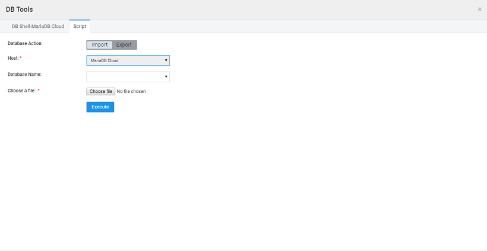

provides database tools to connect to your development and deployment database servers in the cloud. You can execute scripts and run the commands supported by the database server. To access the database tools, click on DB Tools located at the bottom of your project workspace, when in the Databases Resource page.

# Shell

Shell is one of the database tools which simplify the management of your development and deployment databases. DB Shell is a command-line interface to execute DDL (Data Definition Language) and DML (Data Modification Language) commands supported by the database server.

: DB Shell can be used only for the database hosted on Cloud supporting MariaDB ver 10.2.

clicking DB Tools from Databases Resource page, you will be shown the DB Shell- MariaDB Cloud tab which connects to the development database server and displays a command-line interface to execute database commands.

# Scripts

also makes it simple to execute SQL scripts on your database servers. From the  **Tools** dialog, click the  tab. You can either or DB. **:** execution does not work on IE9 browsers

### Database

Database can be used to import an external data source into the WaveMaker and work with it. A data source will be replicated within WaveMaker. Importing an existing database will result in overwriting of the WaveMaker copy with the original data source, i.e. any changes made to the database within WaveMaker will be lost. In order to retain the changes made within WaveMaker, an export is essential.

that once you run the script, you need to physically Import the Database from the **Resource + icon** use the link from the success screen

Key things to note while importing databases are:

- supports major SQL data types. In case the imported database uses any other data type, those will be converted to the closest matching data type.
- \-generated primary key columns will not be mapped during database import. It will be converted to assigned generator type. To retain the original sequence-generation, one needs to manually change the generator type to sequence, give a generator name, save and re-import the database.
- configuration fields need to be entered based on the type of database used.

Click on the tab and use the following steps to execute a script:

1. the database server on which the script needs to be executed by selecting from the options in the field. Currently, the only server option is _ Cloud_ database server.
2. the **Name** Note: A database with this name must exist in the selected database server. You can create one using the DB Shell if the database doesn't exist.
3. **File** to locate and upload the script file to be executed. Make sure you choose a valid script file.
4. on the button. After the script executes, the status of the script execution is displayed.
5. you have executed the script, the database is ready for import. Import the Database from the **Resource + icon ** use the link from the success screen.

### Database

Database can be used to export the database within WaveMaker to an external data source. Click on the tab and use the following steps to execute a script:

1. the database server on which the script needs to be executed by selecting from the options in the field. Currently, the only server option is _Cloud_ database server.
2. the **Name** Select from the list provided.
3. **Only** to export the Schema without data. To get the data and schema – do not check Schema only option – click GET Data Dump will get the schema and data.
4. on the **Data Dump** button. After the script executes, the status of the script execution is displayed.

< Working with DB Schema

Artifacts >

5\. Creating Backend Services

- 5.1 Overview
    - [Accessing Data](/learn/app-development/services/creating-backend-services/#accessing-data)
        - [Life-cycle of data](/learn/app-development/services/creating-backend-services/#life-cycle)
    - [Manipulating Data](/learn/app-development/services/creating-backend-services/#manipulating-data)
        - [Life-cycle of Events](/learn/app-development/services/creating-backend-services/#life-cycle-events)
    - [REST APIs](/learn/app-development/services/creating-backend-services/#rest-apis)
- 5.2 Web Services
    - [Overview](/learn/services/web-services/web-services/#overview)
    - [Variables for Invocation](/learn/services/web-services/web-services/#service-variable)
    - iii. Working with SOAP Services
        - [Overview](/learn/app-development/services/web-services/web-services/working-with-soap-services/#SOAP-service-setup)
        - [SOAP Service Setup](/learn/app-development/services/web-services/working-with-soap-services/#SOAP-service-setup)
        - [SOAP Service Settings](/learn/app-development/services/web-services/working-with-soap-services/#SOAP-service-settings)
        - [Generated REST APIs](/learn/app-development/services/web-services/working-with-soap-services/#generated-rest-apis)
        - [SOAP Service Usage](/learn/app-development/services/web-services/working-with-soap-services/#SOAP-service-usage)
    - iv. Working with REST Services
        - [ Overview](/learn/app-development/services/web-services/rest-services/)
        - [ Test REST Service](/learn/app-development/services/web-services/rest-services/#test-API)
        - [ Configure REST Service](/learn/app-development/services/web-services/rest-services/#configure-REST-service)
        - [REST Service Usage](/learn/app-development/services/web-services/rest-services/#REST-service-usage)
    - v. Working with Web Sockets
        - [Overview](/learn/app-development/services/web-services/working-with-websockets/)
        - [Service Integration](/learn/app-development/services/web-services/working-with-websockets/#import)
        - [Service Consumption](/learn/app-development/services/web-services/working-with-websockets/#variable)
        - [Use Cases](/learn/app-development/services/web-services/working-with-websockets/#use-cases)
- [5.3 Database Services](/learn/app-development/services/database-services/database-services/)
    - [Overview](/learn/app-development/services/database-services/database-services/#)
    - [Supported Databases](/learn/app-development/services/database-services/database-services/#supported-databases)
    - iii. Working with Databases
        - [Overview](/learn/app-development/services/database-services/working-with-databases/#)
        - [Adding Database](/learn/app-development/services/database-services/working-with-databases/#integrating-database)
        - [Database Actions](/learn/app-development/services/database-services/working-with-databases/#database-actions)
    - iv. Data Modelling
        - [Overview](/learn/app-development/services/database-services/data-modelling/#)
        - [Configuration Settings](/learn/app-development/services/database-services/data-modelling/#configuration-settings)
        - [Database Designer](/learn/app-development/services/database-services/data-modelling/#database-designer)
            - [Schema Import Modes](/learn/app-development/services/database-services/database-schema-import-modes/)
        - ○ Working with Database Schema
            - [Overview](/learn/app-development/services/database-services/working-database-schema/)
            - [Adding Tables and Columns](/learn/app-development/services/database-services/working-database-schema/#add-tables-columns)
            - [Working with Relationships](/learn/app-development/services/database-services/working-database-schema/#database-relationships)
            - [Identity Generators for Primary Key Column](/learn/app-development/services/database-services/working-database-schema/#identity-generators)
            - [Column Metadata Configuration](/learn/app-development/services/database-services/working-database-schema/#column-metadata-configuration)
            - [Virtual Primary Keys and Relations](/learn/app-development/services/database-services/working-database-schema/#virtual-primary-keys)
            - [Temporal Support](/learn/app-development/services/database-services/temporal-support/)
    - [Databases Access](#)
        - [Overview](/learn/app-development/services/database-access/)
        - ○ Working with Queries
            - [Overview](/learn/app-development/services/database-services/working-with-queries/)
            - [Query Editor](/learn/app-development/services/database-services/working-with-queries/#query-editor)
            - [Types of Queries](/learn/app-development/services/database-services/working-with-queries/#query-types)
            - [Query Creation](/learn/app-development/services/database-services/working-with-queries/#query-creation)
            - [Query Usage](/learn/app-development/services/database-services/working-with-queries/#query-usage)
            - [Parameterised Query Creation](/learn/app-development/services/database-services/working-with-queries/#query-creation-parameterised)
            - [Query Operation Type](/learn/app-development/services/database-services/working-with-queries/#query-op-types)
            - [Query Architecture](/learn/app-development/services/database-services/working-with-queries/#query-architecture)
        - ○ Working with Stored Procedures
            - [Overview](/learn/app-development/services/db-services/working-stored-procedures/)
            - [Procedure Creation](/learn/app-development/services/db-services/working-stored-procedures/#procedure-creation)
            - [Procedure Parameters](/learn/app-development/services/db-services/working-stored-procedures/#proc-params)
            - [Procedure Invocation](/learn/app-development/services/db-services/working-stored-procedures/#procedure-invocation)
            - [Procedure Architecture](/learn/app-development/services/db-services/working-stored-procedures/#procedure-architecture)
        - [Versioning of Queries and Procedures](/learn/app-development/services/database-services/versioning-queries-procedures/)
        - [ Blob Support for Queries and Procedures](/learn/app-development/services/database-services/blob-support-queries-procedures/)
        - [Invoking Queries & Procedures from Java Service](/learn/app-development/services/database-services/invoking-queriesprocedures-java-services/)
        - [ Database Views](/learn/app-development/services/db-services/database-views/)
        - [ Database Tools](#)
            - [Overview](#)
            - [DB Shell](#db-shell)
            - [DB Scripts](#db-scripts)
                - [Import DB](#import-db)
                - [Export DB](#export-db)
    - vi. ORM Artifacts
        - [Database Integration Process](/learn/app-development/services/db-services/orm-artifacts/#database-integration-process)
        - [Layered Architecture](/learn/app-development/services/db-services/orm-artifacts/#layered-architecture)
        - [Generated Files](/learn/app-development/services/db-services/orm-artifacts/#generated-files)
        - [Generated APIs](/learn/app-development/services/db-services/orm-artifacts/#generated-apis)
            - [CRUD APIs](/learn/app-development/services/db-services/orm-artifacts/#crud-apis)
            - [Query APIs](/learn/app-development/services/db-services/orm-artifacts/#query-apis)
            - [Custom Query Syntax](/learn/app-development/services/db-services/orm-artifacts/#custom-query-syntax)
- 5.4 Java Services
    - [ Overview](/learn/app-development/services/java-services/java-service/#overview)
    - [Java Services Framework](/learn/app-development/services/java-services/java-service/#java-services-framework)
    - iii. Integration Services
        - [Current Loggedin User](/learn/app-development/services/java-services/java-integration-services/#loggedin-user)
        - [External Java Libraries](/learn/app-development/services/java-services/java-integration-services/#external-java-libraries)
        - [Database Entities](/learn/app-development/services/java-services/java-integration-services/#db-services)
        - [Named Queries](/learn/app-development/services/java-services/java-integration-services/#query-service)
        - [Imported Web Services](/learn/app-development/services/java-services/java-integration-services/#web-services)
    - [Service Variables](/learn/app-development/services/java-services/service-variables/)
    - [ Generated REST APIs](/learn/app-development/services/java-services/generated-rest-apis-api-designer/)
- 5.5 API Designer
    - [Overview](/learn/app-development/services/api-designer/api/)
    - [Database Services APIs](/learn/app-development/services/api-designer/database-service-apis/)
    - [Web Services APIs](/learn/app-development/services/api-designer/web-service-apis/)
    - [Java Services APIs](/learn/app-development/services/api-designer/java-service-apis/)
    - [Security Services APIs](/learn/app-development/services/api-designer/security-service-apis/)
- 5.6 3rd Party Libraries
    - [Overview](/learn/app-development/services/3rd-party-libraries/)
    - [Including resource files](/learn/app-development/services/3rd-party-libraries/#resource-files)
    - [Using third-party JavaScript file](/learn/app-development/services/3rd-party-libraries/using-3rd-party-javascript-files/)
    - [Using third-party jar file](/learn/app-development/services/3rd-party-libraries/using-3rd-party-jar-files/)
