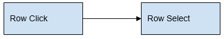
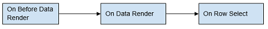
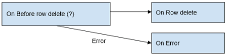

Data Table behavior can be customized with the help of the call-back events. These events can be accessed from the events tab on the Properties panel. The trigger for the event can be JavaScript, another Variable call etc..

and JavaScript Usage

row select

event will be called when a row from Data Table is selected

\[gridname\]Select = function($event, widget, row) {
        //row: row has the selected row data. row has also the index of the row
        // Note: Row selection will happen on click of a cell. So, cell element is present in $event.
        //Printing the selected row data and its index

        console.log(“The row data with index:”, row.index , row); 
    };

row deselect

event will be called when a row from Data Table is deselected

\[gridname\]Deselect = function($event, widget, row) {
        //row has the deselected row data. row has also the index of the row
        // Note: Row deselection will happen on click of a cell. So, cell element is present in $event.
        //Printing the deselected row data and its index
        console.log(“The row data with index:”, row.index , row); 
    };

data sort

event will be called when the Data Table header is clicked to sort by a particular column.

1Sort = function($event, widget, $data) {
        //$data: $data contains the newly sorted data, colDef, and sortDirection

        // Note: Column selection will happen on click of the header. So, column element is present in $event.
        //Printing the sorted data
        console.log(“The sort column data:”, $data); 
    };

header click

event will be called when the Data Table header is clicked.

\[gridname\]Headerclick = function($event, widget, column) {
         //column has the column definition data of the corresponding clicked header
        // Note: Column selection will happen on click of the header. So, column element is present in $event.

        //Printing the selected column field and the column definition
        console.log(“The column data with column field:”, column.field , column); 
    };

row click

event will be called when a row in Data Table is clicked. this event can happen when selecting or deselecting a row.

\[gridname\]Rowclick = function($event, widget, row) {
        //row has the data of the row which is clicked and the index of the row
        // Note: Row selection will happen on click of a cell. So, cell element is present in $event.

       //Printing the clicked row data and its index
        console.log(“The clicked row data with index:”, row.index , row); 
    };

column select

event will be called when a column in Data Table is selected.

\[gridname\]Columnselect = function($event, widget, $data) {
        //$data has the object containing colDef, data and sortDirection. 
        //data has the selected column data. colDef has the selected column definition

        //Printing the selected column data and field name

        console.log(“The column data with column field:”, $data.colDef.field , $data.data);
    };

column deselect

event will be called when a column in Data Table is deselected.

\[gridname\]Columndeselect = function($event, widget, $data) {
        //$data: $data contains colDef, data and sortDirection

        //Printing the selected column data and field name
        console.log(“The column data with column field:”, $data.colDef.field , $data.data);
    };

row delete

event will be called when a record is deleted from the underlying data entity. **:**

- event will be triggered for _Data Table with delete action defined_
- Data Table with Form option, this event will be available in the corresponding Form widget and not with Data Table.

\[gridname\]Rowdelete = function($event, widget, row ) {
        //row: row has the data of the row deleted
        //Printing the deleted row data 
        console.log(“The deleted row data:”, row);
    };

before row insert

event will be called before a new record is inserted in the underlying data entity.

- event is triggered for _Data Table with insert action defined_ Use Case: Populate the date modified or modified user to the current date or logged in user
- Data Table with Form option, this event will be available in the corresponding Form widget and not with Data Table.

\[gridname\]Beforerowinsert = function($event, widget, row, options) {
        //row has the data of the new record to be inserted. This data can be modified and validated before sending the request

       //Validation can be performed here. 
       //If validation fails, return false will stop the operation and service call will not be made.
       if (row.password.length < 6) {
            wmToaster.show('error', 'ERROR', 'Password too small');
            return false;
        }
        //On before insert row, modify the data 
        row.dateModified = Date.now(); //Set today's date as modified date field
    };

row insert

event will be called after a new record is inserted in the underlying data entity.

- event is triggered only for _Data Table with insert action defined_
- Data Table with Form option, this event will be available in the corresponding Form widget and not with Data Table.

\[gridname\]Rowinsert = function($event, widget, row) {
        //row: row has the data of the the new record inserted.

        //Printing the inserted row data 
        console.log(“The inserted row data:”, row);
    };

before row update

event will be called before a record is updated to the underlying data entity.

- event is triggered only for _Data Tables with update action defined_
- Data Table with Form option, this event will be available in the corresponding Form widget and not with Data Table.

\[gridname\]Beforerowupdate = function($event, widget, row, options) {
        //row has the data of the the record to be updated. This data can be modified and validated before sending the request

       //Validation can be performed here. 
       //If validation fails, return false will stop the operation and service call will not be made.
       if (row.password.length < 6) {
            wmToaster.show('error', 'ERROR', 'Password too small');
            return false;
        }

        //On before update row, modify the data 
        row.dateModified = Date.now(); //Set today's date as modified date
    };

after row update

event will be called after a record is updated to the underlying data entity. **:**

- event is triggered only for _Data Tables with update action defined_
- Data Table with Form option, this event will be available in the corresponding Form widget and not with Data Table.

\[gridname\]Rowupdate = function($event, widget, row) {
        //row has the data of the the record updated.

        //Printing the deleted row data 
        console.log(“The deleted row data:”, row);
    };

before data render

event will be called the before the data is rendered in the Data Grid. the data accessible is restricted to the current page of the Data Grid. Use Case: If you want to change the display value based on the values of a column

\[gridname\]Setrecord = function($event, data, columns) {
        //data has data to be rendered in table
        // An object of column names with each column name pointing to column definition.

        //Modify the data in required format. This modified data will be rendered in data table
        $data.forEach(function(obj) {
            if (obj.age <= 5) { obj.age = 'younger'; } else if (obj.age > 5 && obj.age <= 10) {
                obj.age = 'young';
            } else {
                obj.age = 'older';
            }
        });
    };

data render

event will be called when the data is rendered in the Data Table. : This gives access to data displayed on the current page of the Data Table Use Case: You can use this event to add a class to a particular row.

\[gridname\]Datarender = function(widget, data) {
        //data: data has the data to be rendered in the current page of data table

        //widget.datagridElement has the data table jquery element
        widget.datagridElement.find('tr.app-datagrid-row').each(function(index) {
            //Loop through the rows. Add class admin for users having role as adminrole
            if (data\[index\].role === 'adminrole') {
                $(this).addClass('admin');
            }
        });
    };

Before Form Render

(Only for Data Table with Quick-Edit and Inline-Edit)

This event is fired on the edit of a row and before the inline form is rendered. : This gives access to data to be displayed in the form Use Case: You can use this event to edit values to be displayed in the form. Edit also can be prevented in form based on some condition.

\[gridname\]Beforeformrender = function($event, 
widget, $rowData, $operation) { 
   //$rowData: $rowData has the data of the row being edited/ inserted 
   //$operation: $operation value is 'new' for new row and 'edit' when row being edited 
   //If $rowData has role admin, show error and stop edit 
   if ($rowData.role === 'admin') { 
       wmToaster.show('error', 'error', 'Admin row can not be edited'); 
       return false; //Returning false will stop the editing and form is not rendered 
   } 
   //If city is not present in the row being edited, set default city 
   if (!$rowData.city) { 
       $rowData.city = 'New York'; 
   } 
   //For insert, set default role as 'user' 
   if ($operation === 'new') { 
       $rowData.role = 'user'; 
   } 
};

Form Render

(Only for Data Table with Quick-Edit and Inline-Edit)

This event is fired after the inline form is rendered. : This gives access to the widgets in the form. Use Case: Individual widget can be disabled based on a condition.

\[gridName\]Formrender = function($event, widget,
formWidgets, $operation) {
   //formWidgets: formWidgets has the scopes of all the widgets in the form. Individual widget can be accessed as formWidgets.\[fieldName\]
   //$operation: $operation value is 'new' for new row and 'edit' when row being edited
   //Disabled the editing of role field
   formWidgets.role.disabled = true;
};

Error

(ONLY for Data Table with Quick-Edit and Inline-Edit)

This event will be called after the edit/insert/delete operation returns a failure response

\[gridName\]Error = function($event, widget,
$data, $operation) {
    //$data has the error message returned from the API.
    //$operation: operation performed - edit or new or delete
    console.log("Error returned from server:", $data);};

Before Export

(ONLY for Data Table with Export Format selected)

This event will be called before downloading the file. Any data changes like file format changes, field expression, size changes etc can be performed here. Returning false from the script will stop the file download.

1Beforeexport = function (widget, $data) { 
    $data.exportType = 'CSV';

   //updating the header
     $data.columns.firstname.header = ‘Fullname’;
    //updating first name expression
    $data.columns.firstname.expression = firstname + ' ' +lastname;

    //adding new column 
    $data.columns.username = {
       header: ‘Username’,
        expression: firstname + '.' + lastname
    }
};

Before Filter

event will be called when filter is applied on Data Table and before the search is triggered by the Data Table. Search values can be modified in this method. If false is returned from the method, Data Table filter will be stopped.

1Beforefilter = function($event, widget, columns) {
    // Add tenantId filter always
    columns.tenantId = {
        value: 1
    }
};

### Flow

Following is the flow of events for each action triggered on the Data Table.

row select

select  Row deselect will be called only if previously a row was selected

\-Select If a selected row is clicked:  If an unselected row is clicked: 

Header click

selection is enabled If a selected column is clicked:  If an unselected column is clicked: 

selection is disabled & sort is enabled  On Row Select row is triggered if select first record is enabled

Page Load

 If ‘Select first record’ is enabled: 

Filter

 On Row Select row is triggered if select first record is enabled.

Export

Pagination

Click of edit or new buttons

Click of save in edit mode

 If before row update returns false, operation is stopped and next events are not fired

Click of save in insert mode

 If before row insert returns false, operation is stopped and next events are not fired

Click of delete button

 If before row delete returns false, operation is stopped and next events are not fired

Data Grid has few methods exposed on widget scope which can be accessed via JavaScript. For the following script samples, we are considering the hrdb Department table. DepartmentGrid is bound to the Database CRUD Variable corresponding to the Department table.

- refresh the data in data table with the currently applied filters and sort:
    
    \[gridName\].refreshData();
    
- clear the filters applied on data table:
    
    \[gridName\].clearFilter();
    
- focus on a field in edit mode(applicable to inline and quick edit data tables alone):
    
    \[gridname\].formfields.\[columnname\].focus();
    //This will focus the input on \[columnname\] field
    
- change a property of a column:
    
    \[gridname\].columns.\[columnname\].displayName = ‘Deptarment Id’; 
    //Will change the display name of specified column to ‘Department Id’.
    
- force re-render Data Table:
    
    \[gridname\].redraw(true); 
    //Will force re-render data table.
    
- change a property of a column:
    
    \[gridname\].column.\[columnname\].sortable = false; 
    // disables the sort property on the data table 
    //Note: you can replace 'sortable' with any column property listed in the advanced settings.
    
- change value of a field which is in edit mode (applicable to inline and quick edit data tables alone):
    
    \[gridname\].formfields.\[columnname\].value = 'Engineering 1'; 
    // Sets ‘Engineering 1’ to the specified column edit field 
    //Note: This will work only on click of edit on a row.
    
- retrieve value of a field which is in edit mode (applicable to inline and quick edit data tables alone):
    
    (Page.Widgets.\[gridname\].formfields.\[columnname\].getProperty('value')); 
    // This will display the specified column field value in the console. 
    //Note: This will work only on click of edit on a row.
    
- select a row:
    
    \[gridname\].selectItem(1); 
    // The parameter can be index or object of row
    
- deselect a row: Note: deselect will work only for data table with multiselect enabled on it.
    
    \[gridname\].deselectItem(1);
    //the parameter can be index or object of row (data bound to row), 
    //For grid actions user can send $row (which is row data) , 
    //that can be sent as an argument to this method.
    
- with selected item:
    
    \[gridname\].selecteditem = 2; 
    //Selects the third row or item          
    Page.Widgets.\[gridname\].selecteditem = \[2, 3\]; 
    //Selects the third and fourth row/item 
    Page.Widgets.\[gridname\].selecteditem = \[\]; 
    //Deselects the existing rows or items
    
- filter mode:
    
    \[gridname\].filtermode = ‘search’; 
    // To set filter mode as search
    Page.Widgets.\[gridname\].filtermode = ‘multicolumn’; 
    //To set filter mode as multi column
    
     

### edit for service variable

Inline editing can be enabled for a Data Grid when bound to a Web Service/Java Service Variable

- to Advanced Settings for the Data Table.
- to the Actions tab.
- the New, Edit and Delete actions.
- the Data Table is bound to Variable based on APIs exposed by the web service/ java service which returns list of records, for edit, update or delete user should map it to respective variables. This can be achieved through events on data table.
- _Record Insert_:
    
    \[gridName\]Rowinsert = function($event, widget, $rowData) {
         //$rowData: $rowData has the data of the row being inserted
         //$rowData can be modified here
         $rowData.dateInserted = Date.now();
         //Set the input as $rowData for variable
         Page.Variables.\[insertVariable\].setInput($rowData);
         //Insert the data by invoking the variable
         Page.Variables.\[insertVariable\].invoke({}, function() {
           //On success, call the refreshData on method to get the refreshed data
           widget.refreshData();
         });
      };
    
- On Record Update:
    
    \[gridName\]Rowupdate = function($event, widget, $rowData) {
        //$rowData: $rowData has the data of the row being updated
        //$rowData can be modified here
        $rowData.dateModified = Date.now();
        //Set the input as $rowData for variable
        Page.Variables.\[updateVariable\].setInput($rowData);
        //Update the data by invoking the variable
        Page.Variables.\[updateVariable\].invoke({}, function() {
            //On success, call the refreshData on method to get the refreshed data
            widget.refreshData();
          });
      };
    
- Record Delete:
    
    \[gridName\]Rowdelete = function($event, widget, $rowData) {
         //$rowData: $rowData has the data of the row being deleted
         //Set the input as $rowData for variable
         Page.Variables.\[deleteVariable\].setInput($rowData);
         //Delete the data by invoking the variable
         Page.Variables.\[deleteVariable\].invoke({}, function() {
             //On success, call the refreshData on method to get the refreshed data
             widget.refreshData();
          });
       };
    

Methods: Below methods can be used for inline editing (applicable to inline and quick edit data tables alone)

- edit a row
    
    \[gridname\].editRow(); 
    // Selected row will be edited
    
- add a new row
    
    \[gridname\].addRow();
    
- save a row
    
    \[gridname\].saveRow();
    
- cancel a row edit
    
    \[gridname\].cancelRow();
    
- delete a row
    
    \[gridname\].deleteRow();
    
- hide the edit row and go back to view mode
    
    \[gridname\].hideEditRow();
    
     

< Actions

Cases >

[1\. Live & Data Widgets](/learn/app-development/widgets/widget-library/#data-live)

- [1.1 Cards](/learn/app-development/widgets/datalive/cards/)
- [1.2 Data Table](/learn/app-development/widgets/datalive/data-table/)
    - [Data Source](/learn/app-development/widgets/datalive/datatable/data-source/)
        - [Variable Source](/learn/app-development/widgets/datalive/datatable/data-source/#variable-source)
        - [Widget Source](/learn/app-development/widgets/datalive/datatable/data-source/#widget-source)
    - [Layouts](/learn/app-development/widgets/datalive/datatable/layouts/)
        - [Editable with Form as Dialog](/learn/app-development/widgets/datalive/datatable/layouts/#efd)
        - [Editable with Form given below the Table](/learn/app-development/widgets/datalive/datatable/layouts/#efb)
        - [Inline Editable](/learn/app-development/widgets/datalive/datatable/layouts/#edi)
        - [Quick Edit](/learn/app-development/widgets/datalive/datatable/layouts/#edq)
        - [Read-Only with details given below](/learn/app-development/widgets/datalive/datatable/layouts/#rof)
        - [Read-only Simple View](/learn/app-development/widgets/datalive/datatable/layouts/#ros)
    - [Table Configuration](/learn/app-development/widgets/datalive/datatable/table-configuration/)
        - [Search & Filter](/learn/app-development/widgets/datalive/datatable/table-configuration/#search-n-filter)
        - [Sorting](/learn/app-development/widgets/datalive/datatable/table-configuration/#sorting)
        - [Selection](/learn/app-development/widgets/datalive/datatable/table-configuration/#selection)
        - [Pagination](/learn/app-development/widgets/datalive/datatable/table-configuration/#pagin)
        - [Export Data](/learn/app-development/widgets/datalive/datatable/table-configuration/#export-data)
        - [Message](/learn/app-development/widgets/datalive/datatable/table-configuration/#message)
        - [Row Styling](/learn/app-development/widgets/datalive/datatable/table-configuration/#row-style)
    - [Field Configuration](/learn/app-development/widgets/datalive/datatable/field-configuration/)
        - [Column Grouping](/learn/app-development/widgets/datalive/datatable/field-configuration/#grouping)
        - [View Mode](/learn/app-development/widgets/datalive/datatable/field-configuration/#view-mode)
        - [Edit Mode](/learn/app-development/widgets/datalive/datatable/field-configuration/#edit-mode)
        - [Export Options](/learn/app-development/widgets/datalive/datatable/field-configuration/#export)
        - [Filter Options](/learn/app-development/widgets/datalive/datatable/field-configuration/#filtering)
    - [Actions](/learn/app-development/widgets/datalive/datatable/actions/)
        - [Table Specific Actions](/learn/app-development/widgets/datalive/datatable/actions/#table-actions)
        - [Row Specific Actions](/learn/app-development/widgets/datalive/datatable/actions/#row-actions)
        - [Actions Visibility](/learn/app-development/widgets/datalive/datatable/actions/#actions-visibility)
        - [Actions Layout](/learn/app-development/widgets/datalive/datatable/actions/#actions-layout)
    - [Events & Methods](/learn/app-development/widgets/datalive/datatable/datatable-events-methods/)
        - [Events](#events)
        - [Methods](#methods)
        - [Inline Edit for Service Variables](#inline-edit)
    - [Cases](/learn/app-development/widgets/datalive/datatable/data-table-use-cases/)
- [1.3 Form](/learn/app-development/widgets/datalive/form/)
- [1.4 List](/learn/app-development/widgets/datalive/list/)
- [1.5 Live Form](/learn/app-development/widgets/datalive/live-form/)
- [1.6 Live Filter](/learn/app-development/widgets/datalive/live-filter/)
