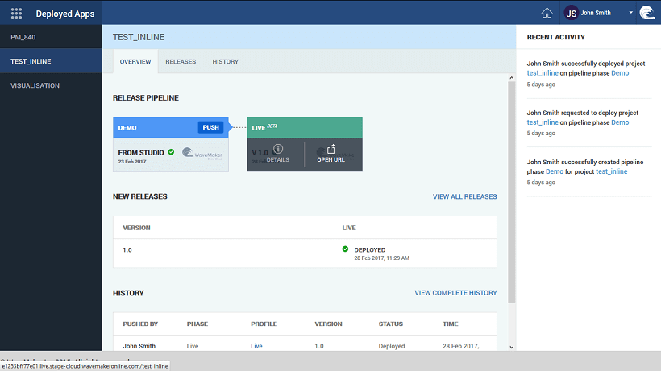

times you might get stuck with a situation wherein your app does not respond the way you intended it to or throws an error that is particularly difficult to solve. In such cases debugging comes in handy. There are two ways to debug a WaveMaker app:

- logs or
- debug option from JavaScript.

# Logs for Debugging

files can be accessed from the project workspace footer area. There are types of logs that are recorded - Server, and Application. These can be accessed from the [Utilities](http://[supsystic-show-popup id=107]) menu for an application.

### Logs

logs consist WaveMaker designer backend logs while developing the app. For example: On importing/updating database, sometimes a message saying _while updating/importing database please see server logs_ is displayed. In such cases, Server logs contain stack trace of error, along with the cause.

can download the log files using the download icon in the far right corner of the logs window. This option is available for both server and application logs.

# with HAR files

Sometimes, in order to debug a problem WaveMaker support team may ask you to send the HAR file. To obtain the HAR file:

1. the app runtime window, open the **Tools**  Access to the Developer Tools varies from browser to browser. For example, in Chrome Browser you will be using the Chrome menu (:) -> _tools_ -> _Tools_ or a key pattern ' _+ Shift + I_'.
2. the Developer Tools panel select the **tab**
3. the option to **Log**
4. the page
5. \-click on any Network call and choose the option \-> _all as HAR_ 
6. any editor like Notepad and paste the content.
7. the file and send it to the support team along with the name of the Service call that is failing.

# Debugging

debug the JavaScript code of the pages, add keyword in the script part of the page. Example: Suppose we want to debug the function on click of a button ‘button2’.

2Click = function ($event, widget) { 
    var postion = $event.pageX;
    debugger;
};

, if you want to just print the results in the console use the method ‘console.log()’. Example: Suppose we want to print the results of a dataset.

2Click = function ($event, widget) { 
    console.log(Page.Variables.HrdbEmployeeData.dataSet)
};

are more methods of how you want to print the results in the console. For more detailed information refer to the product documentation of the browser you are running your app on.

you have the debugger in place, run the app and open the developer tools. The method of accessing developer tools differs from browser to browser.

example, in use Function Key 12 (F12) or use the key pattern ‘ _+ Shift + i_’ to open the developer tools.

**debugging**: In the developer tools window select on ‘’ tab. During the script execution when the script reaches that line containing the debugger statement, it would stop the script execution and provide us options to debug the script. F10 will move the script execution to next method and F11 will move the script execution to next step.

**logs**: Click on the ‘’ tab, to see the results printed when the script is executed.

# Deployed Apps

In case you want to debug deployed apps or to send logs for the deployed app to WaveMaker support team you might have to download the logs for deployed apps. In such cases

1. the [Portal](http://[supsystic-show-popup id=122]) either
    - selecting Manage Deployed Apps button from the Project Dashboard, or
    - using the Manage App option under Deploy from the Project Workspace Main Menu and then selecting the app in question.
2. you have opened the app, hover over the phase for which you want the logs, select DETAILS. 
3. the Logs tab and locate the download button to download the logs. 

< Version Control

using IDE >

8\. Developer Integrations

- 8.1 Test Run (Preview) Apps
    - [Overview](/learn/dev-integration/developer-tools/)
    - [Preview](/learn/dev-integration/developer-tools/#preview)
    - [Run](/learn/dev-integration/developer-tools/#run)
- 8.2 Import, Export & Update App
    - [Overview](/learn/app-development/dev-integration/import-export-update-apps/)
    - [Export](/learn/app-development/dev-integration/import-export-update-apps/#export-project)
    - [Import](/learn/app-development/dev-integration/import-export-update-apps/#import-project)
    - [Update](/learn/app-development/dev-integration/import-export-update-apps/#update-project)
    - [Project Recovery](/learn/app-development/dev-integration/import-export-update-apps/#project-recovery)
        - [Export](/learn/app-development/dev-integration/import-export-update-apps/#export)
        - [Restore](/learn/app-development/dev-integration/import-export-update-apps/#restore-project)
- 8.3 Developer Collaboration
    - [Overview](/learn/app-development/dev-integration/developer-collaboration/)
    - [Project Sharing](/learn/app-development/dev-integration/developer-collaboration/#project-sharing)
    - [Code Sharing - VCS](/learn/app-development/dev-integration/developer-collaboration/#vcs)
        - [Checkout](/learn/app-development/dev-integration/developer-collaboration/#checkout)
        - [Pull Changes](/learn/app-development/dev-integration/developer-collaboration/#pull-changes)
        - [Push Changes](/learn/app-development/dev-integration/developer-collaboration/#push-changes)
        - [View Changes](/learn/app-development/dev-integration/developer-collaboration/#view-changes)
        - [Commit History](/learn/app-development/dev-integration/developer-collaboration/#commit-history)
        - [Merge Conflicts](/learn/app-development/dev-integration/developer-collaboration/#merge-changes)
        - [Restore Project](/learn/app-development/dev-integration/developer-collaboration/#restore-project)
        - [Push to External Repo](/learn/app-development/dev-integration/developer-collaboration/#push-to-external-repo)
- [8.4 Debugging](#)
    - [Overview](#)
    - [Debugging using Log Files](#logs)
    - [Debugging using HAR Log Files](#har)
    - [Debugging through JavaScript](#javascript)
    - [Debugging Deployed Apps](#deployed_logs)
- 8.5 App Extensions
    - [Overview](/learn/dev-integration/extending-application-using-ides/)
    - [Working with IDEs](/learn/dev-integration/extending-application-using-ides/#steps)
    - [Integrating with Jenkins](/learn/dev-integration/extending-application-using-ides/#jenkins)
