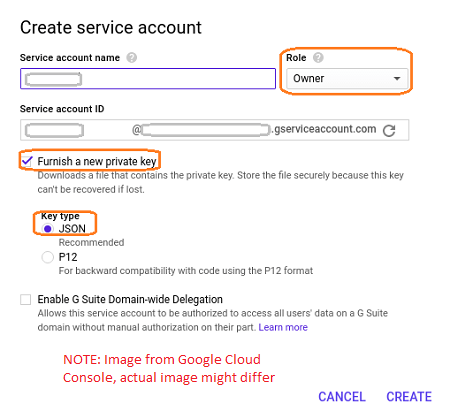

WaveMaker allows you to deploy your app to your Google Cloud account for Live (and Stage for WME users) phase. [more about App Phases from here](/learn/app-development/deployment/release-management/)

To deploy your app to Google Cloud account, you need to configure the Live (Stage) phase.

: This document covers the Live Phase configuration for your AWS account and is a part of the [Deployed Apps](/learn/app-development/deployment/manage-deployed-apps/):

1. are expected to have a [Cloud Account](https://console.cloud.google.com/)
2. need to create a [Account](https://cloud.google.com/iam/docs/creating-managing-service-accounts#creating_a_service_account) with the following settings:
    - set to Project Owner i.e. full access to all resources,
    - the API Dashboard ensure that the following APIs are Enabled:
        
        - Compute Engine API and
        - Cloud Resource Manager API
        
        ( **shows the screen from the Google Developer Console dialog. This dialog might differ from the actual one**) 
    - downloaded file containing Private Key in JSON format ( **shows the setting from the Google Create Service Account dialog. This dialog might differ from the actual one**) 

**in Configuring Google Cloud**:

1. [Portal](http://[supsystic-show-popup id=122]), select the project.
2. Configure on the Live Phase option.
3. configuring the Live phase choose to host your app on Google Cloud
4. your Google Cloud account credentials to proceed with the configuration.  You need to enter
    - **Project Id**: It is the project created by you on Google Cloud Platform. All resources are referenced with this project. ( [here for details](https://cloud.google.com/resource-manager/docs/creating-managing-projects))
    - **Account Id**: You will get this when creating a Service account. This account should have set to and **Type** as ( [here on how to obtain it](https://cloud.google.com/compute/docs/access/service-accounts))
    - region/zone in which you wish to provision the instance.
    - Credentials: This is a private key in a JSON file to authenticate the service account. You need to copy the entire content of the JSON file including the braces - {}.( [here on how to obtain it](https://cloud.google.com/compute/docs/access/service-accounts))
5. the appropriate instance size based upon the resources and database utilized by your app ( [here for pricing details](https://cloud.google.com/compute/pricing))
6. enter the key-value instance tags ( [here for best practices for instance tagging](https://cloud.google.com/compute/docs/storing-retrieving-metadata)) 
7. the setup is done, you can push the app from Demo to Live. ( [from here](/learn/app-development/deployment/manage-deployed-apps/#push-to-live))

< Manage Deployed Apps

Profile >

9\. Deployment

- 9.1 One-Click Deployment
    - [Overview](/learn/app-development/deployment/one-click-deployment/)
    - [Deployment to Cloud](/learn/app-development/deployment/one-click-deployment/#cloud-deployment)
- 9.2 Release Management
    - [Overview](/learn/app-development/deployment/release-management/)
    - [Implementation](/learn/app-development/deployment/release-management/#working)
- [9.3 Manage Deployed Apps](/learn/app-development/deployment/manage-deployed-apps/)
    - [Overview](/learn/app-development/deployment/manage-deployed-apps/)
    - [Apps Portal](/learn/app-development/deployment/manage-deployed-apps/#apps-portal)
    - [Manage Deployed App](/learn/app-development/deployment/manage-deployed-apps/#manage-deployed-app)
    - [Configure Live Phase](/learn/app-development/deployment/manage-deployed-apps/#configure-live)
    - [Push to Live](/learn/app-development/deployment/manage-deployed-apps/#push-to-live)
    - [App Versioning](/learn/app-development/deployment/manage-deployed-apps/#versioning)
    - [AWS Configuration](/learn/app-development/deployment/deployment-to-aws/)
    - [Azure Configuration](/learn/app-development/deployment/deployment-to-azure/)
    - [Google Cloud Configuration](#)
- 9.4 Deployment to Web Server
    - [Overview](/learn/app-development/deployment/deployment-web-server/#)
    - [WAR file generation](/learn/app-development/deployment/deployment-web-server/#war-file-generation)
    - [Deployment to Tomcat](/learn/how-tos/wavemaker-application-deployment-tomcat/)
    - [Deployment to WebSphere](/learn/how-tos/wavemaker-application-deployment-websphere-liberty-profile/)
    - [Deployment to JBoss](/learn/how-tos/wavemaker-application-deployment-jboss/)
    - [Deployment to WebLogic](/learn/how-tos/wavemaker-application-deployment-weblogic-application-server/)
- 9.5 Configuration Profiles
    - [Overview](/learn/app-development/deployment/configuration-profiles/)
    - [Development Profiles](/learn/app-development/deployment/configuration-profiles/#dev-profile)
    - [Deployment Profiles](/learn/app-development/deployment/configuration-profiles/#deploy-profile)
    - [Custom Profiles](/learn/app-development/deployment/configuration-profiles/#custom-profile)
