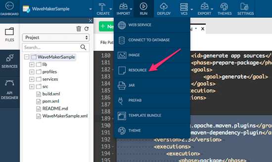
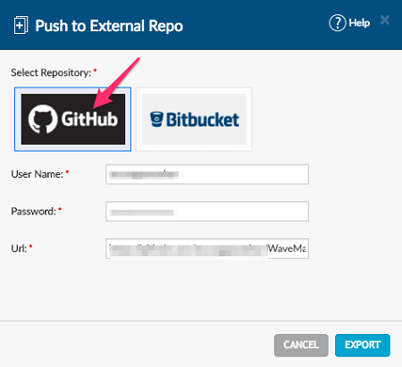
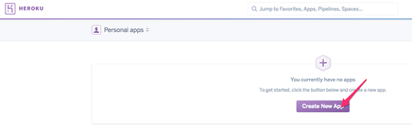

is a platform as a service (PaaS) that enables developers to build, run, and manage applications entirely in the cloud. Developers can setup a Continuous Integration pipeline for a wide range of technologies.

post demonstrates how you can deploy a WaveMaker app to Heroku. You can also setup auto deploy from an associated GitHub account.

process can be divided into following three steps:

1. [WaveMaker App for Heroku](#configure-app) - which includes
    - Heroku's webapp-runner plugin
    - Heroku's Procfile
    - app in external repo
2. [and Configuring Heroku App](#create-heroku-app) including
    - Heroku app
    - it to the external repo
3. [and Run the App](#deploy-app)

**\-requisites**

- WaveMaker App. [here for a jump start on WaveMaker App Building process](/learn/jump-start/jump-start-app-essentials/)

**Configuration Setup for Heroku**

1. the WavaMaker App you want to deploy to Heroku.
2. _Heroku’s webapp-runner plugin_ -  and add the following (as mentioned in the section “Configure Maven to download Webapp Runner” of  this ).
    
           <plugin>
                <groupId>org.apache.maven.plugins</groupId>
                <artifactId>maven-dependency-plugin</artifactId>
                <version>2.3</version>
                <executions>
                    <execution>
                        <phase>package</phase>
                        <goals><goal>copy</goal></goals>
                        <configuration>
                            <artifactItems>
                                <artifactItem>
                                    <groupId>com.github.jsimone</groupId>
                                    <artifactId>webapp-runner</artifactId>
                                    <version>8.0.30.2</version>
                                  <destFileName>webapp-runner.jar</destFileName>
                                </artifactItem>
                            </artifactItems>
                        </configuration>
                    </execution>
                </executions>
            </plugin>
    
    
3. a Heroku’s to WaveMaker App
    1. the instructions at [your application to Heroku→ Create Procfile](https://devcenter.heroku.com/articles/java-webapp-runner#create-a-procfile) the Procfile as a local file on your machine
    2. it to the root of WaveMaker project using the **\-> Resource** menu  
4. up app in External Github Repository
    1. your application to External Repository 
    2. changes if prompted 
    3. your GitHub credentials and a new repository name. 
    4. repository will be created and code will be pushed to your GitHub account. 

## and Configure Heroku application

1. a new application in Heroku. 
2. Heroku application to GitHub. 
3. GitHub project name and connect. 
4. Settings Add buildpack 
5. Java and Save changes 

## and run the application

1. the Deploy tab, Deploy Manually. 
2. Heroku application after the deployment is done. 
3. app is now running in Heroku
4. , enable auto deployment. Any push to GitHub repository will automatically deploy your application now. 

to Heroku

- [1. Configure WaveMaker App for Heroku](#configure-app)
- [2. Create & Configure Heroku App](#create-heroku-app)
- [3. Deploy and Run](#deploy-app)
