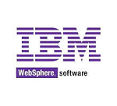

Applications built with WaveMaker can be deployed to a number of environments. In this document, we walk through the process of WaveMaker app deployment to Web Server.

1. will need a valid Web Server installation. The following is a list of Web Servers where the WaveMaker apps can be deployed. **: This list is for reference purpose. Apart from these, you can use any standard Java Web Server running on JDK 1.8 and Servlet Framework version 3.1.**
    
    **Server**
    
    
    
    8.x
    
    [instructions](/learn/how-tos/wavemaker-application-deployment-tomcat/)
    
    9.x
    
    
    
    17.0.0.2 Liberty
    
    [instructions](/learn/how-tos/wavemaker-application-deployment-websphere-liberty-profile/)
    
    
    
    10.0
    
    [instructions](/learn/how-tos/wavemaker-application-deployment-jboss/)
    
    11.0
    
     WebLogic
    
    12c (12.2.1)
    
    [instructions](/learn/how-tos/wavemaker-application-deployment-weblogic-application-server/)
    
2. need to set up the **profile** - you can choose to use the [profile](/learn/app-development/deployment/configuration-profiles/) configured by WaveMaker based upon the services incorporated within the app or build a [profile](/learn/app-development/deployment/configuration-profiles/#custom-profile) as per your needs
3. need to generate a **WAR file** of the WaveMaker app you want to deploy. WAR file can be generated either by
    - **Export** -> **as WAR** option, or
    - \-> **as ZIP** and use this file to generate WAR file through [Build](https://maven.apache.org/) : For deployment to WebSphere (for apps with JNDI profile) and to WebLogic there is a pre-processing needed before generating the war file, check the corresponding deployment instructions before proceeding. 
4. a WAR file is generated, deploy the same to , , , or  following the instructions that are given.
    
    , the WAR file may also be deployed to public or private cloud servers. To deploy an application to one of the supported clouds you will need to:
    
    - an account (public cloud) or install the software (private cloud)
    - a cloud instance - a virtual machine with a standard operating system
    - a Java web server - for example, Tomcat
    - the WaveMaker WAR to the Java web server
    
    : Instead of above steps you can instantly deploy to Amazon Web Service or to WaveMaker Demo Cloud with just a single click. [about one-click deployment](/learn/app-development/deployment/one-click-deployment/)
    

< Manage Deployed Apps

to Tomcat >

to WebSphere >

to JBoss >

to WebLogic >

Profile >

9\. Deployment

- 9.1 One-Click Deployment
    - [Overview](/learn/app-development/deployment/one-click-deployment/)
    - [Deployment to Cloud](/learn/app-development/deployment/one-click-deployment/#cloud-deployment)
- 9.2 Release Management
    - [Overview](/learn/app-development/deployment/release-management/)
    - [Implementation](/learn/app-development/deployment/release-management/#working)
- 9.3 Manage Deployed Apps
    - [Overview](/learn/app-development/deployment/manage-deployed-apps/)
    - [Apps Portal](/learn/app-development/deployment/manage-deployed-apps/#apps-portal)
    - [Manage Deployed App](/learn/app-development/deployment/manage-deployed-apps/#manage-deployed-app)
    - [Push to Live](/learn/app-development/deployment/manage-deployed-apps/#push-to-live)
    - [App Versioning](/learn/app-development/deployment/manage-deployed-apps/#versioning)
    - [AWS Deployment](/learn/app-development/deployment/deployment-to-aws/)
    - [Azure Deployment](/learn/app-development/deployment/deployment-to-azure/)
    - [Google Cloud Deployment](/learn/app-development/deployment/deployment-google-cloud/)
- [9.4 Deployment to Web Server](#)
    - [Overview](#)
    - [WAR file generation](#war-file-generation)
    - [Deployment to Tomcat](/learn/how-tos/wavemaker-application-deployment-tomcat/)
    - [Deployment to WebSphere](/learn/how-tos/wavemaker-application-deployment-websphere-liberty-profile/)
    - [Deployment to JBoss](/learn/how-tos/wavemaker-application-deployment-jboss/)
    - [Deployment to WebLogic](/learn/how-tos/wavemaker-application-deployment-weblogic-application-server/)
- 9.5 Configuration Profiles
    - [Overview](/learn/app-development/deployment/configuration-profiles/)
    - [Development Profiles](/learn/app-development/deployment/configuration-profiles/#dev-profile)
    - [Deployment Profiles](/learn/app-development/deployment/configuration-profiles/#deploy-profile)
    - [Custom Profiles](/learn/app-development/deployment/configuration-profiles/#custom-profile)
