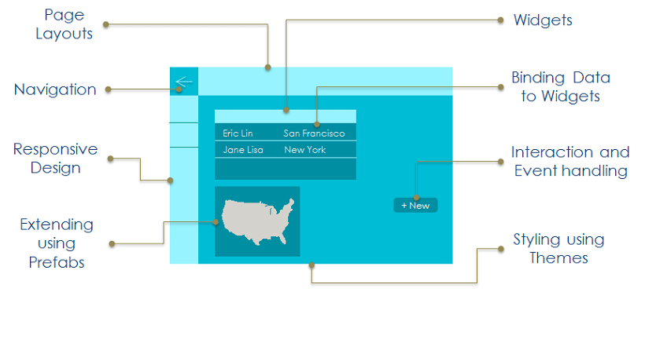
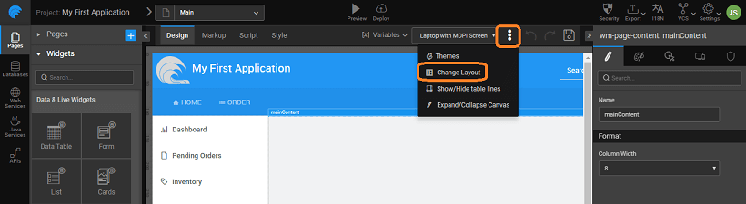
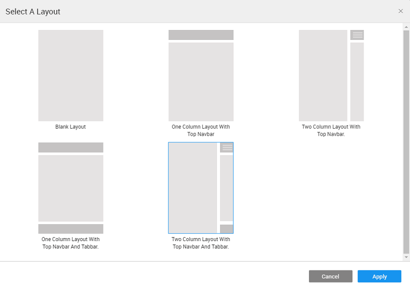
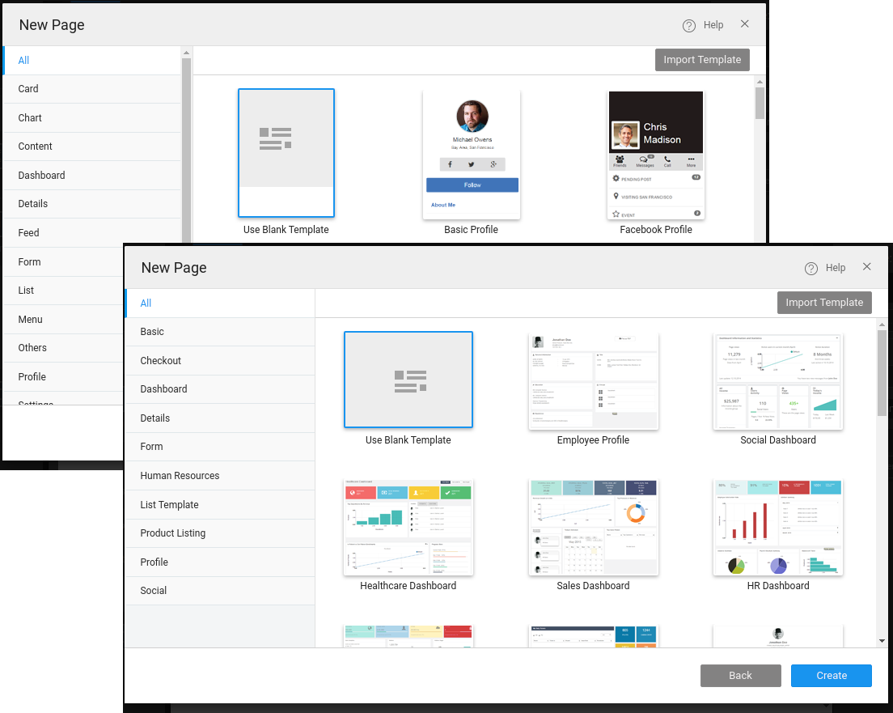

# App UI Design

application is a collection of pages, with each page being composed of various UI elements or Widgets. These UI elements enable user interaction with the app and can get data from backend Services via Variable binding. Navigation and interaction rules can be setup across pages. Thus, the UI design becomes an integral part of any app development.

WaveMaker Pages are built using the drag-n-drop approach, by placing widgets in the corresponding responsive layout grids.

# UI

The design of UI involves the following subtasks:

1. a proper **Layout** for composition of Widgets or UI Elements;
2. various for:
    - rendering,
    - interaction and event handling, and
    - navigation to control the workflow
3. to customize and extend the widget capabilities
4. using and

# is Responsive Design

page is divided automatically into different areas, with the content of all areas except the main area, repeated across all pages of the app. This helps achieve UI consistency throughout the app, easily.

**Design**: WaveMaker supports responsive design, i.e. the apps are rendered automatically based upon the device they are viewed on.  This is achieved using the 12-column grid layout defined by bootstrap. [ on Grid Layout](/learn/app-development/widgets/container/grid-layout/) 

## \-usability and Consistency

Various types of Pages help achieve this consistency and reusability.

**pages** are reusable portions of a page, for repeatedly occurring UI elements with same data binding (e.g.: profile info, business card etc.). Partial page is built just like any other page, using any UI element and data binding. Partial page can also be built from templates and are always included within a page. The header, footer, topnav, leftnav and rightnav, when added to page through the layouts, are partial pages generated by WaveMaker automatically. They can be edited like any other page and customised as per your app needs.

, also known as pop-up, can be built as a portion of a page, reusable and contains UI elements with data binding (e.g.: drill down details, pop-up menus etc.). These can be built like a partial page, but have pop-up based interaction.

[on Pages](/learn/app-development/ui-design/page-concepts/)

**Layout**: Based on the Page construction system WaveMaker provides different options for Page Layouts, which can be picked based on the interaction required for the app. Depending upon the app platform the layout will differ.

Layout can be set at the time of Page Creation or can be changed from the Workspace Toolbar

 Responsive

  [on Responsive Web Page Layout](/learn/responsive-web/web-ui-design/)

 Mobile

[on Hybrid Mobile Page Layout](/learn/hybrid-mobile/mobile-page-concepts/)

 are style elements which work at the widget or UI component level. [ on Themes](/learn/app-development/ui-design/themes/)

By default, Material Theme is set for Page and can be changed from the Workspace Toolbar.

are editable pages with content pre-defined for the ease of UI development. [on templates](/learn/app-development/ui-design/page-concepts/page-templates/)

Templates are selected at the time of Page Creation and cannot be changed later.

# \-n-drop UI development

 are designed as a composition of Widgets or UI Elements. Widgets are the building block for any application. Widgets enable users to interact with the App and can get their data (binding) from backend Services.

They can be dropped into the Grids or Containers, making UI well-aligned and ready for consumption.

[on Widgets](/learn/app-development/widgets/ui-elements/)

Concepts >

2\. Design UI

- - [2.1 Overview](#)
        - [App UI Design](#app-ui-design)
        - [Responsive Design](#responsive-design)
        - [UI Development](#ui-development)
    - 2.2 Page Concepts
        - [Single Page Apps](/learn/app-development/ui-design/page-concepts/)
        - [Page Life Cycle](/learn/app-development/ui-design/page-concepts/#page-lifecycle)
        - [Page Creation](/learn/app-development/ui-design/page-creation/)
        - [Parameter Passing](/learn/app-development/ui-design/page-creation/#page-parameters)
        - [Partial Pages](/learn/app-development/ui-design/page-concepts/partial-pages/)
        - vi. Page Basics
            - [Page Layouts](/learn/app-development/ui-design/page-concepts/page-layouts/#page-layouts)
            - [Page Navigation](/learn/app-development/ui-design/page-concepts/page-layouts/#page-navigation)
            - [Events](/learn/app-development/ui-design/page-concepts/page-layouts/#events)
                - [Event Categorization](/learn/app-development/ui-design/page-concepts/page-layouts/#event-categorization)
                - [Multiple Event Handling](/learn/app-development/ui-design/page-concepts/page-layouts/#multiple-events)
        - [Page Templates](/learn/app-development/ui-design/page-concepts/page-templates/)
            - [ Custom Page Templates](/learn/app-development/ui-design/page-concepts/page-templates/#creating-page-templates)
        - [Use Cases](/learn/app-development/ui-design/use-cases-ui-design/)
    - [2.3 Project Shell](/learn/app-development/ui-design/project-shells/)
    - 2.4 Page Artefacts
        - [Overview](/learn/app-development/ui-design/page-artefacts/)
        - [Markup](/learn/app-development/ui-design/page-artefacts/#page-markup)
        - [Script](/learn/app-development/ui-design/page-artefacts/#page-script)
        - [Style](/learn/app-development/ui-design/page-artefacts/#page-style)
    - 2.5 Themes
        - [Overview](/learn/app-development/ui-design/themes/)
        - [Applying Theme](/learn/app-development/ui-design/themes/#apply-theme)
        - [Importing Theme](/learn/app-development/ui-design/themes/#import-theme)
        - [Creating Themes](/learn/app-development/ui-design/themes/#create-theme)
            - [Creating Web Theme](/learn/app-development/ui-design/themes/#create-theme-web)
            - [Creating Web Theme using Bootswatch](/learn/app-development/ui-design/themes/#create-theme-bootswatch)
            - [Creating Mobile Theme](/learn/app-development/ui-design/themes/#create-theme-mobile)
        - [Building Theme](/learn/app-development/ui-design/themes/#build-theme)
        - [Testing Theme](/learn/app-development/ui-design/themes/#test-theme)
