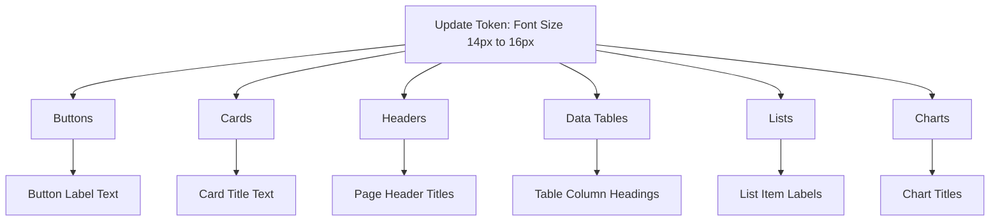

import DesignSystemArchitecture from '/learn/assets/design-system-architecture.png';

### What is Design System?

A design system is a framework for creating and maintaining a consistent application theme across all components. It uses tokens to define reusable styles like colors, typography, and spacing and more. WaveMaker brings the Design System concept into a practical, visual environment that connects design and development seamlessly.


#### 1. Design Phase: Figma  
Designers define the base design tokens — colors, typography, spacing, and other style rules — directly in Figma.  
These tokens represent the visual foundation of your brand or app theme.

#### 2. Automation: AutoCode Plugin  
The AutoCode Plugin acts as the bridge between Figma and WaveMaker.  
When you use the plugin, it:
- Extracts design tokens and component styles from Figma.  
- Converts them into WaveMaker-readable JSON structures.  
- Pushes those token definitions into WaveMaker Studio via the **“Edit in WaveMaker”** action.  

This ensures that:
- The design file from Figma is automatically translated into an editable design system inside WaveMaker.  
- The corresponding JSON files are generated and mapped correctly, so tokens can be modified within the Style Workspace.

#### 3. Styling: WaveMaker Style Workspace  
Once imported, the Style Workspace becomes the central hub to manage and customize those tokens visually.  
Developers can:
- Edit colors, typography, and spacing in real time.  
- Preview all design updates instantly before applying them globally.  
- Work on top of the synchronized JSON tokens from Figma, ensuring design–code consistency.

#### 4. Application: Live App UI  
After the updates are confirmed, the token changes automatically cascade across all linked components in the app.  
Every color, font, and spacing update made in Style Workspace is reflected live in the App UI — no manual CSS edits or repetitive style updates required.

### Example: Brand Color Update

Imagine your app’s primary brand color is blue. You decide to switch it to orange:


Think of it like **update once** → **preview** → **applied everywhere**.

1. Update the primary color token in [Style Workspace](/learn/design-system/working-with-style-workspace).
2. Instantly, every button, card header, and link using that token changes to orange in the preview.
3. Once you confirm, the update is applied across the app. No need to manually edit each component.

By updating a token once, you can instantly preview changes and apply them across your entire app with just a few clicks.

### Why WaveMaker uses Them

#### Consistency Across Apps

Tokens ensure every component in your app follows the same style rules, from buttons to text, so the design looks uniform everywhere. If you set your brand’s primary color as #E8925C, every button, link, or heading that uses this token instantly reflects the same brand color across all screens.

#### Scalability for Enterprise Apps

Design tokens let you manage styles centrally, so updating a single token cascades changes across 90+ components, scaling effortlessly for large apps. An enterprise dashboard with 20+ modules: update the token for font size, and every chart title, list label, and data table adjusts automatically. 



Learn more about the [Design Token architecture here](/learn/design-system/design-token-architecture). 

#### Cross-Platform Theming

Tokens are framework-agnostic, working seamlessly across web and mobile. They also enable instant theme switching, like Light and Dark modes. 

**For example**: toggle your app from Light to Dark mode; all backgrounds, text, and buttons adapt automatically without separate styling.

#### Collaboration Between Designers & Developers

Tokens act as a shared language between design tools (like Figma) and development in WaveMaker, reducing miscommunication. 

For example, a designer updates the typography scale in Figma. The exported tokens automatically apply to the app, so developers don’t re-code font sizes.

:::note
Figma file → Autocode Plugin → Edit in WaveMaker → token JSON → app UI.  

Figma file → Autocode Plugin → token JSON → app UI.  
:::

#### Easy Preview & Testing

WaveMaker lets you preview token changes in real time, so you see exactly how updates look before saving. For example, change a button’s corner radius token from 4px to 12px, preview it live, and then confirm to apply across the app.


<details>
<summary>Behind the Scenes: What is the role of Amazon Style Dictionary in the WaveMaker design token system?
</summary>

Platform-Agnostic Tokens → Platform-Specific Output


| Platform     | Output Format     | Example                                       |
| ------------ | ----------------- | --------------------------------------------- |
| Web          | CSS Variables     | `--color-primary: #E8925C;`                   |
| React Native | JavaScript Object | `{ colorPrimary: "#E8925C" }`                 |
| iOS          | Swift Constants   | `let colorPrimary = UIColor(hex: "#E8925C")`  |
| Android      | XML Resources     | `<color name="color_primary">#E8925C</color>` |

Tokens in JSON (agnostic):  
Defined once, in a neutral format (JSON).  
Example:

```css
{
  "color": {
    "primary": { "value": "#E8925C" }
  }
}
```

Generated Files (platform-specific):  
These JSON tokens are compiled into the right format for each platform:  

```css
Web → CSS variables

:root {
  --color-primary: #E8925C;
}
```

React Native → Style objects

```css
export const tokens = {
  colorPrimary: "#E8925C"
}
```

</details>
