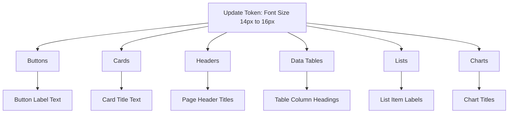

import DesignSystemArchitecture from '/learn/assets/design-system-architecture.png';

### What is Design System?

A design system is a framework for creating and maintaining a consistent application theme across all components. It uses tokens to define reusable styles like colors, typography, and spacing. By updating a token once, you can instantly preview changes and apply them across your entire app with just a few clicks.

Think of it like **update once** → **preview** → **applied everywhere**.


Imagine your app’s primary brand color is green. You decide to switch it to blue:

1. Update the primary color token in [Style Workspace](#).
2. Instantly, every button, card header, and link using that token changes to blue in the preview.
3. Once you confirm, the update is applied across the app. No need to manually edit each component.

### Why WaveMaker uses Them

**Consistency Across Apps**: Tokens ensure every component in your app follows the same style rules, from buttons to text, so the design looks uniform everywhere. If you set your brand’s primary color as #E8925C, every button, link, or heading that uses this token instantly reflects the same brand color across all screens.

**Scalability for Enterprise Apps**: Design tokens let you manage styles centrally, so updating a single token cascades changes across 90+ components, scaling effortlessly for large apps. An enterprise dashboard with 20+ modules: update the token for font size, and every chart title, list label, and data table adjusts automatically. 



**Cross-Platform Theming**: Tokens are framework-agnostic, working seamlessly across web and mobile. They also enable instant theme switching, like Light and Dark modes. For example, toggle your app from Light to Dark mode; all backgrounds, text, and buttons adapt without separate styling per platform.

**Collaboration Between Designers & Developers**: Tokens act as a shared language between design tools (like Figma) and development in WaveMaker, reducing miscommunication. For example, a designer updates the typography scale in Figma. The exported tokens automatically apply to the app, so developers don’t re-code font sizes.

Figma file → Autocode Plugin → token JSON → app UI
Figma file → Autocode Plugin → Edit in WaveMaker → token JSON → app UI

**Easy Preview & Testing**: WaveMaker lets you preview token changes in real time, so you see exactly how updates look before saving. For example, change a button’s corner radius token from 4px to 12px, preview it live, and then confirm to apply across the app.

<details>
<summary>
Quick question: What is the role of Amazon Style Dictionary in the Wavemaker design token system?
</summary>

Platform-Agnostic Tokens → Platform-Specific Output

Tokens in JSON (agnostic):  
Defined once, in a neutral format (JSON).  
Example:

```css
{
  "color": {
    "primary": { "value": "#E8925C" }
  }
}
```

Generated Files (platform-specific):  
These JSON tokens are compiled into the right format for each platform:  

```css
Web → CSS variables

:root {
  --color-primary: #E8925C;
}
```

React Native → Style objects

```css
export const tokens = {
  colorPrimary: "#E8925C"
}
```

iOS → Swift constants  
Android → XML resources
</details>

## Style Workspace

