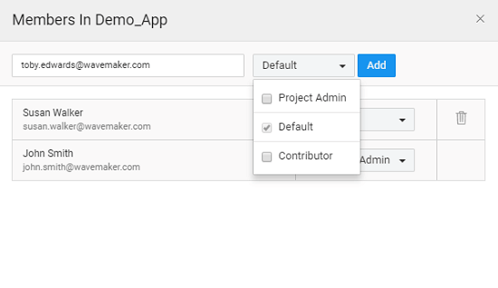
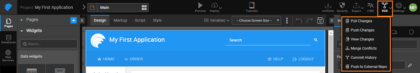

Developer Collaboration includes two steps:

1. the project and dividing the work between multiple contributors, and
2. and keeping up to date with the changes made by these collaborators.

In this document, we will be seeing how this can be achieved for WaveMaker.

# Sharing

Sharing ensures that you do not lose any changes made by the developer network by tying your app into a version control system. You can start collaborative development, by, from the [**Dashboard**](http://[supsystic-show-popup id=102])

- on Members link on the [card](http://[supsystic-show-popup id=103]) to view the App Member Details, add and remove having access to the project. 

### members

- default, the owner of the project is assigned the role of a Project Admin.
- Admin can add members to the Project, these new members are assigned the Default role which gives them read access.
- the email id of the Member you want to add as Project Admin or Contributor in the appropriate text box and click the button. This feature is available only to the Project Admins.
- **Project Admins and contributors** can be added to the project.

**:** _need not be on the same email domain to collaborate on the project. _

### Roles

- the user is added as Project Admin/Contributor, the role can be changed. To change the role of the existing member, click on More options and select Add as Project Admin/Add as Contributor option.
- opens a  confirmation dialog saying <user\_name> role will be changed from <existing\_role> to <new\_role> in <project\_name>. Click OK button to confirm.

[here](/learn/app-development/wavemaker-overview/project-user-management/#roles) to know more about the Roles.

**:** Only the Project Admins are allowed to change the roles.

### a member

- Project Admin can remove a member from the project using Remove option. The owner, who created the project cannot be deleted. However, the owner's role can be changed to a contributor.
- gives a confirmation dialog box, stating whether the <user\_name> needs to be removed from the <project\_name>

### project

- the [card](http://[supsystic-show-popup id=103]), you can leave or delete the project from the Leave project/Delete option on the project.

#  Code Sharing - VCS

multiple developers are working on the same application, tracking code changes and synchronizing the changes is of the essence. WaveMaker provides Version Control Services for this purpose.

**control** is the process of tracking and controlling changes to a project's files, which includes source code, documentation, and web pages. Subversion and Git are examples of such version control systems.

includes an integrated version control system. When you open a project it is checked out from the version control repository. You can pull, push, revert and merge changes back to the repository. WaveMaker version control system by default is hosted on You can choose to push your code to an external VCS, too.

the Project Listing page, you have the option to your project to the repo version, thus replacing your local copy of the project with the one in the repo.

Also, in the project workspace, you will find that a **Menu** is displayed for projects.

# Control System

### Project

you start working on a project, i.e. open it from the Project Dashboard, the project is checked out from the repository. Any changes made to the project will be saved on your local machine. To ensure that the changes are reflected in the repository, one needs to explicitly push the changes to the repository.

###  Pull Changes

1. your project listings page, a notification will indicate when your team collaborator has pushed any changes to the shared project.
2. the project workspace of a checked out project, from the menu, select **Changes**
3. will ensure that your local copy of the project gets the latest copy of the project.

###  Push Changes

1. the project workspace of a checked out project, from the menu, select **Changes**
2. **Changes ** is displayed, where you need to enter the Commit Message. There are two parts to the Commit Message
    1. commit message to be entered by the developer, and
    2. \-populated message based on New Files Added, Files modified and Removed files categories. Any of these categories will be shown if there are any files related to that category. When there are no changes in the project, the auto-populated message will be displayed.
3. a Commit Message summarizing your changes and click on  check in the changes you have made to the project code back to the repository.

###  View Changes

Changes enables you to see the code difference. If you wish to undo the changes that you have performed on a project that you have checked out, you can revert changes to all or some of the files using the revert changes option.

1. the project workspace of a checked out project, From the  menu, select  **Changes** The changes made to your project will be displayed:
    - , based upon the functionality and folder structure, into Pages, Services, Prefabs, Folders and standalone files;
    - can choose the category to revert the changes. All the files in the categorized sections will follow the atomicity rules - the action can be taken in all or no files for both ADDED and DELETE operations. However, for cases where the files are modified, the user is provided an option to REVERT the files individually within the category.
2. the  **Diff** icon against the file you to see the code changes, with conflicts clearly marked. You can choose to revert or save the changes.
3. can also select the files that you want to revert changes for and click The project reloads after reverting your changes. You can also use the select-all option on the dialog to revert all the changes across the project.

###  Merge Changes

you perform a pull or a push operation, you may have to merge files and resolve conflicts resulting from the changes by other team members or developers. WaveMaker will prompt you with a **Files ** to merge files and resolve conflicts when you try to Push changes. You can also click on  **Files** the menu to merge files and resolve conflicts.

**Files** dialog displays a list of files which need to merge. For each file, it displays the changes from the server, local changes and a merged result alongside to compare the differences. The merged result is shown in the center. The dialog also displays conflicting and non-conflicting changes in different colors to make merging easier. You can select multiple files and apply the same behavior to all. You can choose to Discard Pull Changes and revert back to the original version.

are three ways to merge files:

- **only server changes**: Review the changes and click **Theirs** button to accept only server changes.
- **only your changes**: Review the changes and click  **Yours** button to accept only local changes.
- **Conflicts**: Each change has a corresponding region next to it which links it to the merged result. You can click on a region to exclude the corresponding changes from the merged results. You can even edit the merge results to make changes to the code manually. Once you are satisfied with the merged result (displayed in the center), click to accept the merged result.

: Currently, Merge Files supports code level merges and the user is expected to know about the generated code of the project.

###  Commit History

"Commit History"  option under VCS shows history (git log) of last 10 commits with the following information:

- Time and Date,
- ,
- Message

can navigate through the older and newer commits by 10 commits each time by clicking on Older and Newer buttons.

###  Push to External Repo

can choose to have a copy of your project code in an **Repo** WaveMaker supports GitHub, Bitbucket and any Git repository. This functionality is available only for Project Admins.

the **to External Repo** option from the **Menu** You will be prompted to choose from three options: , or **Repo** Provide the credentials of the selected repo and the project code will be to that repo using the credentials provided.

can specify the branch to which the project needs to be pushed. In case the branch does not exist, one will be created. When using an existing branch, keep in mind that the folder structure of the selected branch should match the code being pushed. You can optionally choose the branch from the list provided.

:

- option is available only to PUSH to the external repo, it does not update the project on WaveMaker with the code from the external repository.
- using GitHub or Bitbucket, you should be having an account by registering with either of them. If no URL is provided one will be created for you.
- work with the **Repo** Repository URL is mandatory, you have to create the repo and provide the URL.

< Import, Export & Update Apps

\>

8\. Developer Integrations

- 8.1 Test(Preview) and Run Apps
    - [Overview](/learn/dev-integration/developer-tools/)
    - [Preview](/learn/dev-integration/developer-tools/#preview)
    - [Run](/learn/dev-integration/developer-tools/#run)
- 8.2 Import, Export & Update App
    - [Overview](/learn/app-development/dev-integration/import-export-update-apps/)
    - [Export](/learn/app-development/dev-integration/import-export-update-apps/#export-project)
    - [Import](/learn/app-development/dev-integration/import-export-update-apps/#import-project)
    - [Update](/learn/app-development/dev-integration/import-export-update-apps/#update-project)
    - [Project Recovery](/learn/app-development/dev-integration/import-export-update-apps/#project-recovery)
        - [Export](/learn/app-development/dev-integration/import-export-update-apps/#export)
        - [Restore](/learn/app-development/dev-integration/import-export-update-apps/#restore-project)
- [8.3 Developer Collaboration](#)
    - [Overview](#)
    - [Project Sharing](#project-sharing)
    - [Code Sharing - VCS](#vcs)
        - [Checkout](#checkout)
        - [Pull Changes](#pull-changes)
        - [Push Changes](#push-changes)
        - [View Changes](#view-changes)
        - [Commit History](#commit-history)
        - [Merge Conflicts](#merge-changes)
        - [Push to External Repo](#push-to-external-repo)
- 8.4 Debugging
    - [Overview](/learn/app-development/dev-integration/debugging/)
    - [Debugging using Log Files](/learn/app-development/dev-integration/debugging/#logs)
    - [Debugging through JavaScript](/learn/app-development/dev-integration/debugging/#javascript)
- 8.5 App Extensions
    - [Overview](/learn/dev-integration/extending-application-using-ides/)
    - [Working with IDEs](/learn/dev-integration/extending-application-using-ides/#steps)
    - [Integrating with Jenkins](/learn/dev-integration/extending-application-using-ides/#jenkins)
