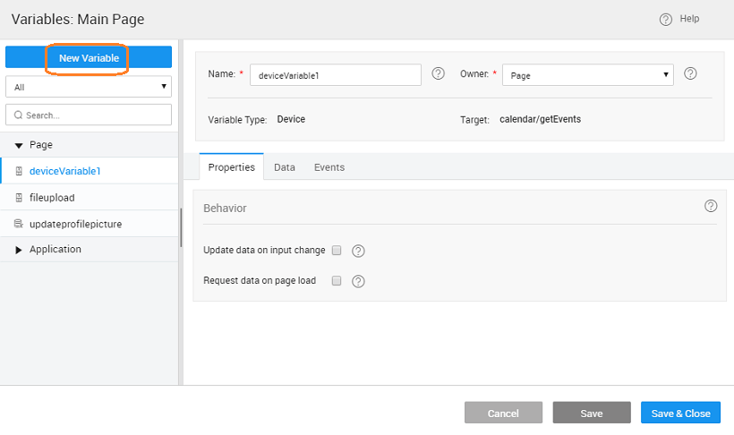

**Variables** are specific to Mobile App projects. These are useful in performing operations specific to a Mobile Device like taking a picture and getting its path, select a contact, add events to a calendar, etc.

s the target service to be used. Each service is targeted to perform a set of operations for a feature. Available services are:

- – you can use this service to add, remove and list events in your phone calendar. The event details would include title, notes, location, start and end times.
- – you can use this to capture an image or a video
- – you can use this variable to list the contacts on your phone. You can apply a filter on the list retrieved.
- \- you can use this service to sync data
- – you can use this service to handle your mobile device features like vibrate, get connection type, model, OS, OS version etc.
- – you can upload files to your mobile device
- – can be used to access the barcode scanner.

Based upon the service selected various operations are available.

[Service Operations](#calendar)

[Service Operations](#camera)

[Service Operations](#device)

[Service Operations](#device)

[Service Operations](#device)

[Service Operations](#file)

[Service Operations](#scan)

## Service Operations

: Creates calendar event in device

**Parameter** (from Data Tab)

Title

the event title

‘Space Race’

Notes

notes related to the event

‘Bring Sandwiches’

Location

the event location

‘The Moon’

Start

the start date and time of the event

2016-09-20 10:35:38 AM (select value from date time input)

End

the end date and time  of the event

2016-09-25 08:35:38 PM (select value from date time input)

: Deletes the calendar event in device satisfying the provided input, any combination of the below-mentioned parameters

**Parameter** (from Data Tab)

Title

the event title

‘Space Race’

Notes

notes related to the event

‘Bring Sandwiches’

Location

the event location

‘The Moon’

Date

the start date of the event

2016-09-20 10:35:38 AM (select value from date time input)

Date

the end date of the event

2016-09-25 08:35:38 PM (select value from date time input)

: Retrieves the calendar events in device satisfying the provided input, any combination of the below-mentioned parameters. Returns array of objects, each object containing the same fields as input parameters.

data on input change

checked, the component will be triggered automatically on the change of input data (as mentioned in the data tab) for the variable.

or unchecked

data on page load

checked, 'Page' variable will be triggered on page load while 'Application' variable will be triggered on application load

or unchecked

**Parameter** (from Data Tab)

Title

the event title

‘Space Race’

Notes

notes related to the event

‘Bring Sandwiches’

Location

the event location

‘The Moon’

Date

the start date of the event

2016-09-20 10:35:38 AM (select value from date time input)

Date

the end date of the event

2016-09-25 08:35:38 PM (select value from date time input)

## Service Operations

: Capture image from the device camera

**Parameter** (from Data Tab)

Edit

simple editing of image before selection

(default), false

the quality of saved image, expressed as a range of 0-100, where 100 is typically full resolution with no loss of file compression. The default value is 80.

80

Type

the returned image file’s encoding.

(default) or PNG

Orientation

the image to correct for the orientation of the device during capture.

(default) or false

Width\*

in pixels to scale image.

100 (only when required to get small images)

Height\*

in pixels to scale image.

100 (only when required to get small images)

\*: To get smaller images, you can return a resized image by passing both targetHeight and targetWidth values. If these values are not set, it returns the original image captured by the camera.

: to capture video using the device camera

## Service Operations

: Retrieves the device contacts list

**Parameter** (from Data Tab)

string field can be used as a search filter when querying the contacts database. If provided, a case-insensitive, partial value match is applied to each field specified in the contactsFields parameter. If there is a match for any of specified fields, the contact is returned.

:

data on input change

checked, the component will be triggered automatically on the change of input data (as mentioned in the data tab) for the variable.

data on page load

checked, 'Page' variable will be triggered on page load while 'Application' variable will be triggered on application load.

: Returns array of objects, each object containing phoneNumber and displayName fields. : Sample Input: “Bob” (contact name) Result: Retrieves all the contacts containing string “Bob”

## Service Operations

: Offline database is saved as zip in ‘Downloads’ folder in Android. In IOS, zip is stored in ‘Documents’ folder so that one can export from iPhone via iTunes. For the file to be visible in iTunes, File sharing needs to be enabled for the app in iOS preferences.

Context

the pull process is happening, a spinner will be shown in the container that is selected. By default, no context is selected and the spinner will not be shown

of file

: Retrieves the changes made when offline

of changes while offline

pending sync

for which sync failed

: Upon invocation, a file browser opens up to choose the zip file to import.

Context

the pull process is happening, a spinner will be shown in the container that is selected. By default, no context is selected and the spinner will not be shown

: Pull changes from the server to the device

offline data before pull

checked, then the whole offline data (other than BUNDLED data) will be deleted before the pull. The default is true (checked).

Progress

the pull process is happening, a progress bar will be shown. By default, the progress bar will not be shown.

of entities data to pull

number of entities data has been pulled so far.

when data pull process is going on, otherwise false

: Push changes to the server from the device

Progress

the pull process is happening, a progress bar will be shown. By default, the progress bar will not be shown.

of tasks/changes that were successfully pushed to the server.

 Number of changes that failed.

of completed tasks (both successful and failed).

total number of local changes that need to be pushed to the server.

 true only when data push process is going on, otherwise false.

: to get the last pull details

Context

the pull process is happening, a spinner will be shown in the container that is selected. By default, no context is selected and spinner will not be shown

of entity names and number of records pulled per entity

of database names, list of entities within the database, and the number of records pulled per database.

total number of records in the last pull.

time of pull operation.

time of pull operation.

: to get the last push details

Progress

the pull process is happening, a progress bar will be shown. By default, progress bar will not be shown.

of successful tasks (changes synced to server)

of failed tasks

of completed tasks includes tasks which were successful and failed.

of total tasks includes tasks completed and pending

time of push operation.

time of push operation.

## Service Operations

: Returns the version number of the app

: Returns the current location of the app

**Parameter** (from Data Tab)

High Accuracy

a hint that the application needs the best possible results. By default, the device attempts to retrieve a ‘Position’ using network-based methods. Setting this property to true tells the framework to use more accurate methods, such as satellite positioning.

(default), false

Age

to accept a cached position whose age is no greater than the specified time in milliseconds.

number, the default is 3

the maximum length of time (milliseconds) that is allowed to pass from the call to navigator.geolocation.getCurrentPosition until the corresponding geolocationSuccess callback executes. If geolocationSuccess callback is not invoked within this time, geolocationError callback passes a PositionError.TIMEOUT error code.

number, the default is 5

: Returns the followingdevice information

of the device’s model or product. The value is set by the device manufacturer and may be different across versions of the same product.

device’s operating system name.

operation system version.

device’s Universally Unique Identifier (UUID)

: Provides information whether device has internet connection

the device’s connection type, eg: WIFI, ethernet

if phone network is offline

if phone network  is online

if the app is trying to connect to backend service

if network connection is available

: Vibrates the device programmatically

**(from data tab)**

_Time_

to vibrate the device. Default value is 2.

: Used to turn the mobile app to offline mode by blocking all network calls.

: Used to turn the mobile app to online mode by blocking trying to connect to the backend server.

## Service Operations

: Opens files like pdf, document, excel and powerpoint. Note: A file can be opened if corresponding application is available on the mobile device. For example, a pdf file requires acrobat reader or another file that can open the pdf. When a remote file has to be opened for the first time, the file is downloaded. On subsequent calls to open the same file, the earlier downloaded file is just opened.

**Parameter** (from Data Tab)

string value that denotes the type of file to open.

default value is pdf. Values can be pdf, doc, xls, ppt.

string value that denotes the URL of the file.

://www.pdf995.com/samples/pdf.pdf)

: Retrieves the device contacts list

**Parameter** (from Data Tab)

the file path on the device. remoteFolder represents the folder path on the server to save the uploaded image. If empty, then images gets saved to `/wavemaker/appdata//uploads`

## Service Operations

: to access the barcode scanner.

1. **Error**: The event is fired on the error of the device variable.
2. **Success**: The event is fired on the success of the device variable.
3. **Before:** This event is fired before starting the pull/push for the dataSync variable.
4. **Progress:** This event is fired during the pull/push for the dataSync variable.

## (options)

This method invokes the device variable

:

- (object)
- (callback)
- (callback)

_Value_: None

_:_

// Example 1: Notify with default set properties
Page.Variables.myDeviceVariable.invoke();

// Example 2: Notify with callback handlers
Page.Variables.myDeviceVariable.invoke(
    {},
    Function () {
       console.log('success');
     }, function () {
        console.log('error')
});

< Variables & Actions

6\. Data Integration - Variables

- 6.1 Binding Layer
    - [Overview](/learn/app-development/variables/data-integration/)
- [6.2 Variables and Actions](/learn/app-development/variables/variables-actions/)
    - [Overview](/learn/app-development/variables/variables-actions/#)
    - [Variables](/learn/app-development/variables/variables-actions/#variables)
        - a. Database CRUD
            - [Overview](/learn/app-development/variables/database-crud/)
            - [Variable Creation](/learn/app-development/variables/database-crud/#creation)
            - [Properties](/learn/app-development/variables/database-crud/#properties)
            - [Events](/learn/app-development/variables/database-crud/#events)
            - [Methods](/learn/app-development/variables/database-crud/#methods)
        - b. Database API
            - [Overview](/learn/app-development/variables/database-apis/)
            - [Variable Creation](/learn/app-development/variables/database-apis/#creation)
            - [Properties](/learn/app-development/variables/database-apis/#properties)
            - [Events](/learn/app-development/variables/database-apis/#events)
            - [Methods](/learn/app-development/variables/database-apis/#methods)
        - c. Web Service
            - [Overview](/learn/app-development/variables/web-service/)
            - [Variable Creation](/learn/app-development/variables/web-service/#creation)
            - [Properties](/learn/app-development/variables/web-service/#properties)
            - [Events](/learn/app-development/variables/web-service/#events)
            - [Methods](/learn/app-development/variables/web-service/#methods)
        - d. Java Service
            - [Overview](/learn/app-development/variables/java-services)
            - [Variable Creation](/learn/app-development/variables/java-services/#creation)
            - [Properties](/learn/app-development/variables/java-services/#properties)
            - [Events](/learn/app-development/variables/java-services/#events)
            - [Methods](/learn/app-development/variables/java-services/#methods)
        - e. Security Service
            - [Overview](/learn/app-development/variables/security-service/)
            - [Variable Creation](/learn/app-development/variables/security-service/#creation)
            - [Properties](/learn/app-development/variables/security-service/#properties)
            - [Events](/learn/app-development/variables/security-service/#events)
            - [Methods](/learn/app-development/variables/security-service/#methods)
        - f. Model
            - [Overview](/learn/app-development/variables/model-variable/)
            - [Variable Creation](/learn/app-development/variables/model-variable/#creation)
            - [Properties](/learn/app-development/variables/model-variable/#properties)
            - [Events](/learn/app-development/variables/model-variable/#events)
            - [Methods](/learn/app-development/variables/model-variable/#methods)
        - [Device Variables](#)
            - [Overview](#)
            - [Services](#services)
            - [Operations](#operations)
            - [Events](#events)
            - [Methods](#methods)
            - [Usage](#usage)
    - [Actions](/learn/app-development/variables/variables-actions/#actions)
        - i. Navigation
            - [Overview](/learn/app-development/variables/navigation-action/)
            - [Action Creation](/learn/app-development/variables/navigation-action/#creation)
            - [Properties](/learn/app-development/variables/navigation-action/#properties)
            - [Methods](/learn/app-development/variables/navigation-action/#methods)
        - ii. Login
            - [Overview](/learn/app-development/variables/login-action/)
            - [Action Creation](/learn/app-development/variables/login-action/#creation)
            - [Properties](/learn/app-development/variables/login-action/#properties)
            - [Data](/learn/app-development/variables/login-action/#data)
            - [Events](/learn/app-development/variables/login-action/#events)
        - iii. Logout
            - [Overview](/learn/app-development/variables/logout-action/)
            - [Action Creation](/learn/app-development/variables/logout-action/#creation)
            - [Properties](/learn/app-development/variables/logout-action/#properties)
            - [Events](/learn/app-development/variables/logout-action/#events)
        - iv. Timer
            - [Overview](/learn/app-development/variables/timer-action/)
            - [Action Creation](/learn/app-development/variables/timer-action/#creation)
            - [Properties](/learn/app-development/variables/timer-action/#properties)
            - [Events](/learn/app-development/variables/timer-action/#events)
            - [Methods](/learn/app-development/variables/timer-action/#methods)
        - v. Notification
            - [Overview](/learn/app-development/variables/notification-action/)
            - [Action Creation](/learn/app-development/variables/notification-action/#creation)
            - [Properties](/learn/app-development/variables/notification-action/#properties)
            - [Events](/learn/app-development/variables/notification-action/#events)
            - [Methods](/learn/app-development/variables/notification-action/#methods)
    - [Scoping](/learn/app-development/variables/variables-actions/#scoping)
    - [Variable Events](/learn/app-development/variables/variables-actions/#events)
    - [Error Handling](/learn/app-development/variables/variables-actions/#error-handling)
- 6.3 Variable Binding
    - [Overview](/learn/variables/variable-binding/#)
    - [Data Binding](/learn/variables/variable-binding/#data-binding)
    - [Widget Binding](/learn/variables/variable-binding/#widget-binding)
    - [Binding Options](/learn/variables/variable-binding/#binding-options)
- 6.4 JavaScript Access
    - [Overview](/learn/variables/accessing-elements-via-javascript/#)
    - [Widget Controllers](/learn/variables/accessing-elements-via-javascript/#widget-controllers)
    - [Page Scripting](/learn/variables/accessing-elements-via-javascript/#page-scripting)
    - [Script Access](/learn/variables/accessing-elements-via-javascript/#script-access)
