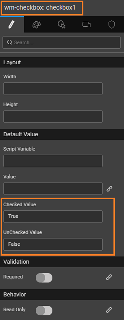
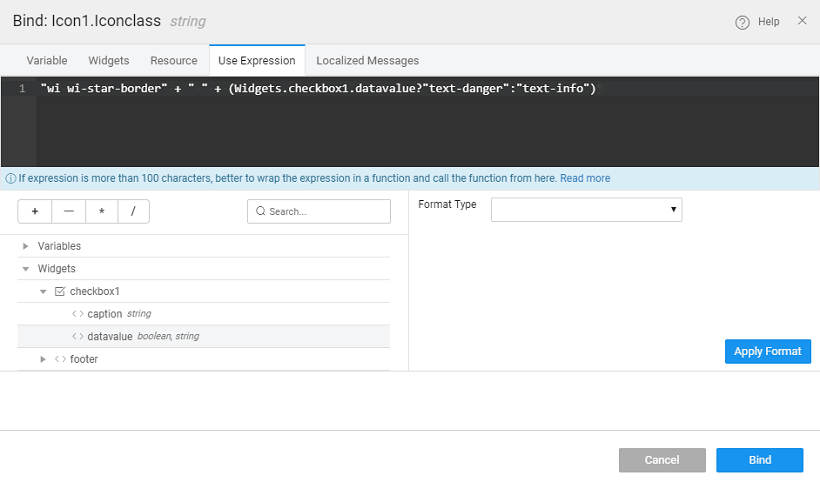

In WaveMaker many widgets like Panel, Button etc. have a way to display an icon. You can choose the icons from the list of wavicons or font-awesome icons or glyph icons.

You can change the color of the Icon displayed based upon a condition. Here we will see how to change the Icon color based upon selection of a Checkbox:

1. and drop an Icon and a Checkbox widget.
2. the Checkbox widget, set the "checked value" and "unchecked value" as true and false respectively. 
3. on the Icon widget and for the "Icon Class" property click on the bind icon 
4. the expression as below "<glyph class name>" + " " + (Widgets.<checkbox\_name>.datavalue?"first\_calssname":"second\_classname")  In this example the expression, _\-danger_ and _\-info_ are the in-build classes of the product which we used to set the color. You can use your own class (defined in the css file) to set the color property.

[UI Cases](/learn/app-development/ui-design/use-cases-ui-design/)

- 1\. How to Navigate between Pages in
    - [Web Responsive Apps](/learn/responsive-web/web-ui-design/#page-navigation)
    - [Mobile Apps](/learn/hybrid-mobile/mobile-page-concepts/#page-navigation-actions)
- [2\. How to pass parameters to pages](/learn/how-tos/passing-parameters-pages/)
- [3\. How to pass parameters to partial pages](/learn/how-tos/passing-parameters-partial-page/)
- [4\. How to use static variable to pass data between pages](/learn/how-tos/use-static-variable-pass-data-pages/)
- [5\. How to set home page, language and date/time format](/learn/how-tos/setting-language-date-format/)
- [6\. How to change the default app favicon](/learn/how-tos/changing-default-favicon/)
- [7\. How to set the app logo](/learn/how-tos/changing-app-logo/)
- [8\. How to incorporate additional icons](/learn/how-tos/incorporating-additional-icons/)
- [9\. How to conditionally change the color of icons](/learn/how-tos/displaying-icon-color-based-upon-condition/)
- [10\. How to change the page title](/learn/how-tos/changing-page-title/)
- [11\. How to customise app styling](/learn/how-tos/customise-app-style/)
- [12\. How to change load icon](learn/how-tos/change-icon-global-spinner/)
- [13\. How to customise the app login page](/learn/how-tos/customise-login-page/)
