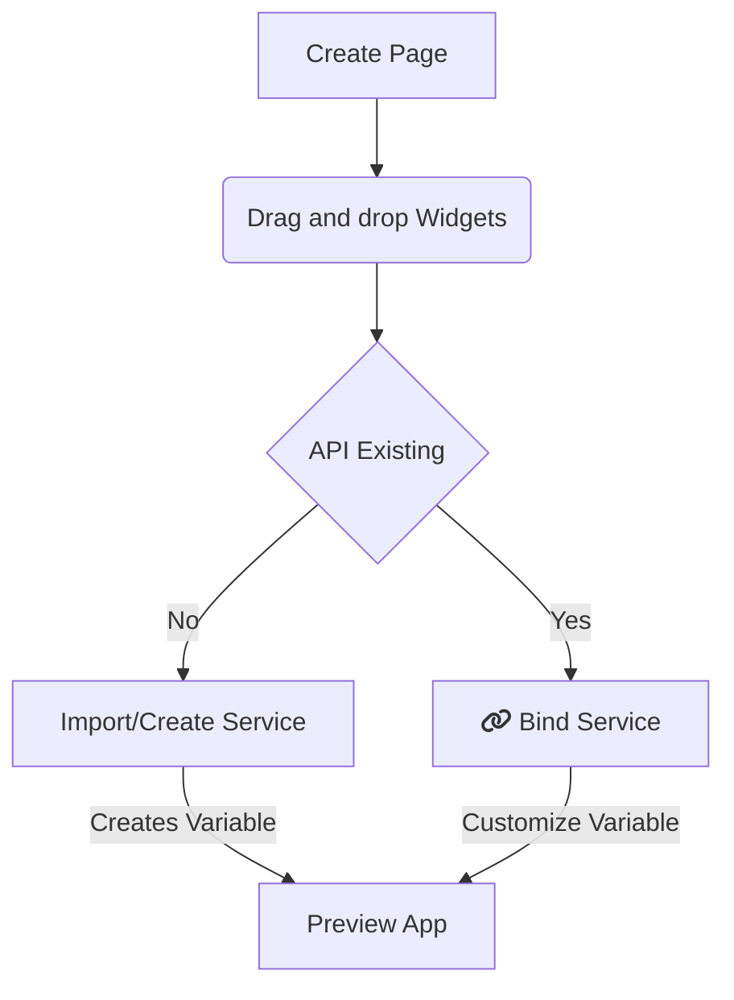

Introduction to WaveMaker. Find a complete developer's guide to build an app with Low-code approach.

---
[WaveMaker](https://www.wavemaker.com/) is a low-code platform for developing modern and secured applications, including native mobile apps and scalable web apps. The Studio offers rich design experience with over [80 out-of-the-box widgets](/learn/app-development/widgets/widget-library), ready to consume APIs. Import or design APIs for Databases, REST services, Java services, and more. 

WaveMaker lays down extensive developer tooling capabilities and integration services. You can customize complex solutions to simpler format, such as variables. Bind them to the user interface to function simply.

In addition, create your own custom widgets called [Prefabs](/learn/app-development/custom-widgets/prefabs-overview) that are API-integrated, encapsulating functionality, interaction and data, allowing you to develop once and edit and reuse as many times. 

The platform provides you with everything you need for developing and building production-ready applications with faster and streamlined deployment process. Find complete developers' guide for building low-code apps using WaveMaker.

## WaveMaker App Development Flow 

Develop apps with a design-first approach or API-first approach. For a general idea, see the flow chart below.

### Create an App

**Step-1**: WaveMaker app is a collection of pages. Design your app by dragging-and-dropping widgets on the page. 

:::tip
Widgets are UI elements, which make your app functional without coding. Explore the [widgets library](/learn/app-development/widgets/widget-library). 
:::

**Step-2**: Create or import a backend service. It can be a data service, web service, java service, security service, or use a third-party API.  

:::tip
WaveMaker provides a few ready-to-use sample databases and services. To learn more, see [Backend Services](/learn/app-development/services/creating-backend-services).
:::

**Step-3**: In a few simple clicks, using [variables](/learn/app-development/variables/variables), integrate the backend service with the widgets. 

**Step-4**: Deploy application with the [one-click deployment](/learn/app-development/deployment/one-click-deployment/) process. 

### See in action 
  
View the short video to see how WaveMaker apps work in a three-layered architecture, which includes, UI, binding, and backend services.  

<iframe width="560" height="315" src="https://www.youtube.com/embed/videoseries?list=PLNlIJ337WpsjTAfNsPE-16_jaNEEJW-5L" frameborder="0" allow="autoplay; encrypted-media" allowfullscreen="allowfullscreen"></iframe>

## WaveMaker Studio Editions

WaveMaker offers two variants of Studio. For cloud-based and on-premise development, respectively.

### 1. WaveMaker Online (WMO)
WMO is a cloud-based product - no installation is required. For more information on the pre-requisites and setup guide, see [WaveMaker Pre-requisites](/learn/app-development/wavemaker-overview/pre-requisites) and [Online Setup Guide](/learn/wmo-setup).

### 2. WaveMaker Enterprise (WME)
WME is an on-premise product. For WME installation, see [WaveMaker Enterprise Setup Guide](/learn/on-premise/welcome).

:::note
Most of the WaveMaker app development capabilities are available in WMO and WME editions. Even so, Enterprise edition offers more specific business integrations like Git Enterprise, behind the firewall services, Single sign-on for platform logins, and more.
:::

## Quick Start Guide

| To                                                         | See                                                                                                                       |
| ---------------------------------------------------------- | ------------------------------------------------------------------------------------------------------------------------- |
| Start with beginner's guide                                | [Video Tutorials](/learn/tutorials)                                                                                       |
| For installation related information, On-premise Setup     | [Pre-requisites to Develop App in WaveMaker](/learn/app-development/wavemaker-overview/pre-requisites)                    |
| Get the WaveMaker Studio walkthrough                       | [Product Terminology and Dashboard Walkthrough](/learn/app-development/wavemaker-overview/product-walkthrough)            |
| Explore Widgets and play around                            | [Widgets Library](/learn/app-development/widgets/widget-library)                                                          |
| Build an app in 5 mins                                     | [Build a WaveMaker App in 5 Minutes](https://www.youtube.com/watch?list=PLNlIJ337WpshRs-8eCubDm2vilhsloiqs&v=tLjGGJbrZ2Q) |
| Jumpstart to app building process and create a simple app. | [WaveMaker App Building Essentials](/learn/jump-start/jump-start-app-essentials/)                                         |

## [Start a free trial!](https://www.wavemaker.com/get-started/)
When you sign up, you will be directed to a **Project Dashboard** page. Voila! You can start creating new projects. Happy developing! 

---
#### Notice something is incorrect or outdated?
First off, great catch! We appreciate your discovery and want to ensure it gets addressed immediately. Please let us know [here](https://github.com/wavemaker/docs/issues/new).
