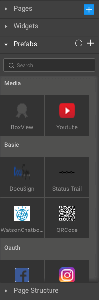
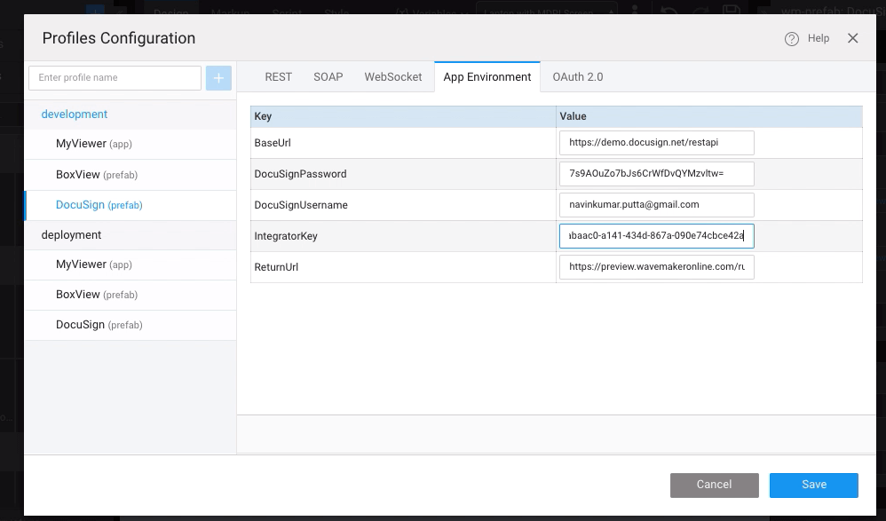

Docusign prefab allows user to enable electronic signature technology services using the Docusign API. Application using this prefab can allow it's users to electronically sign their documents for various purposes.

 

Prerequisites for using the Docusign prefab:

1. Create a developer account in Docusign.
2. Go to Admin page and add an App
3. Now go to your Apps listing and click on Actions drop down of your created app and click Edit.
4. From the pop up copy the Integrator key and keep it ready.

Drag and drop the prefab into your project page. It'll appear as a link labeled "E-sign". Then go to settings and select Config Profiles

In the dialogue that appears enter the required fields after selecting Docusign namely:

1. Base URL: It'll be prefilled
2. Docusign password: provide your password for Docusign(you can also provide the encrypted password)
3. Docusign Username: Provide your username
4. Integrator Key: Provide the Integrator Key derived for your Docusign App from the Docusign Admin console.
5. Return URL: Provide the URL to the page of your Wavemaker app that uses the prefab.

Now bind the Source of the prefab to the URL of the file to be e-signed and the email to the email of the user who will perform the e-signing.

With the above steps done your Docusign prefab integration is complete. Now clicking on the E-sign link will invoke a Docusign dialogue and the your document will appear in the dialogue. Click continue to start the e-signing process. Click on the e-signing options from the left menu and e-sign the document. Then click finish button in the popup to complete the process.

[9\. Custom Widgets - Prefabs](/learn/app-development/widgets/widget-library/#prefabs)

- [9.1 Youtube](/learn/app-development/widgets/prefab/youtube/)
- [9.2 Googlemaps](/learn/app-development/widgets/prefab/googlemaps/)
    - [i. Layouts](#layouts)
    - [ii. Features](#features)
    - [iii. Usage Scenario](#usage-scenario)
- [9.3 QRCode](/learn/app-development/widgets/prefab/qrcode/)
- [9.4 OAuth Prefabs](/learn/app-development/widgets/prefab/oauth-prefabs/)
    - [9.4.1 Box](/learn/app-development/widgets/prefab/oauth-prefabs/box/)
    - [9.4.2 Facebook](/learn/app-development/widgets/prefab/oauth-prefabs/facebook/)
    - [9.4.3 Google](/learn/app-development/widgets/prefab/oauth-prefabs/google/)
    - [9.4.4 Instagram](learn/app-development/widgets/prefab/oauth-prefabs/instagram/)
    - [9.4.5 LinkedIn](/learn/app-development/widgets/prefab/oauth-prefabs/linkedin/)
- [9.5 Box Viewer](/learn/app-development/widgets/prefab/box-viewer/)
- [9.6 Docusign](/learn/app-development/widgets/prefab/docusign/)
