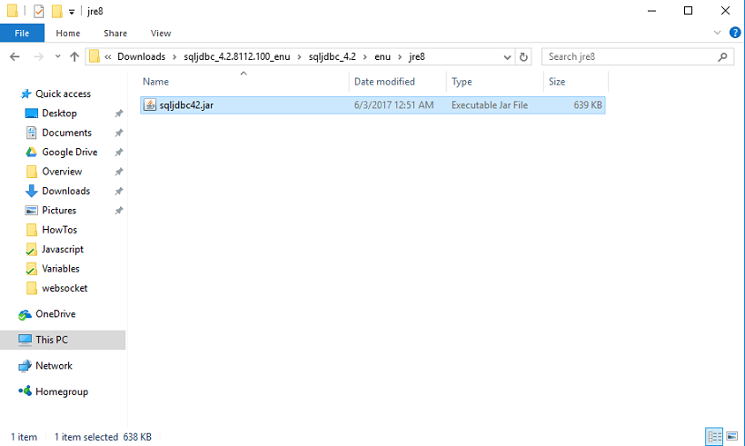

Steps to download the JDBC Driver jar for SQL Server

1. to [://www.microsoft.com/en-us/download/details.aspx?id=54671&751be11f-ede8-5a0c-058c-2ee190a24fa6=True&e6b34bbe-475b-1abd-2c51-b5034bcdd6d2=True](https://www.microsoft.com/en-us/download/details.aspx?id=54671&751be11f-ede8-5a0c-058c-2ee190a24fa6=True&e6b34bbe-475b-1abd-2c51-b5034bcdd6d2=True) page, and click **JDBC Driver** :
    - download instructions are valid as of the day this document was prepared. Changes made by Microsoft at their website since might not be updated here.
    - this site you can download JDBC driver 4.2. You can use JDBC driver 6.0, 6.1 or 6.2, ensure that you import **42.jar** or any Java ver 8 compatible jar file
2. language and click on
3. and download _\_4.2.8112.100\_enu.tar.gz_
4. the download is complete, extract the downloaded file. Select and upload “sqljdbc42.jar” located : \[your extract folder\] \\sqljdbc\_4.2.8112.100\_enu\\sqljdbc\_4.2\\enu\\jre8 : It is recommended to use **42.jar** or any Java ver 8 compatible jar file. 
