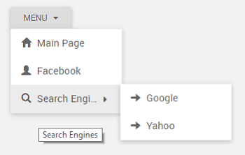

This document talks of a simple Dropdown Menu usage. For usage example involving role-based menu access [here](/learn/how-tos/restricting-menu-item-display-based-user-role/)

this section, we will walk through the steps to create a multi-level menu, with icons and links to pages at various levels.

  We will be using a Model Variable for this example

1. or Open the app where you want to use the Dropdown Menu
2. the Variables dialog from the Variables menu and using New Variable create a Model variable ( [more about variables)](/learn/app-development/variables/model-variable/)
3. the variable as _s_ 
4. the following in the _Editor._ It defines the structure for Menu identifying , , , and Icons can be [from glyphicons](http://glyphicons.com/) or [awesome](https://fortawesome.github.io/Font-Awesome/cheatsheet/) icons.
    
    \[
      {
        "label": "Main Page",
        "icon": "glyphicon glyphicon-home",
        "link": "#Main"
      },
      {
        "label": "Facebook",
        "icon": "glyphicon glyphicon-user",
        "link": "http://www.facebook.com"
      },
      {
        "label": "Search Engines",
        "icon": "glyphicon glyphicon-search",
        "children": \[
          {
            "label": "Google",
            "icon": "glyphicon glyphicon-arrow-right",
            "link": "http://www.google.com"
          },
          {
            "label": "Yahoo",
            "icon": "glyphicon glyphicon-arrow-right",
            "link": "http://www.yahoo.com"
          }
        \]
      }
    \]
    
    : If you follow this structure, WaveMaker picks the label, icon, link and children tags automatically. If you are using different tag names, then you need to specify them in the Menu property as shown in step: 4 
5. the property of the Menu widget to the model variable created in the previous step. 
6. the _label_, _icon_, _link_, _actions_ to the appropriate item names from the model variable. Note, if you have used the same names then you may skip this step.
7. the _link_ specified above to navigate to a page within the project, or an external URL. You can use the **Select event** to invoke a dialog or call a variable. From the Events tab of Properties panel, set On Select event to JavaScript and use the following code. This code will check if the selected value of the Menu is My Account and open either a dialog or invoke a variable.
    
    ($item.label=="My Account"){
       DialogService.open("DialogName");
       }
    else{
       Page.Variables.logoutAction.invoke();
      }
    
8. the application and see the menu in action.

[6\. Navigation Widgets](/learn/app-development/widgets/widget-library/#nav-widgets)

- [6.1 Breadcrumb](/learn/app-development/widgets/navigation/breadcrumb/)
- [6.2 Dropdown Menu](/learn/app-development/widgets/navigation/dropdown-menu/)
    - [Properties](/learn/app-development/widgets/navigation/dropdown-menu/#properties)
    - [Events](/learn/app-development/widgets/navigation/dropdown-menu/#events)
    - [Use Cases](/learn/app-development/widgets/navigation/dropdown-menu-use-cases/)
- [6.3 Nav](/learn/app-development/widgets/navigation/nav/)
- [6.4 Nav Bar](/learn/app-development/widgets/navigation/nav-bar/)
- [6.5 Popover](/learn/app-development/widgets/navigation/popover/)
