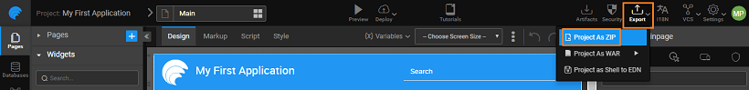

you might want to extend and maintain your code. You might want to work on a local machine text editor, make changes and import these changes back into your application. Or you might also want to work on an IDE of your choice and comfort and take advantage of its Java code editing, testing and debugging features. In WaveMaker all this can be achieved easily as a modular client-side code (AngularJS, CSS, and HTML) incorporating industry best practices is generated. In this section, we list the steps for the same.

: Alternatively, you can use the WorkSpace Sync Plugin to ease this process. [here for details](/learn/how-tos/synchronizing-wavemaker-apps-ides/)

 

# in working with IDEs

1. your project as a file.
2. exporting the project Unzip the downloaded zip file to a folder.
3. of the files shows you a file indicating it is [Maven complaint](http://maven.apache.org/index.html) 
4. the command shell in extracted file system and install the project using Maven Clean Install, by running the command: clean install  : You need to have Maven and Java installed in the system. This downloads all external dependencies needed by the project and creates a WAR file.  This war file can be deployed to any web server like Apache Tomcat. 
5. the successful build, open the IDE which you need to import ex: IntelliJ and click on import project and set as Maven. Ref:- [://www.jetbrains.com/idea/help/importing-project-from-maven-model.html](https://www.jetbrains.com/idea/help/importing-project-from-maven-model.html) Ref:- [://www.eclipse.org/webtools/jst/components/j2ee/scenarios/MavenEclipseIntegration.html](http://www.eclipse.org/webtools/jst/components/j2ee/scenarios/MavenEclipseIntegration.html)
6. Run or Debug configurations as follows: Name: Maven Tomcat Working directory as project directory **Line as:** clean package org.apache.tomcat.maven:tomcat7-maven-plugin:2.2:run -Dmaven.tomcat.port=8181 
7. you run the project in IntelliJ you will get console logs for required maven dependencies and so on. After everything is done you will observe a message as: **\[INFO\] --- tomcat7-maven-plugin:2.2:run (default-cli) @ SampleApp --- \[INFO\] Running war on http://localhost:8181/SampleApp**
8. open in browser with URL as ://localhost:8181/ProjectName/services/myJava/sampleJavaOperation
9. debug any DB/Java service used in the app you need set src folder of DB or Java service which is located in the services section of your project as Mark directory as source root. Similarly, for any service, you need to set src directory as source root and enable debug point and run it. 
10. you are done with all the changes, run Maven Clean Install which will generate a ZIP file in _/exports_ folder. 
11. file can be re-imported into Studio using the [**Source**](http://[supsystic-show-popup id=104]) option from the project **Utilities** The changes will be incorporated into your Studio application.

# with Jenkins

for installing Jenkins [://wiki.jenkins-ci.org/display/JENKINS/Installing+Jenkins](https://wiki.jenkins-ci.org/display/JENKINS/Installing+Jenkins) WaveMaker provides two profiles development, production by default. To execute profiles user needs to execute the command as: clean install -Pdevelopment for development configuration and clean install -Pproduction for production configuration. Install Jenkins and create a job and set windows batch command as maven command(mvn clean install -Pdevelopment) 

< Debugging

8\. Developer Integrations

- 8.1 Test Run (Preview) Apps
    - [Overview](/learn/dev-integration/developer-tools/)
    - [Preview](/learn/dev-integration/developer-tools/#preview)
    - [Run](/learn/dev-integration/developer-tools/#run)
- 8.2 Import, Export & Update App
    - [Overview](/learn/app-development/dev-integration/import-export-update-apps/)
    - [Export](/learn/app-development/dev-integration/import-export-update-apps/#export-project)
    - [Import](/learn/app-development/dev-integration/import-export-update-apps/#import-project)
    - [Update](/learn/app-development/dev-integration/import-export-update-apps/#update-project)
    - [Project Recovery](/learn/app-development/dev-integration/import-export-update-apps/#project-recovery)
        - [Export](/learn/app-development/dev-integration/import-export-update-apps/#export)
        - [Restore](/learn/app-development/dev-integration/import-export-update-apps/#restore-project)
- 8.3 Developer Collaboration
    - [Overview](/learn/app-development/dev-integration/developer-collaboration/)
    - [Project Sharing](/learn/app-development/dev-integration/developer-collaboration/#project-sharing)
    - [Code Sharing - VCS](/learn/app-development/dev-integration/developer-collaboration/#vcs)
        - [Checkout](/learn/app-development/dev-integration/developer-collaboration/#checkout)
        - [Pull Changes](/learn/app-development/dev-integration/developer-collaboration/#pull-changes)
        - [Push Changes](/learn/app-development/dev-integration/developer-collaboration/#push-changes)
        - [View Changes](/learn/app-development/dev-integration/developer-collaboration/#view-changes)
        - [Commit History](/learn/app-development/dev-integration/developer-collaboration/#commit-history)
        - [Merge Conflicts](/learn/app-development/dev-integration/developer-collaboration/#merge-changes)
        - [Restore Project](/learn/app-development/dev-integration/developer-collaboration/#restore-project)
        - [Push to External Repo](/learn/app-development/dev-integration/developer-collaboration/#push-to-external-repo)
- 8.4 Debugging
    - [Overview](/learn/app-development/dev-integration/debugging/)
    - [Debugging using Log Files](/learn/app-development/dev-integration/debugging/#logs)
    - [Debugging through JavaScript](/learn/app-development/dev-integration/debugging/#javascript)
- [8.5 App Extensions](#)
    - [Overview](#)
    - [Working with IDEs](#steps)
    - [Integrating with Jenkins](#jenkins)
