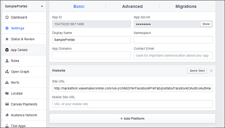
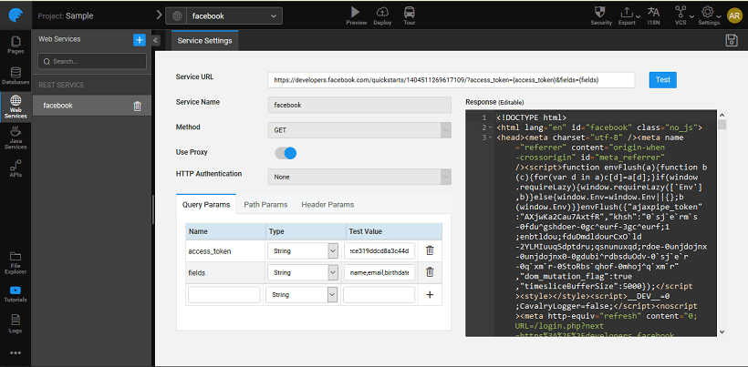

2.0 is an authorization framework, which is updated after the original OAuth protocol created in 2006. OAuth 2.0 is a standard protocol, which provides delegated secured access for web, mobile, and desktop applications. To know more about the working of WaveMaker OAuth Prefabs [ here](/learn/app-development/widgets/prefab/oauth-prefabs/)

## OAuth in WaveMaker

In order to use the OAuth prefab, please follow the below steps: Disclaimer: The screenshots from the FaceBook website were current at the time of writing this document, the actual screens might differ.

1. on to [://developers.facebook.com/apps/](https://developers.facebook.com/apps/) and enter your credentials. Facebook Developers page is displayed.
2. **Now.** Register as a Facebook Developer window is displayed.
3. the **Platform Policy** and **Privacy Policy** click Next.
4. the from the dropdown list and enter your **Number** to get the confirmation code. You may choose to get your confirmation code as a text or via phone call.
5. the **Code** and click Successfully Registered as a Facebook developer window is displayed.
6. On registering, Add a New App page is displayed.
7. as a platform to get started.
8. a to your app and click **New Facebook App ID** Create a New App ID window is displayed.
9. a category from **a Category** drop-down list and click **App ID** Tell us about your website window is displayed.
10. a sample valid URL in the **URL** field and click Your App Dashboard page is displayed. **:** Make a note of the **ID** and **Secret** 

# Example

1. WaveMaker application where you want to use the Facebook OAuth Prefab.
2. and Drop the Facebook Prefab from the Prefabs Tab under OAuth. You can use the default login page created by WaveMaker.
3. can set the **Mode** to be:
    
    - will in the run mode after initialization of the Prefab the app would automatically be navigated to the OAuth Authorization page
    - (default mode) will invoke the OAuth Authorization page on click of the login button
    
    
4. the Properties Panel, under **PROPERTIES**, enter the **, Page, Scope** and in their respective fields. 
5. the application and Run the application. Note the generated redirect URL. You might have to click REMOVE TOOLBAR to get the URL. Copy the redirect uri till the part only. 
6. to Facebook Developers – your project page and click on Settings on the left side of the Dashboard page.
7. this redirect URl in the Site URL field and click Save Changes. 
8. back to WaveMaker application and again Run the app. You can now see the WaveMaker login page. 
9. on the Login with Facebook button to be redirected to Facebook Authorisation page. This will the first page, in case you have set the Login Mode to auto
10. use the Facebook API in your application, import the corresponding [Web Service](/learn/web-services/#rest) into WaveMaker by giving a valid URL with the access token. Test and Import.
11. can see the variables imported from the service in the Left panel and these are available for binding and usage within your app. 

[9\. Custom Widgets - Prefabs](/learn/app-development/widgets/widget-library/#prefabs)

- [9.1 Youtube](/learn/app-development/widgets/prefab/youtube/)
- [9.2 Googlemaps](/learn/app-development/widgets/prefab/googlemaps/)
- [9.3 QRCode](/learn/app-development/widgets/prefab/qrcode/)
- [9.4 OAuth Prefabs](/learn/app-development/widgets/prefab/oauth-prefabs/)
    - [9.4.1 Box](/learn/app-development/widgets/prefab/oauth-prefabs/box/)
    - [9.4.2 Facebook](#)
    - [9.4.3 Google](/learn/app-development/widgets/prefab/oauth-prefabs/google/)
    - [9.4.4 Instagram](learn/app-development/widgets/prefab/oauth-prefabs/instagram/)
    - [9.4.5 LinkedIn](/learn/app-development/widgets/prefab/oauth-prefabs/linkedin/)
