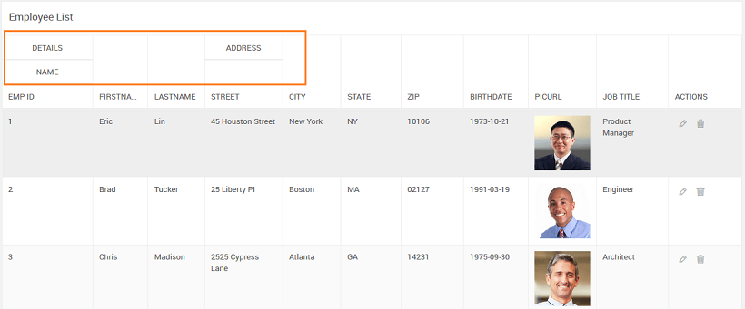
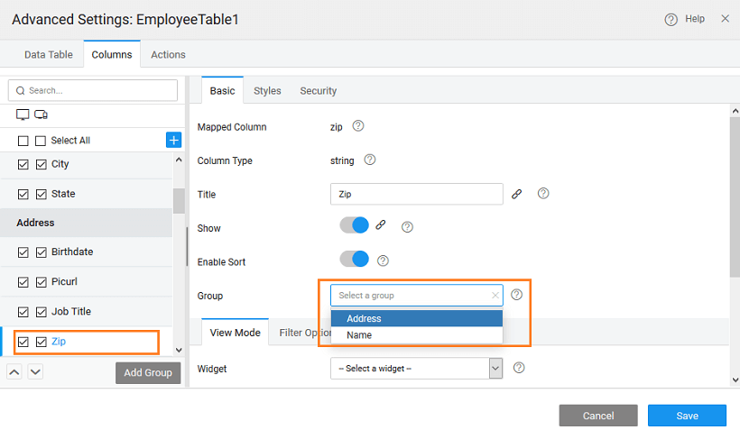
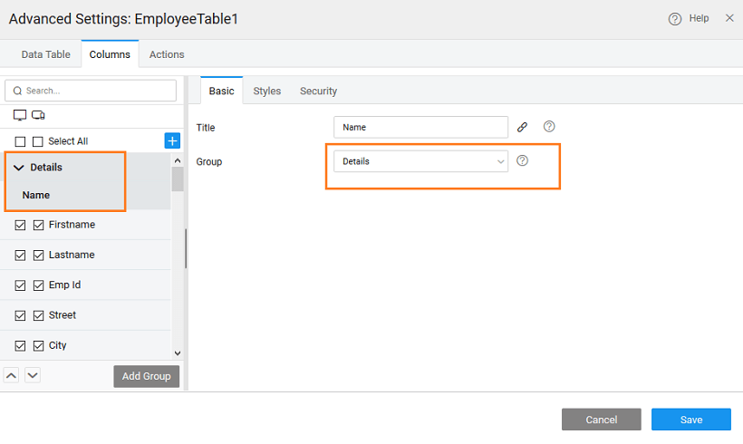
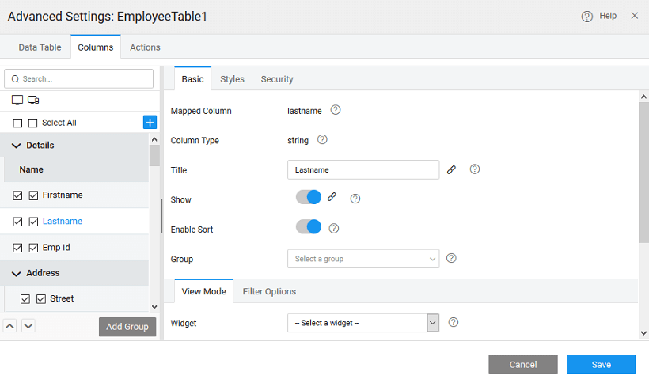
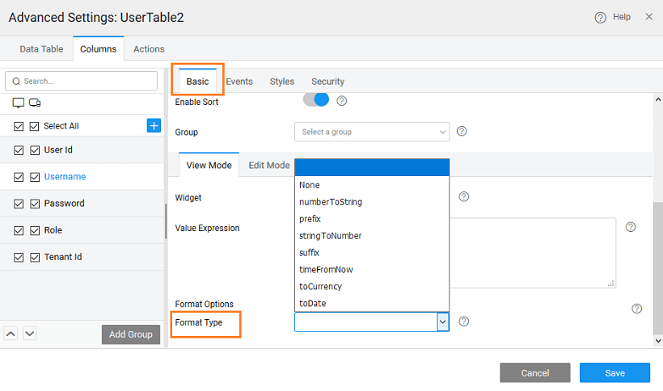
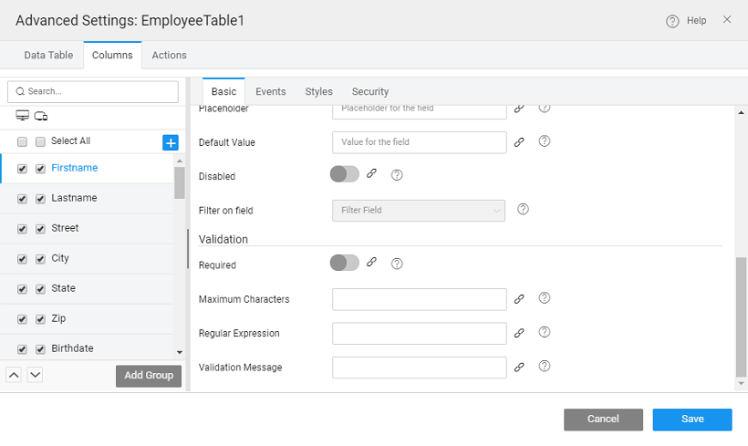
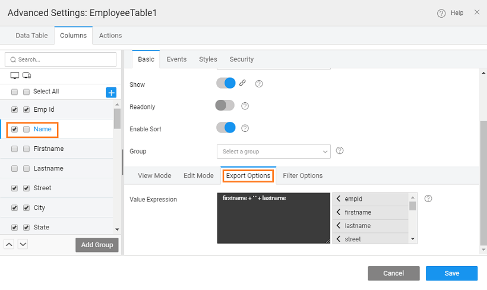

The following features are available from the  **Settings** property of the Data Table.

### column display options

columns or fields to be displayed in a Data Table can be further configured:

1. 1. be displayed based upon the platform i.e. for desktop and mobile. This enables you to keep your mobile display clutter free, you can choose to display only limited columns or fields for mobile platform;
    2. order can also be specified as different from the underlying data source ordering by using the arrow keys given below the column listing;
    3. columns under a common heading;
    4. a custom column;
    5. choose a representational view based upon the field content, like picture field can be depicted as an for the picurl field, boolean fields as a etc.;
    6. define the display format of the column or field, based upon the content including date, currency, decimal and many more formats;
    7. style the fields for a better readability and for highlighting a particular value;
    8. restrict the display based upon the security roles;
    9. criteria can be applied to referenced entities for Inline Editable and Quick Edit Data Tables ( [here for usage](http://pm.wavemaker.com/learn/how-tos/using-filter-criteria-for-a-data-and-live-widgets/)).

the above-mentioned options are available from the ** tab** of the **Settings** property.

### Grouping

feature helps you group columns under a heading for better readability and convenience. 

1. the **Group** button under tab of _Settings_ This will allow you to give a title to the group. 
2. **columns**  to the group by either
    - the or   option from the column tree on the left panel within the  Advanced Settings dialog, or
    - selecting the from the Basic properties tab 
3. can also have nested groups by selecting the parent group while adding the group or use the drag feature.  

### Mode Options

#### Representation

##### Mode Options

- _Class_ - style class for the entire column
- _Widget Class_ - specify the style class name to be applied to select rows satisfying the given condition.
- _Title_ - title to be displayed on the button at run-time, set by default to the column name, can be edited as per the needs
- _Hyperlink_ - link to the page to be opened on click.
- _Expression_ - You can write a custom expression to change the display setting for a table column. The expression needs to follow AngularJS conventions for binding. A sample expression is given which can be enhanced as per the needs of the application.

##### Mode Options

- _Class_ - style class for the entire column
- _Widget Class_ - specify the style class name to be applied to select rows satisfying the given condition.
- _Title_ - title to be displayed on the button at run-time, set by default to the column name, can be edited as per the needs
- _Icon_ - icon name, including the class name, for example, glyphicon glyphicon-home
- _Action_ - method, as defined in Script, to be invoked on the click event of the button. The method will be auto-generated upon the selection of JavaScript option with a parameter set to
- _Expression_ - You can write a custom expression to change the display setting for a table column. The expression needs to follow AngularJS conventions for binding. A sample expression is given which can be enhanced as per the needs of the application.

##### Mode Options

- _Class_ - style class for the entire column
- _Widget Class_ - specify the style class name to be applied to select rows satisfying the given condition.
- \- code example given to disable the checkbox in the table
- _Expression_ - You can write a custom expression to change the display setting for a table column. The expression needs to follow AngularJS conventions for binding. A sample expression is given which can be enhanced as per the needs of the application.

#####  Mode Options

- _Class_ - style class for the entire column
- _Widget Class_ - specify the style class name to be applied to select rows satisfying the given condition.
- _Title_ - title to be displayed on the button at run-time, set by default to the column name, can be edited as per the needs
- _Icon_ - icon name, including the class name, for example, glyphicon glyphicon-home
- _Position_ - to set the position of the Icon; choose Left (default) or Right
- _Expression_ - You can write a custom expression to change the display setting for a table column. The expression needs to follow AngularJS conventions for binding. A sample expression is given which can be enhanced as per the needs of the application.

#####  Image Mode Options

- _Class_ - style class for the entire column
- _Widget Class_ - specify the style class name to be applied to select rows satisfying the given condition.
- _Source_ - by default it is populated with the column name, it can be replaced with any external source path.
- _Expression_ - You can write a custom expression to change the display setting for a table column. The expression needs to follow AngularJS conventions for binding. A sample expression is given which can be enhanced as per the needs of the application.

##### Mode Options

- _Class_ - style class for the entire column
- _Widget Class_ - specify the style class name to be applied to select rows satisfying the given condition.
- _Title_ - title to be displayed on the button at run-time, set by default to the column name, can be edited as per the needs
- _Expression_ - You can write a custom expression to change the display setting for a table column. The expression needs to follow AngularJS conventions for binding. A sample expression is given which can be enhanced as per the needs of the application.

[here for usage example](/learn/how-tos/data-table-widget-representations/)

#### Options

Options enables you to define the display format of the column at runtime. The options include _, toCurrency, prefix, suffix, and srtingtoNumber_ Be aware that these format types selected are only for display purpose. During runtime, edit row will display the values as defined in the data source.

##### /Suffix Options:

- /Suffix value can be specified

##### Options:

- by name can be selected from the drop-down list and the currency symbol will be inserted in the column
- Size can be set

##### Options:

- Pattern can be selected from the drop-down list

##### Options:

- Size can be set

[here for usage example](/learn/how-tos/data-table-format/)

### Mode Options

_Edit_ and _Editable_ Table, you can specify the Display Format and Validation criteria for the columns (non-primary key) when the row is in **Mode**

1. **options** include:
    
    - - \- text, select, datetime etc.,
        
        - _Value_
        - _on Field_ to set cascading data, i.e., restrict the display values for the current field based on the value of the field set for this property. example, the values displayed in the city field should depend upon the value selected for state field; then correspondingly for city field, filter on field property should be set to state.
    
    
2. **options**:
    
    - - : whether the column entry is mandatory or not;
        - : depending upon the data type of the column you have the option to set
            - _character_ for text type,
            - _length_ and  _length_ for number fields and
            - _expression for validations_ for text and numeric fields.
        - **Message** to be displayed if the field fails the validation specified. in case of validation failure, an error icon is displayed, hovering over which will display the validation message.
    
    

### Options

the case where the export option is set by selecting the Export Format as EXCEL or CSV, the  **Options** can be used to customize the export values by setting the Value Expressions. This is particularly useful to display name column as a combined value like 'firstname+lastname' while export.

NOTE: Value Expression to be set for custom fields.

### Mode Options

the case, Filter Option is set to Row while designing the Data Table, then the  **Options** can be enabled or disabled for the specific column.

### Options

can be used to change the styles for the selected field:

- for the column which can be specified in terms of the **Unit** - or _%_
- **Alignment** of the column content
- color for the column can be set
- for styling the field, this needs to be under the Style tab of the Page
- **Class** for custom styling the column based on a condition

[here for usage example](/learn/how-tos/data-table-styling/)

### Options

**\-based access** can be set to enforce security at column-level: If the  [has been enabled](http://[supsystic-show-popup id=111]) in your app, then you can define the app role which has access to a specific column.

< Configuration

\>

[1\. Live & Data Widgets](/learn/app-development/widgets/widget-library/#data-live)

- [1.1 Cards](/learn/app-development/widgets/datalive/cards/)
- [1.2 Data Table](/learn/app-development/widgets/datalive/data-table/)
    - [Data Source](/learn/app-development/widgets/datalive/datatable/data-source/)
        - [Variable Source](/learn/app-development/widgets/datalive/datatable/data-source/#variable-source)
        - [Widget Source](/learn/app-development/widgets/datalive/datatable/data-source/#widget-source)
    - [Layouts](/learn/app-development/widgets/datalive/datatable/layouts/)
        - [Editable with Form as Dialog](/learn/app-development/widgets/datalive/datatable/layouts/#efd)
        - [Editable with Form given below the Table](/learn/app-development/widgets/datalive/datatable/layouts/#efb)
        - [Inline Editable](/learn/app-development/widgets/datalive/datatable/layouts/#edi)
        - [Quick Edit](/learn/app-development/widgets/datalive/datatable/layouts/#edq)
        - [Read-Only with details given below](/learn/app-development/widgets/datalive/datatable/layouts/#rof)
        - [Read-only Simple View](/learn/app-development/widgets/datalive/datatable/layouts/#ros)
    - [Table Configuration](/learn/app-development/widgets/datalive/datatable/table-configuration/)
        - [Search & Filter](/learn/app-development/widgets/datalive/datatable/table-configuration/#search-n-filter)
        - [Sorting](/learn/app-development/widgets/datalive/datatable/table-configuration/#sorting)
        - [Selection](/learn/app-development/widgets/datalive/datatable/table-configuration/#selection)
        - [Pagination](/learn/app-development/widgets/datalive/datatable/table-configuration/#pagin)
        - [Export Data](/learn/app-development/widgets/datalive/datatable/table-configuration/#export-data)
        - [Message](/learn/app-development/widgets/datalive/datatable/table-configuration/#message)
        - [Row Styling](/learn/app-development/widgets/datalive/datatable/table-configuration/#row-style)
    - [Field Configuration](/learn/app-development/widgets/datalive/datatable/field-configuration/)
        - [Column Grouping](#grouping)
        - [View Mode](#view-mode)
        - [Edit Mode](#edit-mode)
        - [Export Options](#export)
        - [Filter Options](#filtering)
    - [Actions](/learn/app-development/widgets/datalive/datatable/actions/)
        - [Table Specific Actions](/learn/app-development/widgets/datalive/datatable/actions/#table-actions)
        - [Row Specific Actions](/learn/app-development/widgets/datalive/datatable/actions/#row-actions)
        - [Actions Visibility](/learn/app-development/widgets/datalive/datatable/actions/#actions-visibility)
        - [Actions Layout](/learn/app-development/widgets/datalive/datatable/actions/#actions-layout)
    - [Events & Methods](/learn/app-development/widgets/datalive/datatable/datatable-events-methods/)
        - [Events](/learn/app-development/widgets/datalive/datatable/datatable-events-methods/#events)
        - [Methods](/learn/app-development/widgets/datalive/datatable/datatable-events-methods/#methods)
    - [Cases](/learn/app-development/widgets/datalive/datatable/data-table-use-cases/)
- [1.3 Form](/learn/app-development/widgets/datalive/form/)
- [1.4 List](/learn/app-development/widgets/datalive/list/)
- [1.5 Live Form](/learn/app-development/widgets/datalive/live-form/)
- [1.6 Live Filter](/learn/app-development/widgets/datalive/live-filter/)
