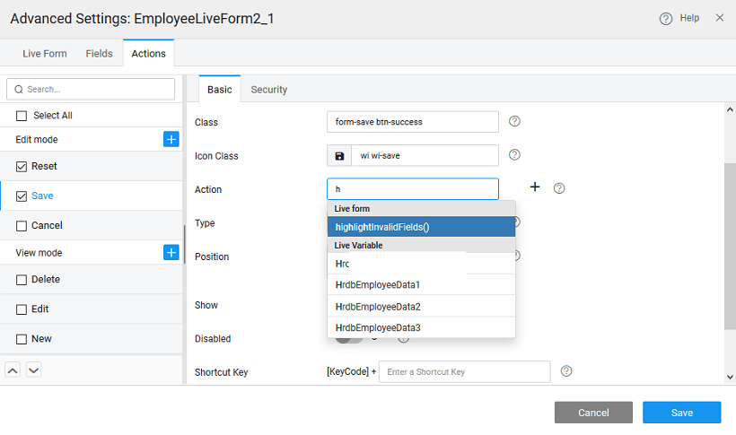

### form fields display options

can set the following properties of the elements of the Live Form from the **Settings** properties:

1. cascading data, i.e., restrict the display values for the current field based on the value of the field set against** Filter on Field** property. For example, the values displayed in the city field should depend upon the value selected for state field; then correspondingly for city field, filter on field property should be set to state.
2. the to be used to represent each data field. Based on the data type of the field, the available widget options would vary.
3. **columns** by clicking on the **'+'** icon. **:** If a custom column is not selected for display, it will be deleted when the Form Designer is saved.
4. the behavior of **fields**, from the canvas, by selecting any field on the form and setting the properties:
    - display for the field - can be bound to another variable,
    - **Type** to perform on screen validation of the user input, for example, setting the Input Text to email will ensure that the user enters the text in an email id format,
    - the **Value** or bind it to a variable
    - when to **the data value** - on or on
    - the **data value delay** in milliseconds
    - Validations like , pattern matching in the form of **Expression** and **Characters** allowed
    - like **Focus**, **Only**, etc can be set;
    - **criteria** can be applied to referenced entities ( [here for usage](http://pm.wavemaker.com/learn/how-tos/using-filter-criteria-for-a-data-and-live-widgets/)).

### Form Validations

are various ways in which Form fields can be validated depending upon the underlying data type. You can see these options in the properties panel for the selected field on the canvas.

1. each field, check check box to make it as mandatory field while submitting the form, this will issue an error in case the user hits save without making an entry
2. **Type fields**, **expression** field can be used to provide valid and desired formats.
3. **Type fields**, you can restrict the **characters** to be entered
4. **Type fields**, **and Maximum Values** permissible can be set
5. **Type fields**, **Date, Max Date, Exclude Days and Dates** can be set. In this case, the date picker will not have the invalid dates available for selection. 
6. can invoke the method on action from the Advanced Settings, to highlight all invalid fields in red and display appropriate error messages. 
7. additional checks, you can use the **Service Call** event to perform any validation checks. For example, we want to make sure that the password entry is at least six characters in length. Select the panel and select Javascript for **Service Call** and enter the following code. This will ensure that before updating the data source, the JavaScript is executed.
    
    1Beforeservicecall = function($data, $event) {
            function isValidData($data) {
                /\*restrict password to be minimum of 6 characters\*/
                if ($data.password) {
                    if ($data.password.length < 6) {
                        return {
                            'error': "Password too small"
                        };
                    }
                } else {
                    return {
                        'error': "Password field required"
                    };
                }
            }
            return isValidData($data)
        };
    

# Widgets for Live Form Fields

like select, autocomplete, radioset, checkboxset and switch can be used for various fields within Live Form. These widgets can be used to show the predefined options to the user.

- they are limited number of options: , and widgets can be used,
- number of options are more -   widget can be used, as user can search from list of available options,
-  multiple options are to be selected - and (with multiple options) widgets are recommended.

1. and drop a Live Form and bind it to a Database CRUD Variable.
2. layout options, as per your needs.
3. fields configuration step, change the required field widget type to Select. 
4. the field from the canvas.
5. dataset for the form field widget is auto populated with the Variable Dataset field. Data field and display field is set to field’s key. Here, the dataset value can be bound to any other variable or widget. 
6. widget can be changed from Live Form Advanced Settings also. 
7. , at runtime, the user can use this widget to select a value from predefined options. 

< Configurations

\>

[1\. Live & Data Widgets](/learn/app-development/widgets/widget-library/#data-live)

- [1.1 Cards](/learn/app-development/widgets/datalive/cards/)
- [1.2 Data Table](/learn/app-development/widgets/datalive/data-table/)
- [1.3 Form](/learn/app-development/widgets/datalive/form/)
- [1.4 List](/learn/app-development/widgets/datalive/list/)
- [1.5 Live Form](/learn/app-development/widgets/datalive/live-form/)
    - [Data Source](/learn/app-development/widgets/datalive/live-form/live-form-data-source/)
    - [Layouts](/learn/app-development/widgets/datalive/live-form/liveform-layouts/)
    - [Configuration](/learn/app-development/widgets/datalive/live-form/liveform-configurations/)
    - [Fields Configuration](/learn/app-development/widgets/datalive/live-form/fields-configuration/)
        - [Display Options](#display)
        - [Validations](#validations)
        - [Widget Usage](#widgets)
    - [Actions](/learn/app-development/widgets/datalive/live-form/liveform-actions/)
    - [Events & Methods](/learn/app-development/widgets/datalive/live-form/events-methods/)
        - [Events](/learn/app-development/widgets/datalive/live-form/events-methods/#events)
        - [Methods](/learn/app-development/widgets/datalive/live-form/events-methods/#methods)
    - [Use Cases](/learn/app-development/widgets/datalive/live-form/liveform-use-cases/)
- [1.6 Live Filter](/learn/app-development/widgets/datalive/live-filter/)
