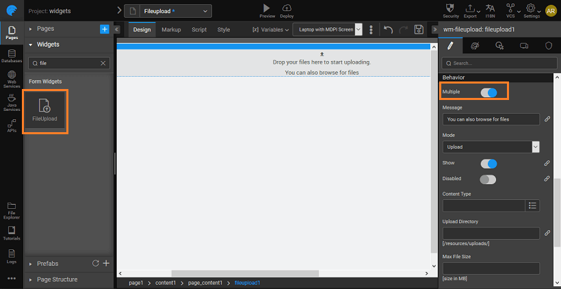

1. and drop a widget onto the canvas.
2. will be prompted to create a Variable. For this demo purpose, retain the default selections of _data on input change_ : You can create and use any service, but keep in mind that the operation selected should be able to accept file data. The default file service operation fulfills this requirement. 
3. the Properties panel, set the  property to true, this will enable us to upload multiple files, else you can upload a single file at a time. 
4. the app, select files to upload 

[Use Cases](/learn/app-development/widgets/basic/fileupload-use-cases/)

- [1\. FileUpload Basic Usage](/learn/app-development/widgets/form-widgets/file-upload-basic-usage/)
- [2\. How to use various file service operations](/learn/how-tos/file-upload-widget-operations/)
- [3\. How to save uploaded file to a DB](/learn/how-tos/upload-file-save-database/)
- [4\. How to upload BLOB file to a DB](/learn/how-tos/file-upload-blob-data/)
- [5\. How to upload file to custom directory](/learn/how-tos/file-upload-custom-directory/)
- [6\. How to uploaded files from Java code](/learn/how-tos/accessing-file-upload-java-code/)
- [7\. How to use FileUpload in Form and Live Form](/learn/how-tos/upload-files-from-live-form-form/)
