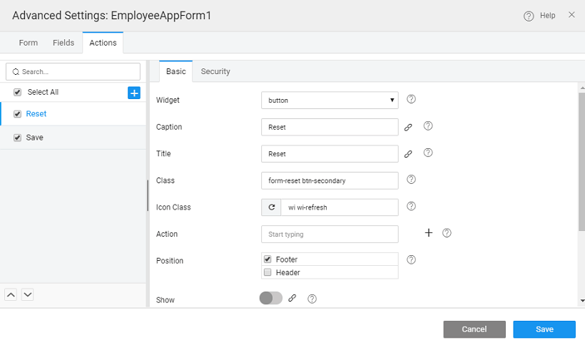

main features of a Form are as follows:

- and **Heading** can be set for the Form
- **Form Data** can be set to value or bound to another widget like Data Table, List or Live Filter. These define the values to be displayed when the Form is first loaded
- **Value** the Web service API or database API on which the insert or update operations will be performed. This is set to the Variable selected in the data selection step while configuring the Form

   ** Configurations** include:

- ** Validation Type ** form level. It can be
    - : here the all failed validation messages will be shown under the corresponding field;
    - : the HTML validations will be applied and displayed for the first failed field, the validation messages set at the field level will be displayed once the field loses focus;
    - _Validations_: validations will not be performed in this case.
- the in terms of
    - to be invoked - , or
    - to be performed in terms of Http request action path
    - **Type**
    
    -   **Complete** for the form fields
-  properties in terms of Alignment, Position, and Size
- **Message** configuration - whether inline or toaster, and content for call success and failure cases

 **Field Configurations** include Display Properties:

- Representation,
- Class Specifications

 **Actions** include default actions of Save and Reset. You can add your own custom actions, if needed.

< Layouts

Configuration >

[1\. Live & Data Widgets](/learn/app-development/widgets/widget-library/#data-live)

- [1.1 Cards](/learn/app-development/widgets/datalive/cards/)
- [1.2 Data Table](/learn/app-development/widgets/datalive/data-table/)
- [1.3 Form](/learn/app-development/widgets/datalive/form/)
    - [Data Source](/learn/app-development/widgets/datalive/form/form-data-source/)
    - [Layouts](/learn/app-development/widgets/datalive/form/form-layouts/)
    - [Form Configuration](/learn/app-development/widgets/datalive/form/form-configurations/)
    - [Fields Configuration](/learn/app-development/widgets/datalive/form/form-fields-configuration/)
    - [Events & Methods](/learn/app-development/widgets/datalive/form/form-events-methods/)
    - [Usage Scenarios](/learn/app-development/widgets/datalive/form/form-usage-scenarios/)
- [1.4 List](/learn/app-development/widgets/datalive/list/)
- [1.5 Live Form](/learn/app-development/widgets/datalive/live-form/)
- [1.6 Live Filter](/learn/app-development/widgets/datalive/live-filter/)
