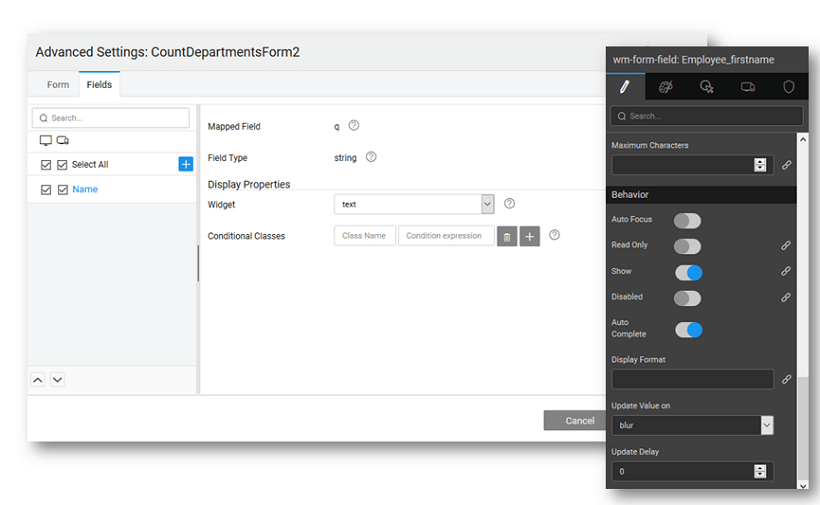

### form fields display options

can set the display properties of the elements of the Form.

1. the to be used to represent each data field. Based on the data type of the field, the available widget options would vary.
2. **columns** by clicking on the **'+'** icon. **:** If a custom column is not selected on the left panel, it will be deleted when the Form Designer is saved.
3. the behavior of **fields**, from the canvas, by selecting any field on the form and setting the properties:
    - display for the field - can be bound to another variable,
    - **Type** to perform on screen validation of the user input, for example, setting the Input Text to email will ensure that the user enters the text in an email id format,
    - the **Value** or bind it to a variable
    - when to **the data value** - on or on
    - the **data value delay** in milliseconds
    - Validations like , pattern matching in the form of **Expression** and **Characters** allowed
    - like **Focus**, **Only**, etc can be set.

### Validations

are various ways in which Form fields can be validated depending upon the underlying data type. You can see these options in the properties panel for the selected field on the canvas.

1. each field, check check box to make it as mandatory field while submitting the form, this will issue an error in case the user hits save without making an entry
2. **Type fields**, **expression** field can be used to provide valid and desired formats.
3. **Type fields**, you can restrict the **characters** to be entered
4. **Type fields**, **and Maximum Values** permissible can be set
5. **Type fields**, **Date, Max Date, Exclude Days and Dates** can be set. In this case, the date picker will not have the invalid dates available for selection.
6. additional checks, you can use the ** Before Submit** event to perform any validation checks. For example, we want to make sure that the password entry is at least six characters in length. Select the panel and select Javascript for ** Before Submit** and enter the following code. This will ensure that before updating the data source, the JavaScript is executed.
    
    1Beforesubmit = function($data, $event) {
            function isValidData($data) {
                /\*restrict password to be minimum of 6 characters\*/
                if ($data.password) {
                    if ($data.password.length < 6) {
                        return {
                            'error': "Password too small"
                        };
                    }
                } else {
                    return {
                        'error': "Password field required"
                    };
                }
            }
            return isValidData($data)
        };
    

< Configurations

& Methods >

- [1\. Live & Data Widgets](/learn/app-development/widgets/widget-library/#data-live)
    - [1.1 Cards](/learn/app-development/widgets/datalive/cards/)
    - [1.2 Data Table](/learn/app-development/widgets/datalive/data-table/)
    - [1.3 Form](/learn/app-development/widgets/datalive/form/)
        - [Data Source](/learn/app-development/widgets/datalive/form/form-data-source/)
        - [Layouts](/learn/app-development/widgets/datalive/form/form-layouts/)
        - [Form Configuration](/learn/app-development/widgets/datalive/form/form-configurations/)
        - [Fields Configuration](#)
        - [Events & Methods](/learn/app-development/widgets/datalive/form/form-events-methods/)
        - [Usage Scenarios](/learn/app-development/widgets/datalive/form/form-usage-scenarios/)
    - [1.4 List](/learn/app-development/widgets/datalive/list/)
    - [1.5 Live Form](/learn/app-development/widgets/datalive/live-form/)
    - [1.6 Live Filter](/learn/app-development/widgets/datalive/live-filter/)
- [2\. Container Widgets](/learn/app-development/widgets/widget-library/#container)
- [3\. Form Widgets](/learn/app-development/widgets/widget-library/#form)
- [4\. Basic Widgets](/learn/app-development/widgets/widget-library/#basic)
- [5\. Chart Widgets](/learn/app-development/widgets/widget-library/#chart)
- [6\. Navigation Widgets](/learn/app-development/widgets/widget-library/#navigation)
- [7\. Advanced Widgets](/learn/app-development/widgets/widget-library/#advanced)
- [8\. Modal Dialog Widgets](/learn/app-development/widgets/widget-library/#dialog)
- [9\. Custom Widgets - Prefabs](/learn/app-development/widgets/widget-library/#prefabs)
- [10\. Mobile & Device Widgets](/learn/app-development/widgets/widget-library/#mobile)
