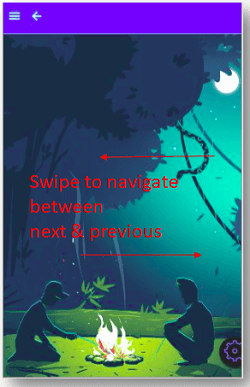

In order to bring the Mobile app experience closer to that of Native apps, Gesture feature has been introduced. Using this the user can swipe to open/close Left panel, navigate to the next Tab and view the successive Carousel pane contents.

# Gestures

A swipe gesture involves the app responding when the user moves one or more fingers across the screen in a horizontal - left or right direction.  WaveMaker Mobile Apps, Gestures are turned on by default. This will cause:

1. **Panel** to be expanded by swiping from left to right and collapsed by swiping right to left; 
2. **content** to navigate to the next tab or previous tab on swipe; NOTE: Transition property for Tabs widget should be set to slide (default setting) for swipe functionality to work. 
3. content to navigate to the next or previous content on swipe; 

This feature is in Beta state and as such there are few limitations.

- , the swipe gesture is supported by Left Panel, Tabs, and Carousel (Static) widgets.
- portion of the Left Panel occupies the left margin on the page to enable swipe. Due to this, touch or tap events on widgets aligned to the left margin of the page might not be triggered. Adding a padding or setting a margin for such widgets will help solve the issue.
- case the Swipe Gesture functionality is hindering your app performance you can disable it. Go to the markup tab and add the attribute \= “off” to the widgets you want the swipe to be disabled. For example, to turn the swipe off for Left Panel, following would be the markup:
    
    <wm-left-panel content="leftnav" name="left\_panel1" gestures ="off"></wm-left-panel>
    

2 Mobile UI Design

- 2.1 Mobile Page Concepts
    - [Page Layouts](/learn/hybrid-mobile/mobile-page-concepts/#page-layouts)
    - [Page Navigation & Actions](/learn/hybrid-mobile/mobile-page-concepts/#page-navigation-actions)
    - [Page Transitions & Gestures](/learn/hybrid-mobile/mobile-page-concepts/#page-transitions-gestures)
- 2.2 Mobile Tabbar
    - [Features](/learn/hybrid-mobile/mobile-tabbar/#features)
    - [Properties](/learn/hybrid-mobile/mobile-tabbar/#properties)
    - [Events](/learn/hybrid-mobile/mobile-tabbar/#events)
    - [Use Cases](/learn/hybrid-mobile/mobile-tabbar/#use-cases)
- 2.3 Mobile Navbar
    - [Features](/learn/hybrid-mobile/mobile-navbar/#features)
    - [Properties](/learn/hybrid-mobile/mobile-navbar/#properties)
    - [Events](/learn/hybrid-mobile/mobile-navbar/#events)
    - [Use Cases](/learn/hybrid-mobile/mobile-navbar/#use-cases)
- 2.4 Mobile & Device Widgets
    - [Media List](/learn/app-development/widgets/mobile-widgets/media-list/)
    - [Segmented Control](/learn/app-development/widgets/mobile-widgets/segmented-control/)
    - [Barcode Scanner](/learn/app-development/widgets/mobile-widgets/barcode-scanner/)
    - [Camera](/learn/app-development/widgets/mobile-widgets/camera/)
- [2.5 Gesture Support](#)
    - [Swipe Gesture](#swipe)
    - [Limitations](#limit)
