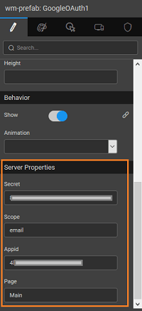
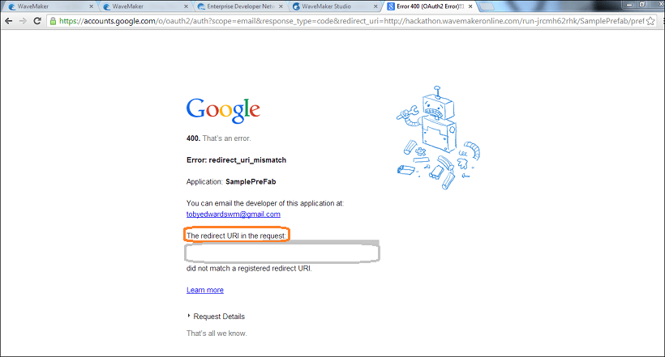
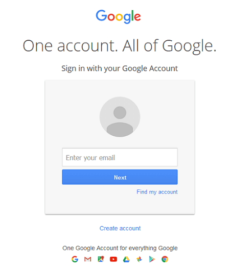

2.0 is an authorization framework, which is updated after the original OAuth protocol created in 2006. OAuth 2.0 is a standard protocol, which provides delegated secured access for web, mobile, and desktop applications. To know more about the working of WaveMaker OAuth Prefabs [ here](/learn/app-development/widgets/prefab/oauth-prefabs/)

## OAuth in WaveMaker

In order to use the OAuth prefab, please follow the below steps:

Disclaimer: The screenshots from the Google website were current at the time of writing this document, the actual screens might differ.

1. on to [://console.developers.google.com](https://console.developers.google.com) and enter your credentials. **Developers Console** window is displayed.
2. the left of the Google Developers Console screen click **Project** New Project window is displayed. Enter the Project name in its respective field. : Project ID is displayed by default. Check the Terms of Service checkbox and click Create. Your project is successfully created.
3. the left panel of the project screen select from **& auth** section.
4. **new Client ID.** Create Client ID window is displayed.
5. the Application type to be a **application** and click **consent screen.** Consent screen page is displayed.
6. **address** and **name** and click Note: The remaining options are optional. Create ID screen with Authorized JavaScripts origins window is displayed.
7. a valid sample Authorized JavaScript origins and Authorized redirect URIs and click Create Client ID. Your client ID is now created. : Make a note of the Client ID and Client secret

# Example

Here we show a simple use case for login using Google credentials. [validation using custom security to access Gmail API see here](/learn/how-tos/custom-security-using-google-oauth-prefab/)

- an application using WaveMaker. Drag and Drop the **OAuth PreFab** onto the canvas. You can use the default login page created by WaveMaker.
- can set the **Mode** to be:
    
    - will in the run mode after initialization of the Prefab the app would automatically be navigated to the OAuth Authorization page
    - (default mode) will invoke the OAuth Authorization page on click of the login button
    
    
- the Properties Panel, enter the Client ID and Client Secret in the **Properties**  panel in their respective fields. 
- the application and Run the application. Note the **URL**
- you run the application, redirect URL is generated. You might have to click REMOVE TOOLBAR to get the URL. Copy the redirect uri till the part only. 
- to **Developers Console** – your project page and click on Edit Settings. Enter this redirect Url in the Authorized redirect URIs field and click Update.
- back to WaveMaker application and again Run the app. You can now see the application. You will see the WaveMaker login screen if you have set the Login Mode as manual:  Click the Login with Google button and you will be directed to the Google login page. This will be the first screen in case you have set the Login Mode to auto: 
- the Google credential will allow access to the WaveMaker App
- use Google APIs, you need to [the appropriate web service](/learn/web-services/#setup) Go to https://developers.google.com/oauthplayground/, select the required API and get the Authorization key 
- app designer, import a web service with the proper credentials as obtained from the above step. 

[9\. Custom Widgets - Prefabs](/learn/app-development/widgets/widget-library/#prefabs)

- [9.1 Youtube](/learn/app-development/widgets/prefab/youtube/)
- [9.2 Googlemaps](/learn/app-development/widgets/prefab/googlemaps/)
- [9.3 QRCode](/learn/app-development/widgets/prefab/qrcode/)
- [9.4 OAuth Prefabs](/learn/app-development/widgets/prefab/oauth-prefabs/)
    - [9.4.1 Box](/learn/app-development/widgets/prefab/oauth-prefabs/box/)
    - [9.4.2 Facebook](/learn/app-development/widgets/prefab/oauth-prefabs/facebook/)
    - [9.4.3 Google](/learn/app-development/widgets/prefab/oauth-prefabs/google/)
    - [9.4.4 Instagram](learn/app-development/widgets/prefab/oauth-prefabs/instagram/)
    - [9.4.5 LinkedIn](/learn/app-development/widgets/prefab/oauth-prefabs/linkedin/)
