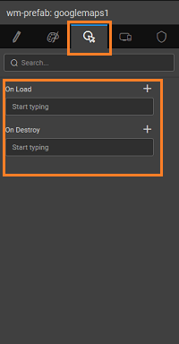
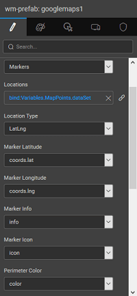
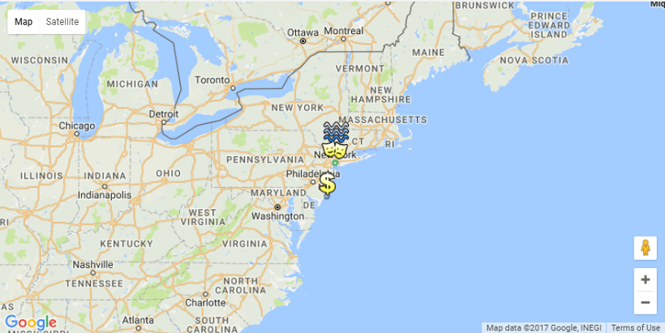

The prefab connects with Google Maps and displays the map on your page. It can be used either for map or as map or as a map.

 order to use GoogleMaps, you need to register your app with Google Maps and add the API key here:

Three types of maps can be plotted using Googlemaps Prefab:

Heat map 

<iframe width="100%" height="400" style="background-color: snow;" allowtransparency="true" src="https://apps.wavemakeronline.com/documentation_snippets/#/HeatMap">of Heat Map</iframe>

Location map 

<iframe width="100%" height="500" style="background-color: snow;" allowtransparency="true" src="https://apps.wavemakeronline.com/documentation_snippets/#/PrefabGMapMarker">of Marker Map</iframe>

Route map 

<iframe width="100%" height="500" style="background-color: snow;" allowtransparency="true" src="https://apps.wavemakeronline.com/documentation_snippets/#/RouteGMaps">of Route Map</iframe>

Using Googlemaps Prefab, you can:

- various [of maps](#types),
- [events](#events) to customize the map behavior, and
- [scripts](#script) to enhance the functionality.

There are three **Types** supported by Googlemaps Prefab:

1. help to mark a given with an , , highlight using a circle of given _shade_(color). The input can be any variable which has the above-mentioned fields delimited. The variable can be bound to the Locations property and each of the above properties can be set to the elements of the variable.
    - : Variable containing the location details. Can be static variable in JSON format, or a Live Variable with the following fields
    - ** type**: tells the format of the location being plotted. It can be
        - in which case Marker Latitude and Marker Longitude of the location is given as the input
        - wherein the Address fields in the form of a city, state, zip etc can be picked from the multi-list dropdown. These are the fields from the variable bound to the Locations property above.
    - **Icon**: Used to mark the location
    - **Info**: Any information that needs to be displayed when the location is clicked
    - **Color**: Used to set a circle shaped boundary around the marker.
    - **Radius**: Used to set the radius of the boundary around the marker. _change is reflected in prefab only when Perimeter property is enabled_
2. a **map** you can mark:
    - and by passing the String or GeoLocations(Latitude and longitude) to get the route rendered on the map,
    - a location which needs to be included in the route from the origin to destination,
    - the property you can choose to mark the waypoint in the route,
    - **Mode** can be Driving, Walking or Transit. The Route information like Origin, Destination, Duration, Distance is displayed below the map.
3. a **,** the traffic congestion points can be marked. You can set:
    - **Latitude** **Longitude ** be selected from the fields from the Locations variable
    
    - **Density** to mark the size of the marker
    - to set the appearance of the marker

The following events are exposed for Googlemaps Prefab:

1. Load: this can be used to trigger any action when the Prefab is loaded on the page containing it
2. Destroy: this can be used to trigger any action when the Prefab is deleted/closed
3. : this can be used to trigger any action when a marker on the map is clicked
4. : this can be used to trigger any action when a marker on the map is hovered on

#### Access

- can get the marker information from **$data** in the On Marker Click event of the google map.
- can open the info window of the marker by invoking the method on the widget scope. Params required for the method : ‘’. For example 1.showInfoWindow(mapMarkerData) This will open the info window for the selected marker. **:** To open the info window of the marker in the Marker on Click event is shown below:
    
    1Markerclick = function($event, $data) {
        Page.Widgets.googlemaps1.showInfoWindow($data);
     };
    
- can plot a custom Marker on the map either by sending the Address to the function (or) by sending the _, lng_ values to the function. For example: 1.markAddress('Chicago') will plot the marker in Chicago, USA. 1.markLatLng(31.619770, 74.876713) will plot the marker according to the provided latitude, longitude values.
- can remove all the custom Markers by invoking the function on widget scope

# Scenario

We will see three use cases for various features of the Googlemaps prefab:

1. [from Database](#db)
2. [from Static Variable](#static)
3. [Map](#route)

#### from Database

1. and drop the prefab onto the canvas on any of the pages in your application.
2. the property to a database which contains the address fields. Here we are using table from the [Sample DB](/learn/app-development/services/database-services/#integrating-database) 
3. the to and choose a **, state, and zip** for the property. 
4. can set the other properties to any fields in your DB. Here we are not setting them since we do not have corresponding fields in the sample DB.
5. and see the map. 

#### from Static Variable

1. and drop the prefab onto the canvas on any of the pages in your application.
2. a custom variable as per your requirements.  [more from here](https://www.wavemaker.com/learn/app-development/variables/model-variable/) Then enable the **property**, and enter the appropriate JSON in the **Editor**  As an example you can use the following:

 \[
  {
    "coords": {
      "lat": 41.428146,
      "lng": -73.918993
    },
    "icon": "http://maps.google.com/mapfiles/ms/micons/water.png",
    "info": "Hudson River",
    "radius": 12345,
    "color": "#5133AB"
  },
  {
    "coords": {
      "lat": 40.712397,
      "lng": -74.005469
    },
    "icon": "http://maps.google.com/mapfiles/ms/micons/arts.png",
    "info": "New York",
    "radius": 12345,
    "color": "#0BC86E"
  },
  {
    "coords": {
      "lat": 39.366105,
      "lng": -74.436832
    },
    "icon": "http://maps.google.com/mapfiles/ms/micons/dollar.png",
    "info": "Atlantic City",
    "radius": 12345,
    "color": "#264B7F"
  }
\]

 

- the location's property of the prefab to the model variable created.
- for property, for property, for property and for property. You can set the height and width of the prefab. The property can be set for the default level of display, set the and of the display window. 
- and run the application.
- will see the google map displayed with the cities mentioned in the static variable highlighted with the appropriate icon and information tags. You can zoom in, zoom out, pan left, right, top and bottom as you would with google maps. 
- get the marker details in the on click event of the marker:
    - to the google map prefab and navigate to the Events tab in the properties panel. Here, in the On Marker Click event, select javascript from the dropdown. 
    - the Script tab from the Markerclick event, you can access the marker data as below: Example:
        
        1Markerclick = function($event, $data) {
         var lat = $data.latLng.lat();
         var lng = $data.latLng.lng();
         var color = $data.color;
         var info = $data.info;
         var icon = $data.icon;
         var radius = $data.radius;
        };
        

#### Map

Using the Origin and Destination properties, you can plot a route.

1. and drop the prefab onto the canvas on any of the pages in your application.
2. the values for and These can be static string values or bound to variables. For example, we have used and values: 
3. property, you can set the intermediary points from origin to destination. : Due to restriction from Google Maps API, the input to waypoint has to be in a JSON format. Create a model **variable** with this content and bind it to the waypoint property.  Here is a sample code we have used for this example.

\[
  {
    "location": {
      "lat": 44.32384807250689,
      "lng": -78.079833984375
    }
  },
  {
    "location": {
      "lat": 44.55916341529184,
      "lng": -76.17919921875
    }
  }
\]

- the and to and , and bind the to the model variable created in the previous step. Selecting the property will mark the waypoint. 
- the app. 

[9\. Custom Widgets - Prefabs](/learn/app-development/widgets/widget-library/#prefabs)

- [9.1 Youtube](/learn/app-development/widgets/prefab/youtube/)
- [9.2 Googlemaps](/learn/app-development/widgets/prefab/googlemaps/)
    - [Layouts](#layouts)
    - [Features](#features)
    - [Usage Scenario](#usage-scenario)
- [9.3 QRCode](/learn/app-development/widgets/prefab/qrcode/)
- [9.4 OAuth Prefabs](/learn/app-development/widgets/prefab/oauth-prefabs/)
    - [9.4.1 Box](/learn/app-development/widgets/prefab/oauth-prefabs/box/)
    - [9.4.2 Facebook](/learn/app-development/widgets/prefab/oauth-prefabs/facebook/)
    - [9.4.3 Google](/learn/app-development/widgets/prefab/oauth-prefabs/google/)
    - [9.4.4 Instagram](learn/app-development/widgets/prefab/oauth-prefabs/instagram/)
    - [9.4.5 LinkedIn](/learn/app-development/widgets/prefab/oauth-prefabs/linkedin/)
