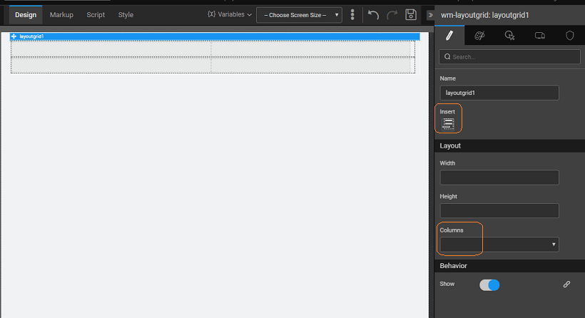
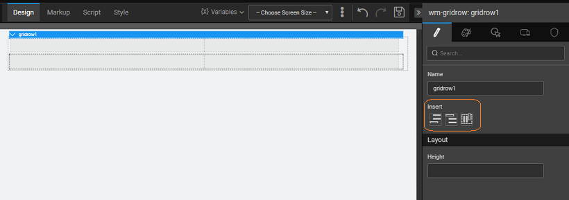

**Layout** is the basic content layout, that caters to multiple layout needs. Using the grid layout, you can divide your page content into cells or grids and place your widgets accordingly. It gives you a flexibility of widget placement without having to get into the intricate design details. The major advantage of using grid layout is its rendering capability. WaveMaker renders the screen depending upon the device being used for viewing the app like mobile, tablet, etc..

WaveMaker implements the [Grid](http://www.w3schools.com/bootstrap/bootstrap_grid_system.asp) system which is the 12-column system:

### Layout - Basic Features

Layout when dropped on the canvas, gives you a two-row, two-column grid to which you can:

- **\-level features**
    
    - the number of columns needed for your grid, this will be propagated to all the rows of the grid;
    - the height and width of the grid;
    -  the columns and rows anywhere in the grid;
    - rows to the existing grid. When inserting a new row, the last row pattern is replicated, i.e. if you have the last row with two columns then the new row added will also be a two-column row.
    
    
- **\-level features**
    
    - the height of the row,
    - columns to the row from the properties panel of the selected row. When adding columns, WaveMaker ensures that the sum of all the column widths does not exceed 12.
    - a row either before or after the selected row
    - a selected row, by clicking delete key after selecting the row
    
    
- **\-level Features**
    
    - the height and width of the column from the properties panel of the selected cell.
    - a cell before or after the selected cell.
    - a selected column, by clicking delete key after selection.
    
    

### Layout Column Width Settings

ensures that the sum of all columns in a given row does not exceed 12. For this, following scenarios are handled:

- **adding columns:** Columns can be added either by selecting a row or from selecting a column:
    - or column is selected: If previous columns are of the same width, the new column width and other columns width is set as 12 / (number of columns) ie.. if previous both columns are 6 and insert column is triggered the column width of all columns will be 12 / 3 = 4.
    - row is selected and all columns are of different width: In this case, the column width will be set to last column width / 2 if it is > 1; if it is < = 1 new column will not be allowed to insert.
    - is selected and all columns are of different width: In this case, the new column width will be width / 2 of selected column if its > 1 else new column will not be allowed to insert
- **adding columns:**
    - total column width is 12 along with the changed width: In this case, it won't adjust the width, it will change the current column width.
    - total column width is greater than 12 along with changed width:  If it can borrow the same from sibling element it will adjust the width else it won't allow the change of width.
    - total column width is less than 12 along with the changed width:  It will add the width to sibling element that is reduced from current column.

following image gives you an idea of the flexible design that grid layout offers. The first row has three columns with the width being 4+4+4; second row three columns - 1+10+1; the third row with two columns - 6+6 and the last row same as the first row.

name is a unique identifier for the grid layout widget.

a row to the grid layout, at the bottom.

width of your widget can be specified in px or % (i.e 50px, 75%).

height of your widget can be specified in px or % (i.e 50px, 75%).

of columns in each row of the layout grid widget. Columns are droppable. The number of columns restricted to a range, to suit bootstrap fluid grid system.

determines whether or not a component is visible. It is a bindable property.

on Demand (visible only when show property is bound to a variable)

this property is set and show property is bound, the initialization of the widget will be deferred till the widget becomes visible. This behavior improves the load time. Use this feature with caution, as it has a downside (as we will not be able to interact with the widget through script until the widget is initialized). When show property is not bound the widget will be initialized immediately.

### Properties

A sub widget of the grid layout is the direct child of the grid.

name is a unique identifier for the grid row.

a row either above or below the current row or add a column to the current row.

height of your widget can be specified in px or % (i.e 50px, 75%).

### Properties

A sub widget of the grid layout is the direct child of the grid row.

name is a unique identifier for the grid column

a column either before or after the current column.

height of your widget can be specified in px or % (i.e 50px, 75%).

Align

text alignment horizontally.

Width

integer(x) between 1-12 and adds class col-md-(x), to suit bootstrap fluid grid system.

[2\. Container Widgets](/learn/app-development/widgets/widget-library/#container)

- [2.1 Accordion](/learn/app-development/widgets/container/accordion/)
- [2.2 Container](/learn/app-development/widgets/container/container/)
- [2.3 Grid Layout](/learn/app-development/widgets/container/grid-layout/)
    - [Features](#features)
        - [Grid-level Features](#grid-features)
        - [Row-level Features](#row-features)
        - [Column-level Features](#column-features)
        - [Column Settings](#column-settings)
    - [Properties](#properties)
        - [Row Properties](#row-properties)
        - [Column Properties](#column-properties)
- [2.4 Panel](/learn/app-development/widgets/container/panel/)
- [2.5 Tabs](/learn/app-development/widgets/container/tabs/)
- [2.6 Tile](/learn/app-development/widgets/container/tile/)
- [2.7 Wizard](/learn/app-development/widgets/container/wizard/)
