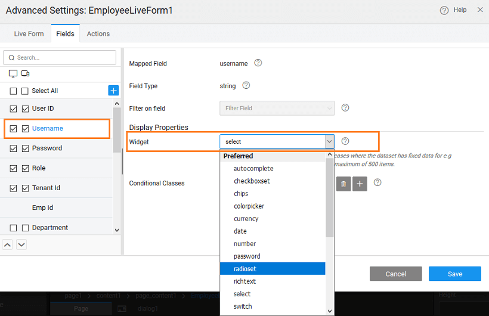

Tabbed Live FormWe will see how to build the following tabbed Live Form:  

1. and drop a **Form** onto the canvas
2. the Variables tab select the data source, for this example we are using
3. a **\-column layout** and retain the default Editable Mode
4. all the Form Fields and their default bindings
5. **Field properties**: To set the Department and Employee by Managerid fields
    1. on **Settings**
    2. the **tab**
    3. field, and set the **Expression** to by selecting it from the list on its right. 
    4. , for **by Managerid** select the **and lastname** as the display expression. : Selecting both will form an expression combining or concatenating both the fields 
    5. the settings
    6. the canvas, select the **by Managerid** field and set the to _Name_
6. and drop **Container** onto the Live Form, below the Layoutgrid that has been generated by the above steps. Set the **Heading** to
7. and drop a **Layout** onto the tabcontent, set to 2. : This will set the width of each column to 6 and add additional rows. You can choose to retain or delete the additional rows, we need only two rows.
8. and drop the fields corresponding to **, Password and Role** from the Live Form into the respective gridcolumns. 
9. **a tab pane** and set the as
10. and drop a **Layout** onto the new tab pane added. Set to 2. : This will set the width of each column to 6 and add additional rows. You can choose to retain or delete the additional rows, we need only one row.
11. and drop from the Live Form, fields corresponding to **and Manager Name** into the respective Grid Columns. 
12. the app

Linking Live Form with another Live WidgetTo use form for updating the table, it needs to be bound to a **Table** or a widget's **row** property. Here we will see linking Data Table to a Live Form, the same can be replicated for a List. Another easy way to achieve this would be to use the Editable Data Table with Live Form layout.

- and drop a Data Table for the Variable.
- the Data Table (grid) selected item as the datasource for the Live Form. This will set the initial values that will be displayed in the form. 
- runtime, the row selected from the table will be displayed in the form. Make changes and click on save to commit the changes to the database.

Using Widgets for Live Form FieldsWidgets like select, autocomplete, radioset, checkboxset and switch can be used for various fields within Live Form. These widgets can be used to show the predefined options to the user.

- they are limited number of options: , and widgets can be used,
- number of options are more -   widget can be used, as user can search from list of available options,
-  multiple options are to be selected - and (with multiple option) widgets are recommended.

1. and drop a Live Form and bind it to a Live Variable.
2. layout options, as per your needs.
3. fields configuration step, change the required field widget type to Select. 
4. the field from the designer.
5. for the form field widget is auto populated with the Variable Dataset field. Data field and display field is set to field’s key. Here, the dataset can be bound to any other variable or widget. 
6. widget can be changed from Live Form advanced settings also. 
7. , user can use this widget to select a value from predefined options. 

Handling Related Fields in a Live FormWhen dealing with tables with foreign key relationships, for related fields in the Live Form Select widget is set as default for the Live Form field.

1. and drop a Live Form and bind it to a Live Variable. Here we are using the Vacation table from the hrdb sample database, which is related to the Employee table.
2. layout options, as per your needs.
3. the form fields configuration, you will see that for related fields (Employee) widget is set to select by default 
4. the related fields, widget dataset value is empty as Live form fetches the data for related fields, by default. 
5. the advanced settings, display expression can be changed by selecting additional fields from the list alongside and order by can be configured for this field. The widget can be changed from live form advanced settings also.

- can select a value from available options. 
- form field can be bind to any other variable. Note that datafield should be set as ‘All Fields’. As this is a foreign key, it expects an object. Here we have changed the binding to the Live Variable for Employee table and the display field has been set to lastname. 
- form field is bound to an variable, Live form will not fetch the data for this field. The bound variable will fetch the data for this field. 

 

Using Live Form MethodsWhen dealing with tables with foreign key relationships, for related fields in the Live Form Select widget is set as default for the Live Form field.Live Form has few methods exposed on widget scope to Edit, Delete, Add record and trigger actions like reset and cancel.

For the following script samples, we are considering the table. is bound to the SelectedItem of a Data Grid corresponding to Employee Live Variable.

- delete a record:
    
    $scope.Widgets.EmployeeForm.delete(); //Deletes the current record that is bound to EmployeeForm.
    
- update a record:
    
    $scope.Widgets.EmployeeForm.save(); //Updates the current record bound
    
- add a new record:
    
    $scope.Widgets.EmployeeForm.new(); //Adds a new record to dataset that is bound to EmployeeForm.
    
- reset a form:
    
    $scope.Widgets.EmployeeForm.reset(); //Resets the form to initial state.
    
- cancel an edit operation:
    
    $scope.Widgets.EmployeeForm.cancel(); //Cancels the form edit.
    

Using Live Form Callback EventsWhen dealing with tables with foreign key relationships, for related fields in the Live Form Select widget is set as default for the Live Form field.Live Form behavior can be customised with the help of the call-back events. These events can be accessed from the events tab on the Properties panel. The trigger for the event can be JavaScript, another Variable call etc..

and JavaScript Usage

before service call

event will be called on saving the live form. Any validation checks can be performed here. Returning false from the script will stop the live form save.

$scope.liveform1Beforeservicecall = function($event, $operation, $data) {
//$operation: Current operation being performed - INSERT or UPDATE or DELETE
//$data has the data of the all widgets inside the live form. This data can be modified and validated before sending the request.
        function isValidData(data) {
            /\*restrict password to be minimum of 6 characters\*/
            if (data.password) {
                if (data.password.length < 6) {
                    return {
                        'error': "Password too small"
                    };
                }
            } else {
                return {
                    'error': "Password field required"
                };
            }
        }
        return isValidData($data)
};

result

event will be called after live form is saved and API returns a response. Event is triggered in both success and failure cases.

$scope.liveform1Result = function($event, $operation, $data) {
//$operation: operation  performed - INSERT or UPDATE or DELETE
//$data has the response returned from the API.
console.log("server response:", $data);
};

success

event will be called after live form is saved and API returns a success response.

$scope.liveform1Success = function($event, $operation, $data) {
//$operation: operation performed - INSERT or UPDATE or DELETE
//$data has the response returned from the API.
console.log("The inserted/updated/deleted data:", $data);
};

error

event will be called after live form is saved and API returns a failure response.

$scope.liveform1Error = function($event, $operation, $data) {
//$operation: operation performed - INSERT or UPDATE or DELETE
//$data has the error message returned from the API.
console.log("Error returned from server:", $data);
};
