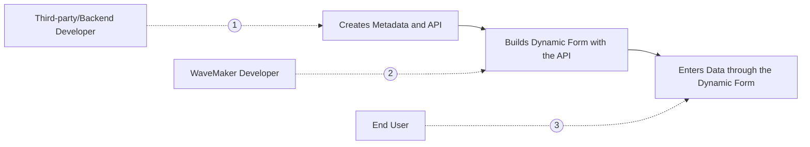

---

A Form is a set of fields used to collect responses from users. These Forms are generally static but to render Forms with varying fields, Dynamic Forms come into use.

Dynamic Form is a type of service Form that adapts its fields and layout based on metadata received from an API. The metadata contains information about the form fields, such as their field names, data types, validation rules, and more.

In the case of Dynamic Forms, the specific fields and their arrangement are determined dynamically at runtime and this flexibility allows for the creation of customizable forms that can change frequently based on business requirements or user roles.

For example, a Business Analyst can use their expertise to define the form fields for a targeted customer without manipulating the metadata.

Dynamic Forms are beneficial in scenarios when:

- the Form requirements change frequently
- driven by business models, or
- the Form is determined by different user roles

By relying on metadata and an API, Dynamic Forms provide a flexible and adaptable solution that can accommodate these dynamic requirements without requiring code changes or redeployment of the Form.

## Understanding Form Types

Following are the differences described to understand which type of Form is appropriate to use.

|   Form   |   Dynamic Form   |
|--------|----------|
| Static display with Fixed fields and labels | Interactive display No fixed fields and labels |
| Upfront knowledge about fields i.e Validation, layout, widget type, formatting etc | No configuration is done upfront, only metadata is available |

## Dynamic Forms in WaveMaker

WaveMaker expects metadata to render fields inside a Dynamic Form. This metadata is an array of objects where each object represents a field inside the form. A typical field object could be something as follows

```markup
[{
“name”: “” //name of the field
“displayname”: “” //name to be displayed for the field
“type”: “” //type of the field
“required”: “” //isRequired
“widget”: “” //widget type for the field
“dataset”: “” //dataset for the field, if the widget is accepting the dataset
}]
```

:::important
If the metadata service returns some other structure than the one mentioned above, use the [on-beforerender event](#modifying-dynamic-form-metadata) on the Form to modify the data accordingly.
:::



## Dynamic Form Workflow

1. Third-party/Backend Developers, create the API that returns the metadata for a Form. It is shared with WaveMaker developers to create a Dynamic Form.
2. WaveMaker developers work on User Interface (UI) to create the required Dynamic Form with the received metadata.
3. The end user can use the created Dynamic Form to provide the responses.

## Benefits of Dynamic Form

### Business Users can Control Fields to Display

Dynamic Forms are metadata-driven, which allows business users to configure the fields to be displayed, including in what order, and how to be displayed, in real-time. These Forms are created with a simple UI that takes Form fields as inputs from business users.

### Update Forms without Frequent Deployments

Dynamic Form is constructed over metadata, where they provide necessary details about the data such as name, type, widget type, and validation rules which help in avoiding repeated deployments to add new field details as it is done in Static Forms. Fields can be added in real-time by business users as per the requirement, as the metadata already contains the field details.

## How to Configure Dynamic Form

To configure a Dynamic Form in WaveMaker, you start by creating or importing a service where the service is created against the metadata.

:::note
**Metadata**: It contains information like name, type, widget type, validation rules, and other required details about the field.
:::

### Importing Metadata Service

As explained, a Dynamic Form requires metadata to render fields inside it. The metadata can come from an API exposed by a service. You can either create the service for this API in WaveMaker using Java Services or use an existing API that provides metadata for the Form. This API can be directly imported into the WaveMaker project.

To know how to import REST Web Service, see [Import REST Services](https://docs.wavemaker.com/learn/app-development/services/web-services/rest-services#test-rest-service-api).

### Creating Page

Dynamic Form is created on a newly created Page. To create a Page, see [Create a Page](https://docs.wavemaker.com/learn/app-development/ui-design/page-creation/). The variable created in [Creating Variable](#creating-variable) section is created inside this Page.

### Creating Variable

The imported API holding the metadata is fetched and stored using a variable.

1. Create a variable `MetadataVariable`. To know how to create a variable, see [Creating Service Variable](https://docs.wavemaker.com/learn/app-development/variables/web-service#how-to-create-a-service-variable). The created variable should be used in the **Markup** tab to [bind the metadata with the Form](#binding-variable-with-form).

[](/learn/assets/variable-markup-dynamicform.png)

### Creating Dynamic Form

#### Creating Form

1. [Create a Form](https://docs.wavemaker.com/learn/app-development/widgets/datalive/form/form-usage-scenarios) with an existing variable as "supportedLocale" and uncheck the Fields as you are creating a Dynamic Form.

#### Binding Variable with Form

1. Go to the Markup tab and add metadata property in the markup with the created variable to bind the variable holding metadata with the Form. For example, replace `dataset="bind:Variables.supportedLocale.dataSet"` with the accepted value for metadata, `metadata="bind:Variables.<Variable Name>.dataSet"`.

[](/learn/assets/add-formcode-metadata-dynamicform.png)

2. Click **Save** to save the changes in the Markup tab. Click Preview to view the created Dynamic Form.

[](/learn/assets/confirm-formcode-dynamicform.png)

#### Modifying Dynamic Form Metadata

1. In WaveMaker Studio, Form expects the metadata in a particular format given in [Dynamic Forms in WaveMaker](#dynamic-forms-in-wavemaker). When the metadata returned by an existing API is not the same as the Form expects, use **on-beforerender** event to transform the metadata returned from API into the metadata the Form expects. For example, use the following format `on-beforerender="<Form_Widget_Name>Beforerender($metadata, $isolateScope)"`.

[](/learn/assets/add-formcode-onbeforerender-dynamicform.png)

You can preview the Dynamic Form.

## Create Business User Form

The metadata can be configured by a Business User (BU) through another Static Form only in cases when BU wants to add or edit fields through WaveMaker. To create a Static Form, see [Creating Form](https://docs.wavemaker.com/learn/app-development/widgets/datalive/form/form-usage-scenarios/).