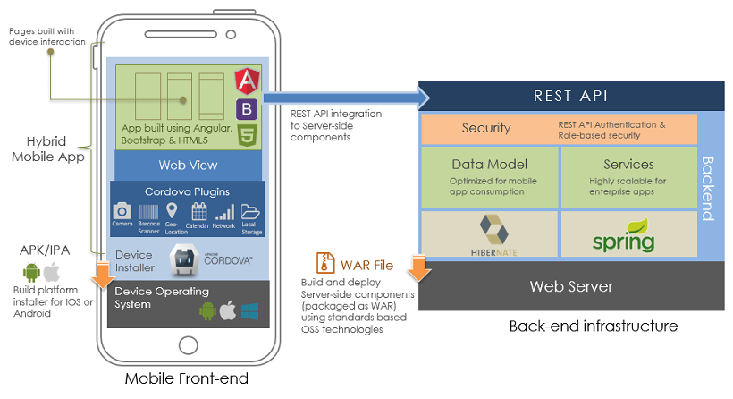

# Hybrid App Architecture

WaveMaker Hybrid Mobile applications are based on Cordova framework, with the Web App built on the open standards-based stack using Angular, Bootstrap & HTML.

WaveMaker App components such as variables, widgets, layouts, prefabs etc. are bundled along with the App and a platform-specific installer using Cordova is created for running the app on mobile. WaveMaker widget library and the runtime component required for backend services integration are bundled as well.

The mobile front-end is developed just like the way Pages are created in Web applications by making use of layouts and Variables for services integration. REST APIs are used for integration with backend services such as Database, Web Services or Java Services. Front end components are packaged into an installer and the backend services developed using WaveMaker should be deployed to any standards-based web server.

# Hybrid Mobile App Development

Mobile App Development involves the following four layers:

1. Building **Mobile UI** using layouts, adding workflow with the help of events supporting navigation, transitions, and gestures. Mobile specific widgets allow you to take advantage of the device features
2. **Data integration** via REST APIs, variables, and data binding
3. The **Native Support** enhances the app functionality by enabling native look and feel, access to device-specific features, offline data support, and responsiveness
4. **Installer** helps build platform-specific installers for deployment

### Developing UI

A WaveMaker application is a single page application(SPA), where Pages are loaded asynchronously on demand. An app is composed of [multiple pages](/learn/app-development/ui-design/page-concepts/). Page Layouts define not only the app UI but also the app behavior through Navigation, Transition, and Gestures. [More on Page Layouts](/learn/hybrid-mobile/mobile-page-concepts/)

Page functionality can be enhanced using UI components for user interaction. Drag-and-drop of WaveMaker's HTML/Bootstrap based widgets provides rich interaction and responsive design. Apart from the generic Widgets, device specific widgets like Camera and Barcode Scanner allow the app to access device capabilities. [More on Widgets](/learn/app-development/widgets/ui-elements/#widget-basics).

### Data Integration

Widgets can be integrated with external data from Database, Web or Java Service. WaveMaker handles external data as a service. Based on the underlying data being served, services are categorized as _Web Services_, _Data Model_ and _Java Services_. Each of these services is converted to a RESTful service and are consumed through their respective REST APIs. [More on Services](/learn/app-development/services/creating-backend-services/)

Variables and Binding enable you to establish the connection between the widgets and REST APIs. Device Variables give access to device features like device information, local file storage, geolocation etc.. [More on Variables](/learn/app-development/variables/data-integration/)

# Preview and Testing Mobile Apps

**Test Run** of the App, give you a preview of the app similar to a Responsive Web app. You will not be able to access any Device specific features that are included in the app. For that, you can use **WaveLens**. WaveLens is an app that helps you to quickly preview their mobile app. It is available on both app store and play store. [More on testing apps](/learn/hybrid-mobile/test-run/)

# Creating Installer

The **Build** process for a mobile application can be performed through Automated Build process where you can generate .apk (Android application package) or .ipa file (iOS App Store package). Another way is to download Cordova/PhoneGap compatible .zip files to build systems manually for Android/iOS platforms.

 WaveMaker supports you to build mobile applications in the following ways:

- **[Build for Android](/learn/hybrid-mobile/mobile-build/#android-build)**: Through this build, you can generate APK files which can be signed and hosted on PlayStore.
- **[Send to PhoneGap](/learn/hybrid-mobile/mobile-build/#send-to-phonegap)**: Through this build, it provides you a complete package of building both apk/ipa files for Android and iOS platforms.
- **[Manual Build](/learn/hybrid-mobile/mobile-build/#cordova-build)**: Through this build, you can generate or download a .zip file which can be further developed to be hosted on any mobile platform.

B.1 Mobile Apps

- [1.1 Mobile App Development](#)
    - [i. App Architecture](#mobile-app-architecture)
    - [ii. App Development](#mobile-app-development)
    - [iii. Testing on Mobile](#testing-mobile)
    - [iv. Creating Installer](#creating-installer)
- 1.2 Native Device Support
    - [i. Device Specific Widgets](/learn/hybrid-mobile/native-device-support/#device-specific-widgets)
    - [ii. Device Variables](/learn/hybrid-mobile/native-device-support/#device-features-variables)
    - [iii. Platform Look n Feel](/learn/hybrid-mobile/native-device-support/#platform-support)
