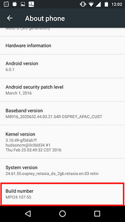
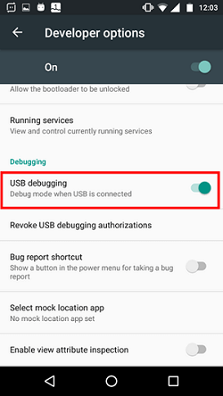
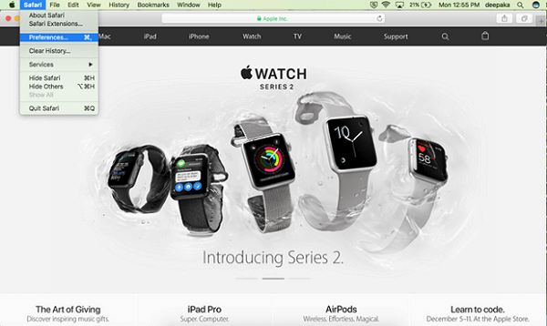
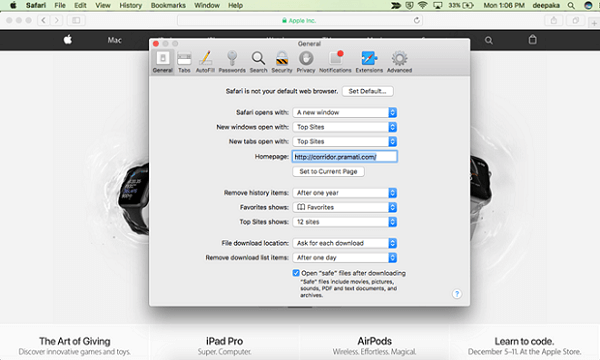
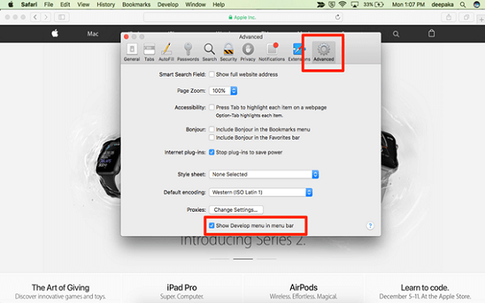

Wavemaker uses Cordova platform to build hybrid mobile apps. While Cordova handles the native JavaScript API binding, WaveMaker handles the core app logic and UI. A mobile app built using WaveMaker runs in a web view (equivalent to a web browser). How to debug the web view layer is explained below.

## Debugging on Android

**Requirements**

- Android Mobile
- An App (to debug) built on Cordova
- Desktop/laptop with chrome browser

**Enable USB debugging in Android (one-time setup)**

- On your android mobile, go to Settings > Security. Enable ‘Unknown sources: Allow installation of apps from unknown sources’ 
- Go to Settings > About Phone. In ‘About Phone’ page, click on build number for 7 times to enable developer options. 
- Go to Settings > Developer Options. Enable USB debugging. 

**Debugging mobile app**

- Open the app on mobile and connect mobile to a desktop with a USB cable.
- On the desktop, open a chrome browser and go to ‘chrome://inspect#devices’. All available apps for debugging are shown on that page. 
- Click on inspect link that appears below to your app.Chrome debugging tools will open and you can debug the app. 

## Debugging on IOS

**Requirements**

- iPhone
- Mobile app built on Cordova
- MacBook (or Mac Pro or Mac Mini) with safari browser

**Enable Safari Web Inspector (one-time setup)**

- On iPhone
    - Open Settings and Tap on Safari 
    - In Safari Settings, Tap on Advanced 
    - Turn on Web Inspector. 
- On MacBook
    - Open Safari browser > preferences  
    - Go to Advanced and check on ‘Show Develop Menu in menu bar’ 

**Debugging Mobile App**

- Open the app to debug on iPhone.
- Connect iPhone to a MacBook with a USB cable.
- Open Safari in a MacBook, and click on ‘Develop’ menu. 
- Under Develop menu, all connected devices (iPhone) are listed.Under each Device sub-menu, all apps available to debug in that device are listed. 
- Click on the app’s page to open the debugger. 

B.3 Platform Installer

- [3.1 Test Run (Preview)](#)
    - [i. App Preview](/learn/hybrid-mobile/test-run/#preview)
    - [iii. Debugging Mobile Apps](#)
        - [○ on Android](#android)
        - [○ on iOS](#ios)
    - [iv. Testing using Wavelens](/learn/hybrid-mobile/testing-hybrid-mobile-apps-using-wavelens/)
- 3.2 Mobile Build
    - [i. Android Build](/learn/hybrid-mobile/mobile-build/#android)
    - [ii. Send to PhoneGap](/learn/hybrid-mobile/mobile-build-phonegap/#phonegap)
    - [iii. Manual build - Using cordova zip](/learn/hybrid-mobile/mobile-build-manual/#manual)
