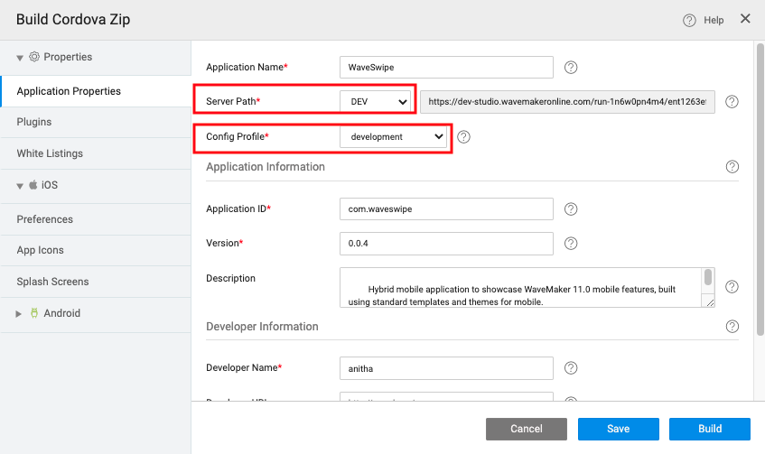
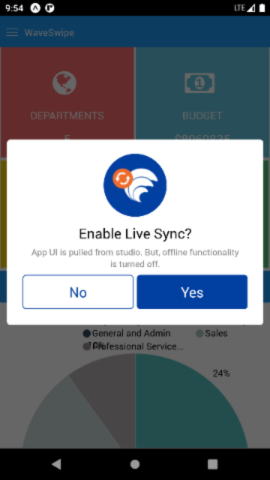
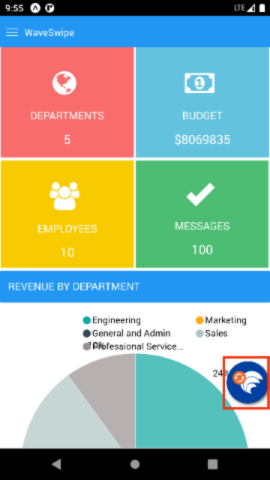
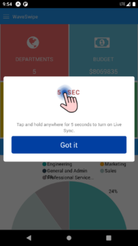

---

Live Sync is feature that brings App UI changes in Studio to mobile app without a new build. This reduces the number of mobile builds required and thus tremondously save developer's time.

## How to enable it

- Open **Export as Cordova zip** dialog.
- Select server path as **dev** and profile as **development**.

- Click on build button.
- Download the cordova zip and do a mobile build using wm-cordova-cli or AppChef.
- Download and install the app in mobile.
- Open the app.
- Following popup will be shown. This popup is shown after every app restart.

- To turn on Live Sync, press **Yes** button. Screen with the Live Sync button at the bottom right corner, should be shown.

- If Live Sync is not needed, press **No**. If Live Sync is needed later, then either restart app or press and hold anywhere for 5 seconds. Live Sync Popup will be shown again.

## What happens in Live Sync Mode
- Whenever a UI change is made in Studio, press on the Live Sync button to refresh the app with the latest changes.

- Except offline functionality, rest of all functionalities should work as is.
- Whenever plugins are added in Studio, a new build is required to get the plugin functionality into the app. When Live Sync observes plugin addition, following warning will be shown. It is recommended to have a new build when this warning is shown. 

:::note
When a device variable or widget is added, plugins (required for that variable or widget) are added automatically.
:::
- Third party plugins are also supported.
- App can be debugged as usual.

## Limitations
- Offline functionality is not supported.