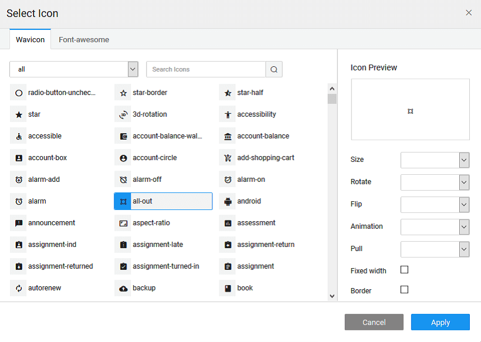
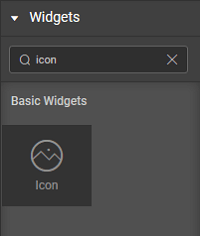

Many widgets like Panel, Button etc. have a way to display an icon. You can choose the icons from the list of  (thin fonts that abide the iOS and Android mobile style guidelines) or **\-awesome** icons.

 

There are two ways of setting the icon class for a given icon:

1. the bind icon next to the Icon class property and bind it to any resource,
2. the **selector** on the left of the **Class** property, you can:
    1. a **\-awesome** or icon. : Wavicon icons are thin fonts that abide the iOS and Android mobile style guidelines. 
    2. can see the icon preview. You can: 

- the of the icon as the regular _1g_, _2x_, _3x_, _4x_, or _5x_
- to of the icon by 90, 180 or 270 degrees,
- to of the icon horizontally or vertically,
- the of the icon to spin or pulse,
- to the icon to left or right for the placement of the icon,
- the _width_ of the icon for a uniform look while using multiple icons, and
- the for the icon

bindable property is the text that the end user sees on icon.

name is a unique identifier for icon widget.

text or html you enter for this property will be shown as a tooltip if the mouse hovers over this widget for 1.5 seconds.

determines whether or not a component is visible. It is a bindable property.

on Demand (visible only when show property is bound to a variable)

this property is set and show property is bound, the initialization of the widget will be deferred till the widget becomes visible. This behavior improves the load time. Use this feature with caution, as it has a downside (as we will not be able to interact with the widget through script until the widget is initialized). When show property is not bound the widget will be initialized immediately.

property controls the animation of an element. The animation is based on the css classes and works only in the run mode.

Class

property defines the class of the icon that is applied to the button.

Size

property defines the size of the icon. Value has to be specified along with the units (em or px).

Position

to set the position of icon - can be left (default) or right.

[4\. Basic Widgets](/learn/app-development/widgets/widget-library/#basic)

- [4.1 Anchor](/learn/app-development/widgets/basic/anchor/)
- [4.2 Audio](/learn/app-development/widgets/media-widgets/)
- [4.3 HTML](/learn/app-development/widgets/basic/html/)
- [4.4 Icon](/learn/app-development/widgets/basic/icon/)
    - [Features](#features)
    - [Properties](#properties)
- [4.5 Iframe](/learn/app-development/widgets/basic/iframe/)
- [4.6 Label](/learn/app-development/widgets/basic/label/)
- [4.7 Message](/learn/app-development/widgets/basic/message/)
- [4.8 Picture](/learn/app-development/widgets/media-widgets/)
- [4.9 Progress Bar](/learn/app-development/widgets/basic/progress-bar/)
- [4.10 Richtext Editor](/learn/app-development/widgets/basic/richtext-editor/)
- [4.11 Search](/learn/app-development/widgets/basic/search/)
- [4.12 Spinner](/learn/app-development/widgets/basic/spinner/)
- [4.13 Tree](/learn/app-development/widgets/basic/tree/)
- [4.14 Video](/learn/app-development/widgets/media-widgets/)
