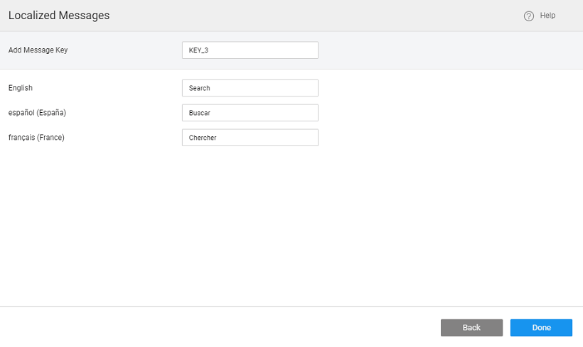
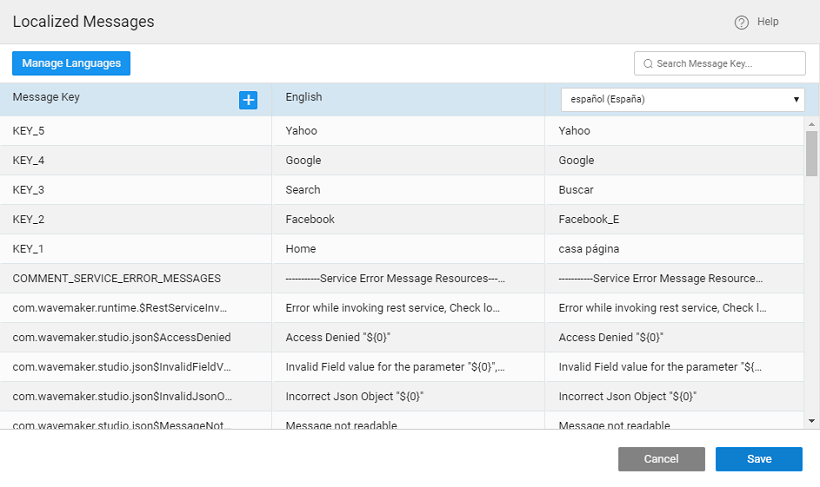

**Statement**: How to implement Localization for the menu items. enables you to render your app in multiple languages. WaveMaker automatically detects the user’s preferred locales (from the browser) and renders the application with the locale of the user’s preference if the application supports. The user can be given a choice to select the language using the Select Locale widget.

In this document, we will be walking through the steps to enable language support to Dropdown Menu widget.

1. the menu create a Model Variable.
2. a name to the Variable, say , and set the option to true.
3. the following JSON structure in the Text Editor, to define the structure for Menu identifying Label, Icon, Link, and Children. Icons can be [from glyphicons](http://glyphicons.com/) or [awesome](https://fortawesome.github.io/Font-Awesome/cheatsheet/) icons.
    
    \[
      {
        "mylabel": "KEY\_1",
        "icon": "glyphicon glyphicon-home",
        "link": "#Main"
      },
      {
        "mylabel": "KEY\_2",
        "icon": "glyphicon glyphicon-user",
        "link": "http://www.facebook.com"
      },
      {
        "mylabel": "KEY\_3",
        "icon": "glyphicon glyphicon-search",
        "children": \[
          {
            "mylabel": "KEY\_4",
            "icon": "glyphicon glyphicon-arrow-right",
            "link": "http://www.google.com"
          },
          {
            "mylabel": "KEY\_5",
            "icon": "glyphicon glyphicon-arrow-right",
            "link": "http://www.yahoo.com"
          }
        \]
      }
    \]
    
    NOTE: Here, we have parameterized the values as KEY\_1, KEY\_2, KEY\_3, KEY\_4, KEY\_5 so that the label values can be displayed as per the locale selection at runtime.
4. and drop a Dropdown Menu widget on the canvas ( [on Dropdown Menu](/learn/app-development/widgets/navigation/dropdown-menu-use-cases/))
    - Properties panel, under the Dataset section, using the chain icon next to the Value property bind the widget to the Modal Variable (menudata) created in the above steps.
    - the Actions section set:
        - Action Label to the following value: _\[mylabel\],_ (you have to use the Use Expression option from the Bind Dialog)
        - Action Icon to icon, and
        - Action link to link.
5. the I18N dialog from the Project Configurations of the [Workspace](http://[supsystic-show-popup id=107]) ( [on localization](/learn/app-development/widgets/form-widgets/select-locale-usage/)). 
    1. **Languages** to add languages to your app. By default, English is already added. 
    2. **+** sign next to Message Key header to open the Localized Message Dialog. 
    3. a message as shown below: 
    4. the process for all the messages keys. 
6. and drop a Select Locale widget onto the canvas. The Select Locale widget auto-populates the languages added from the I18N dialog as a drop-down. ( [on Select Locale widget](/learn/app-development/widgets/form-widgets/select-locale/))
7. the page and check the functionality at runtime. On changing the language in the select Locale widget, the values in the Menu dropdown will also change.

Menu Use Cases

- [1\. Dropdown Menu Basic Usage](/learn/app-development/widgets/navigation/dropdown-menu-use-cases/)
- [2\. How to enable user role-based access to menu items](/learn/how-tos/restricting-menu-item-display-based-user-role/)
- [3\. How to localize menu items](#)
