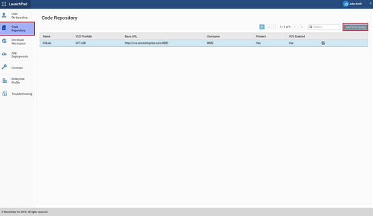
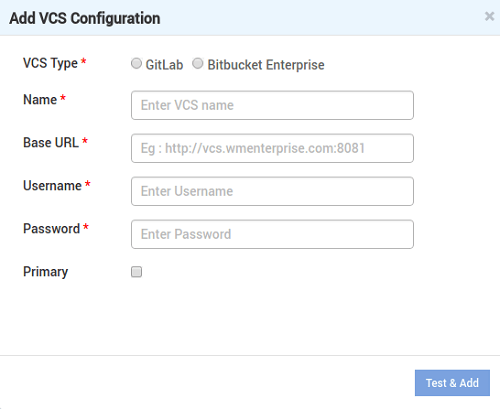

###### Applicable to WaveMaker Studio alone

When multiple developers are sharing the development base, tracking code changes and synchronizing the changes is of essence. WaveMaker provides Version Control Services for this purpose. By default, WaveMaker Studio comes with a version control system that runs within your VM based on Gitlab. You can choose to add an external repo of your choice.

1. From Launchpad, go to **Code Repository**. You will see the existing internal VCS server referred to as `vcs.wmenterprise.com`. This points to the Gitlab based VCS installed within your WME VM as part of Studio. 
2. If you have an **external repo** which you want to use for version control, you can add a new VCS configuration. Click **Add VCS Config** on the top right corner. Add VCS Configuration window is displayed. 
3. Enter the appropriate **Gitlab Base URL, Username** and **Password** in the respective fields.
4. Check the **Primary** box, if you want the new VCS server to be default. **Note**: On selecting the Primary checkbox, the new VCS server becomes the default for all the projects that you create subsequently in Studio.
5. Click **Test and Add**. The new VCS server is now configured.

**Note**: After you create a new VCS server and make it Primary, if you wish to edit the projects from the old VCS server, when you sync/push the changes they will be made to the old VCS server and not the new VCS server. Since the references of the project are to the old server, there is no relation with the new VCS server.

Configuring Development & Deployment Capacity

Contents

- [1\. Getting Started](/learn/installation/wavemaker-enterprise-setup-guide/)
- [2\. Launching & Initializing WME](/learn/installation/wme-setup-guide-launch-initialize/)
- [3\. Setting Up WME](/learn/installation/wme-setup-guide-access-setting/)
- [4\. Configuring WME](/learn/installation/wme-setup-guide-configuration/)
    - [i. Adding Users](/learn/installation/wme-setup-guide-configuration/#adding-users)
    - [ii. Uploading License](/learn/installation/wme-setup-guide-configuration/#uploading-license)
    - [iii. External VCS Configuration](#)
    - [iv. Development & Deployment Capacity](/learn/installation/wme-setup-guide-increasing-development-deployment-capacity/)
    - [v. Custom Apps Capacity](/learn/installation/wme-setup-guide-custom-apps-capacity/)
- [5\. Maintaining WME](/learn/installation/wme-setup-guide-maintenance/)
- [6\. Upgrading WME](/learn/installation/wme-setup-guide-upgrading/)
